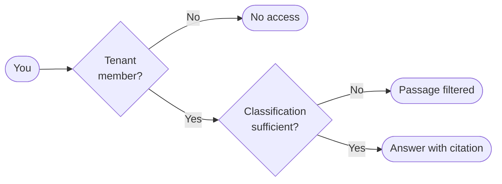

# Documents & Collections

A **collection** is a curated, indexed set of documents — policies, procedures, manuals, regulations — that hestIA can search and cite when answering questions. Think of it as a knowledge base your organisation maintains to make authoritative content queryable through AI.

 

As a regular user you query against collections; moderators manage what is in them.

## How Access Works

Access to any document is controlled by **two independent checks** that both must pass before a passage appears in your answers:

🏢

<strong>Tenant membership</strong> 
Your account belongs to one or more <em>tenants</em> (organisational units). Each tenant is linked to specific collections. If you are not a member of a tenant, you cannot query its collections at all.

🔒

<strong>Classification level</strong> 
Every document carries a classification level. Your personal classification <em>ceiling</em> within each tenant determines which documents you may receive answers from. A document above your ceiling is never retrieved— not even partially.

### Classification levels

| Level | Who can access it |
|-------|------------------|
| **Public** | All authenticated members |
| **Internal** | Members of the owning organisation |
| **Confidential** | Users cleared to Confidential or above |
| **Restricted** | Only users explicitly cleared at Restricted level |
| **Secret** | Only users explicitly cleared at Secret level |

> [!NOTE]
> Classification enforcement is automatic and silent — if a document is above your ceiling, hestIA answers as if it does not exist. You will not be told that restricted content was withheld.

---

## How Indexing Works

When a moderator uploads a document, hestIA processes it in three steps:

1. **Split into passages** — the document is divided into overlapping text chunks, each sized to give hestIA enough context to answer from.
2. **Embed each passage** — every passage is converted into a numeric vector that captures its meaning.
3. **Store in the vector database** — passages and their vectors are saved for retrieval.

When you ask a question, hestIA converts it into the same vector space and retrieves the passages whose meaning is closest to your question. Those passages are used to compose the answer and are shown as source citations.

> [!WARNING]
> Indexing happens **at upload time**. If a source document is updated after it was uploaded, the old version remains in the index until a moderator re-uploads the new file. Always check the document name and version in the Sources panel if an answer seems outdated.

---

## Language & Retrieval Quality

Retrieval works by comparing the meaning of your question against the meaning of indexed passages. This comparison is most accurate when both are in the **same language**.

- If your policy library is in French, ask in French.
- Mixed-language queries against a single-language collection will return lower-quality results.
- Multilingual collections are supported but each query should still match the language of the target documents.

 

## Cross-Organisation Sharing

How shared collections work

An organisation can grant another organisation access to one of its collections — for example, sharing regulatory guidelines with an external partner or auditor.

The owning organisation sets a **maximum classification ceiling** for the external tenant. External users can never receive passages above that ceiling, even if their own individual classification level would otherwise permit it. The stricter of the two limits always applies.

This allows controlled knowledge sharing without exposing restricted content across organisational boundaries.

## If Results Are Missing

I expected a document to be cited but it wasn't

Work through the checklist:

1. **Not indexed** — the document may not have been uploaded to a collection yet. Contact your moderator.
2. **Tenant access** — you may not be a member of the tenant that owns the relevant collection. Contact your moderator to check.
3. **Classification** — the document's level may exceed your personal ceiling. Contact your Moderator.
4. **Language mismatch** — ask in the same language as the document for best retrieval.
5. **Phrasing** — try rephrasing your question using terms that appear in the document. Different wording retrieves different passages.

The cited passage is outdated

hestIA reflects the document as it was when last uploaded. If the source file has since been updated, ask your moderator to re-upload the current version. The index will update automatically.

