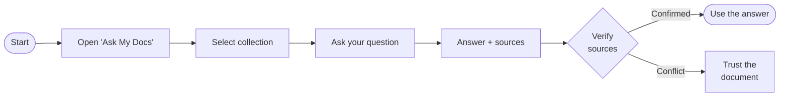

# Getting Started

> [!WARNING]
> **AI outputs can contain errors.** hestIA may produce inaccurate, incomplete, or outdated information. Always verify important answers against the **source documents** displayed alongside each response. Do not rely solely on hestIA for decisions with legal, financial, medical, or safety implications.

hestIA combines a general-purpose language model with your organisation's own document collections. Use it for open-ended questions and writing tasks, or ground it in a specific **knowledge base** so every answer cites the passages it drew from.

 

---

## The Chat Screen

| Area | Purpose |
|------|---------|
| **Left sidebar**  | Conversation history, new chat button, feature shortcuts |
| **Centre panel**  | Active conversation |
| **Top-right**     | Account menu — profile, password, logout |
| **Right sidebar** | Sources panel — can be opened once sources are generated |

---

## Quick Start: 

 

### General AI Use

 

hestIA can also be used as a general-purpose assistant — drafting, summarising, translating, explaining, brainstorming — without selecting a collection. Simply start typing in the chat box. In this mode the AI draws on its training data rather than your documents, and no source citations are shown.

 

### Querying a Knowledge Base

1. **Open Ask My Docs** — Click **Ask My Docs** in the left sidebar. A modal window opens.

2. **Select a collection** — Choose the document collection from the dropdown — for example a policy library, product catalogue, or onboarding pack.
3. **Ask your question** — Type in natural language and press **Enter**. hestIA retrieves relevant passages and generates an answer.
4. **Review the sources** — Sources are cited where applicable. Read them to confirm the AI's response matches what the documents actually say. **If there is a conflict, trust the source.**
5. **Continue the conversation** — Ask follow-up questions in the same session. hestIA remembers context so you can refine or go deeper without repeating yourself.

---

---

## Key Things to Know

Sources are your ground truth

When hestIA cites documents, the cited passages are authoritative — the AI summarises, the document decides. If the summary conflicts with the source text, go with the source.

Language matching matters

Query a collection in the same language the documents are written in for best retrieval accuracy. Mixed-language queries may return lower-quality results.

No web access

hestIA does not search the internet or connect to external services. All knowledge comes from the AI model's training or your organisation's indexed collections.

Session history

Past conversations are saved in the left sidebar. You can return to any previous session at any time and continue where you left off.

