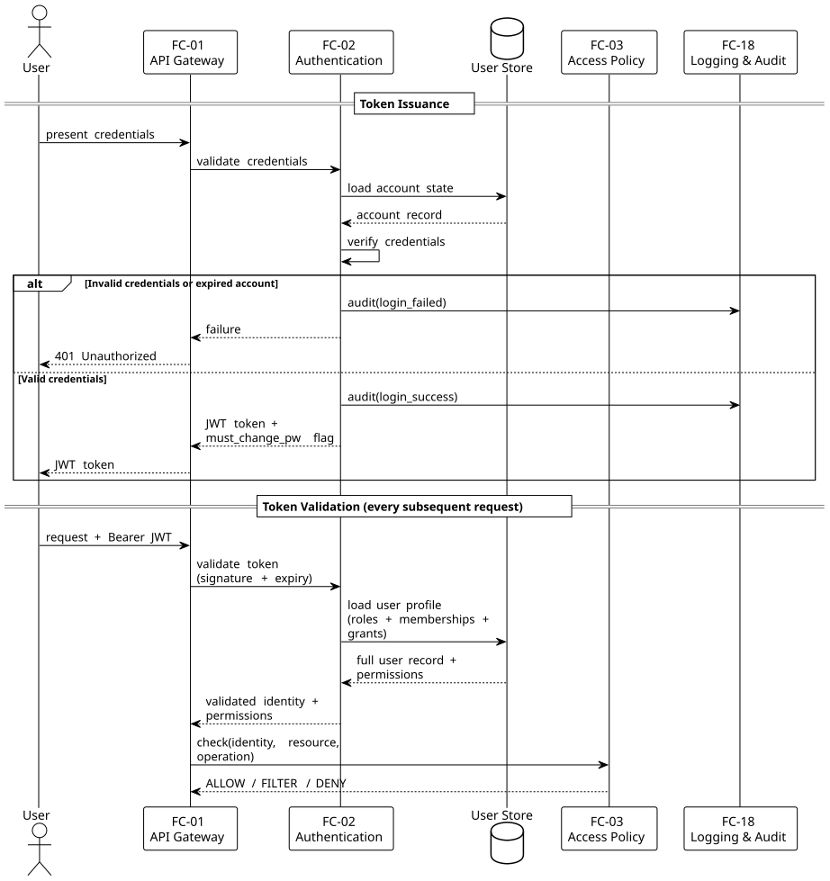
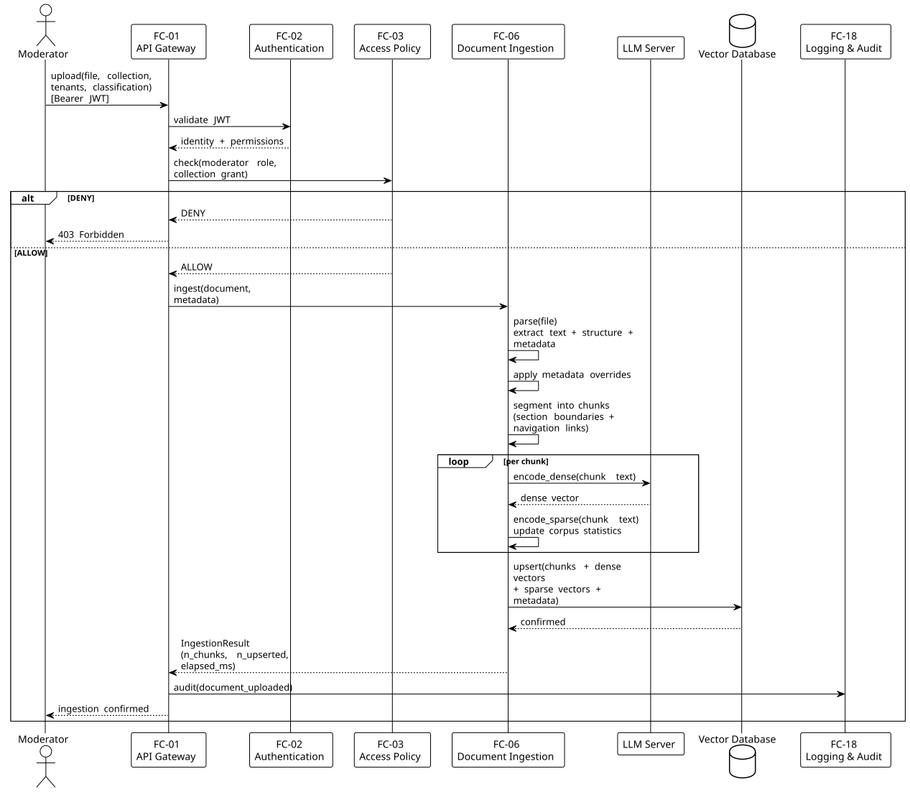
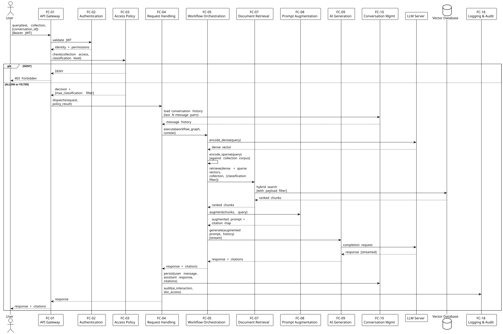
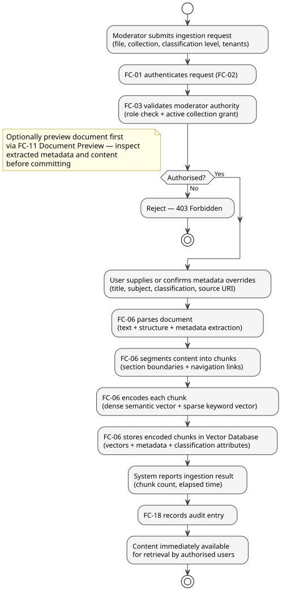
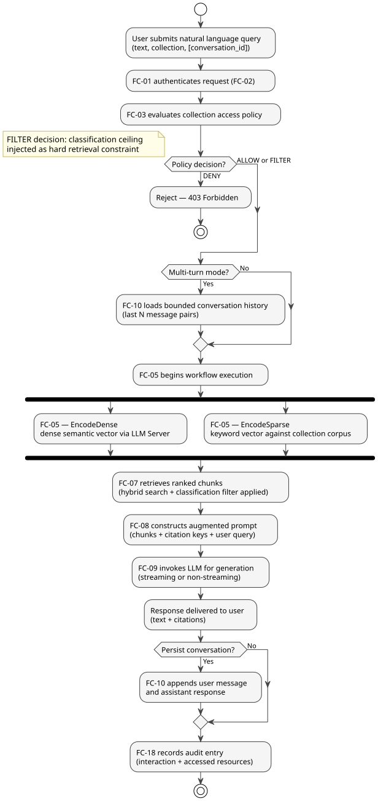
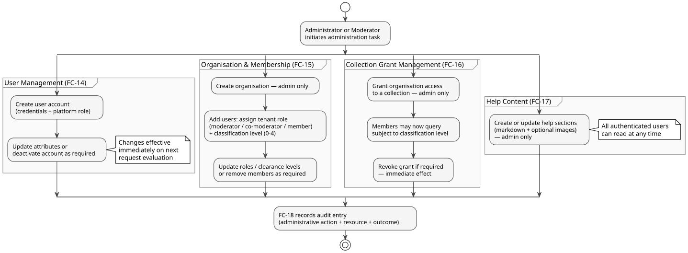

# Functional Architecture Document (FAD)

Service: hestIA
Version: alpha_v0.4
Classification: INTERNAL
Date: 2026-09-09
Issuer: iTrust Luxembourg

Revision note: This revision incorporates the findings of an architecture conformance review conducted against the implemented codebase (2026-09-09). Six functional components were added (FC-20 through FC-25) to document previously unrecorded administration and collaboration capabilities; several existing functional descriptions and constraints were corrected where implementation diverged from the prior text. See the accompanying Architecture Conformance Review for the full discrepancy analysis.

---

## 1 Introduction

### 1.1 Context
hestIA is an on-premises AI assistance platform developed by itrust for IT governance and compliance (ISMS) use cases. It operates as an orchestration and logic layer positioned between end-user interfaces and a set of managed infrastructure services, mediating all access to AI generation, vector knowledge bases, and identity stores. This document elaborates the functional architecture of hestIA, complementing the System Concept Document (SCD) and Interface Control Document (ICD).

### 1.2 Objectives
This Functional Architecture Document (FAD) describes what hestIA does in functional terms: the functions it provides, the data it processes, the workflows it supports, and the constraints it enforces. It does not describe implementation technology, deployment topology, or internal algorithms. The FAD serves as the authoritative reference for functional completeness assessment, requirements traceability, and verification planning.

### 1.3 Document Structure

| Section | Title | Content Summary |
|---------|-------|-----------------|
| 1 | Introduction | Context, objectives, and document guide |
| 2 | Functional Overview | Functional scope and domain decomposition |
| 3 | Functional Decomposition | Component inventory and per-component functional descriptions |
| 4 | Functional Data Flows | High-level and per-scenario data flows; data object catalogue |
| 5 | Functional Workflows | User-level logical sequences for principal use cases |
| 6 | Functional Dependencies | Inter-function dependency table and critical dependency descriptions |
| 7 | Assumptions and Constraints | Functional constraints bounding system behaviour |

---

## 2 Functional Overview

### 2.1 Functional Scope
hestIA provides a managed AI assistance capability over organisationally controlled document corpora, enforcing classification-based access control at every interaction that touches a document collection. The system accepts document uploads, transforms them into retrievable knowledge, and responds to user queries by synthesising retrieved knowledge with AI-generated language. It supports multi-tenant operations, ensuring that knowledge visibility is governed by organisational membership and individually assigned classification clearance levels. Document ingest, query, administration, and conversation management are subject to authentication without exception, and to policy enforcement whenever a document collection is involved (see FC-03). One documented function, Help Content Management (FC-17), is implemented by the presentation tier outside this authenticated backend boundary; see A-16. The AI generation, embedding, and vector-search capabilities are provided by one or more independently configurable backend connections (see FC-22) rather than by a single fixed "LLM Server" and "Vector Database" instance; this document uses those terms to denote the currently active connection(s) for each purpose.

### 2.2 Functional Domains

| Domain | Description |
|--------|-------------|
| Identity and Access | Authentication of users via configurable credential schemes (local, directory, federated); issuance, validation, and revocation of session tokens; account self-service; role and classification-level assignment; execution of access policy decisions on collection-scoped requests |
| Document Intelligence | Ingestion of heterogeneous document formats; extraction of content and metadata; segmentation into addressable knowledge units; semantic and keyword encoding for retrieval |
| AI Interaction | Orchestrated AI workflows for single-turn generation and multi-turn conversational queries; retrieval-augmented prompt construction; AI response generation and delivery; bounded, token-budgeted conversation context with automatic and on-demand compaction |
| Knowledge Management | Storage and lifecycle management of document collections; retrieval of knowledge units using hybrid search; conversation history persistence and management |
| Collaboration and Notifications | User-initiated requests to join organisations or share collection access across organisations, subject to moderator approval; in-app notification delivery and inbox management, including administrator broadcasts |
| Administration | Lifecycle management of users, organisations, collection grants, and organisational memberships; runtime configuration of authentication/security settings, AI and vector-database backend connections, workflow graph definitions, and system logging; help content management |
| Observability | Structured system logging with request traceability; security audit logging of sensitive actions mediated by the backend; queryable and exportable log access; health and readiness status exposure |
| Extensibility | Declarative, administrator-editable composition of AI workflow graphs from a fixed vocabulary of processing node types; workflow graphs are strictly linear (no conditional branching) and new node types require platform code changes |

---

## 3 Functional Decomposition

### 3.1 Functional Components

| Function ID | Name | Description |
|-------------|------|-------------|
| FC-01 | API Gateway | Single system entry point; authenticates all inbound requests; assigns correlation identifiers; routes requests to appropriate functions |
| FC-02 | Authentication | Validates user credentials via one of three configurable modes (local, directory, federated); issues and validates short-lived session tokens |
| FC-03 | Access Policy Enforcement | Evaluates collection-scoped access decisions based on organisational membership, collection grants, and document classification clearance; returns ALLOW, FILTER, or DENY decisions |
| FC-04 | Request Handling | Receives authenticated and authorised requests; selects workflow templates; drives workflow execution; persists conversation outcomes; emits audit entries |
| FC-05 | Workflow Orchestration | Executes declaratively defined directed execution graphs; coordinates typed processing nodes in sequence or composition |
| FC-06 | Document Ingestion | Accepts source documents; extracts text and structural metadata; segments content into chunks; encodes chunks for storage in the knowledge base |
| FC-07 | Document Retrieval | Executes hybrid knowledge base queries using encoded query vectors subject to access-policy-derived constraints; returns ranked result sets |
| FC-08 | Prompt Augmentation | Constructs augmented prompts by formatting retrieved knowledge chunks with citation keys and combining them with the user query |
| FC-09 | AI Generation | Delegates prompt execution to the LLM Server; supports single-turn and multi-turn modes; delivers streaming and non-streaming responses; handles reasoning-model output |
| FC-10 | Conversation Management | Persists, loads, and manages multi-turn conversation histories per user; supports conversation lifecycle operations and bounded context window loading |
| FC-11 | Document Preview | Parses an uploaded document without persisting it; returns extracted metadata and a structured content preview for pre-ingestion review |
| FC-12 | Direct Vector Search | Exposes knowledge base search in semantic, keyword, and hybrid modes for integrators managing their own retrieval workflows |
| FC-13 | Vector Encoding Exposure | Exposes the encoding pipeline externally for dense semantic embedding and sparse keyword vectorisation against a specified collection corpus |
| FC-14 | User Administration | Manages the full lifecycle of user accounts: creation, retrieval, update, deactivation |
| FC-15 | Organisation and Membership Administration | Manages tenant organisations and their membership: creation, update, member add/remove, role and classification-level assignment |
| FC-16 | Collection Grant Administration | Manages which organisations have access to which document collections and under what conditions |
| FC-17 | Help Content Management | Manages a set of markdown-based help sections and associated images; readable by all authenticated users; writable by administrators only. Implemented in the presentation tier against its own local content store, outside the hestIA backend's policy-enforcement and audit boundary (see A-16) |
| FC-18 | Logging and Audit | Emits structured system logs with correlation identifiers; records security-relevant audit events to a dedicated, file-based audit trail |
| FC-19 | Health and Readiness | Exposes unauthenticated liveness and readiness status; reports active services and available models and collections |
| FC-20 | Tenant Collaboration Workflows | Manages user-initiated requests to join an organisation, requests to share collection access between organisations, and direct member invitations, each subject to moderator approval |
| FC-21 | Notification Management | Delivers and manages in-app notifications arising from collaboration workflows and administrator broadcasts; maintains per-user read state and a configurable new-user welcome message |
| FC-22 | Platform Connection Administration | Manages the lifecycle of backend connections providing generation, embedding, reranking, and vector-database capability; supports connectivity testing and live activation without service restart |
| FC-23 | Authentication and Security Configuration Administration | Manages the active authentication mode and its associated password policy, token signing configuration, directory-service configuration, and federated-identity configuration; changes take effect on the next request without service restart |
| FC-24 | Workflow Graph Administration | Manages the declarative YAML definitions of AI workflow graphs, allowing administrators to view, create, update, and reset the graphs used by FC-05 without platform code changes |
| FC-25 | System Log Administration | Provides administrator query, filtered export, and live verbosity control over system and audit logs |

---

### 3.2 Functional Descriptions

**FC-01 — API Gateway**
- Description: The single functional entry point to hestIA. Every inbound interaction passes through this function before reaching any other.
- Inputs: All inbound requests from user interfaces or integrating systems.
- Outputs: Authenticated, correlated requests routed to the appropriate downstream function; error responses for unauthenticated or malformed requests.
- Behaviour: Assigns a unique correlation identifier to each request and propagates it through the processing chain. Invokes FC-02 to validate session tokens on all protected operations. Rejects requests that fail authentication before routing. Passes health and readiness probes directly to FC-19 without authentication. Routes for functions bound to a configurable backend purpose — Document Ingestion, Direct Vector Search, Vector Encoding Exposure, and AI Generation — are exposed only when at least one connection has been configured for the corresponding purpose (see FC-22); in a deployment lacking such a connection, the corresponding routes are not available.

---

**FC-02 — Authentication**
- Description: Verifies the identity of users and issues session tokens, supporting three mutually exclusive credential validation modes: local credential store, directory service (LDAP/Active Directory), and federated identity (OIDC). Also provides session termination and account self-service.
- Inputs: User credentials (username and password, or directory-bound credentials, or OIDC exchange artefacts); bearer tokens on subsequent requests; self-service profile and password-change requests.
- Outputs: Short-lived JWT access tokens on successful authentication; validation outcome (valid/invalid) on token verification; error responses for failed, expired, or rate-limited attempts; caller's own profile record.
- Behaviour: Local authentication tries the local credential store first, falling back to the directory service when the user is directory-sourced; a first-time directory login auto-provisions a local profile. Applies rate limiting to login attempts, keyed by the attempted username, and separately to all federated-identity (OIDC) authorize/callback/logout requests, keyed by client IP address, to mitigate brute-force attacks (see A-08). Enforces account expiry. Validates JWT signatures (restricted to an HMAC algorithm allowlist), expiry, and subject identity on every protected request; permission and profile data are re-derived fresh on every request with no caching. Supports session termination (logout) via server-side revocation of the individual token's identifier, independent of the token's remaining lifetime. A client-driven heartbeat call updates the caller's last-activity timestamp (consumed by FC-14's presence indicator) and returns the caller's current unread notification count (FC-21) as a side effect. Exactly one authentication mode is active at any given time; unlike a fixed deployment-time choice, the active mode and its full configuration (password policy, token signing parameters, directory-service parameters, federated-identity parameters) are administrator-configurable at runtime through FC-23 and take effect on the next request without a service restart (see A-04).

---

**FC-03 — Access Policy Enforcement**
- Description: Evaluates whether a requesting user may retrieve knowledge from a target document collection and, if so, whether results must be filtered by classification level. This function is the single collection-access gate invoked by retrieval-touching workflows (FC-05, FC-12); it is a narrower function than platform- and tenant-role authorisation, which is enforced by dedicated guards on the administration functions (FC-14 through FC-17, FC-20 through FC-25).
- Inputs: The requesting user's pre-computed permission set — derived from platform role, organisational memberships, tenant role, and per-tenant classification level — and, where applicable, a target document collection.
- Outputs: A policy decision of ALLOW, FILTER, or DENY. FILTER decisions carry a maximum classification constraint applied to retrieval queries. Requests that do not target a collection (e.g. non-RAG generation or chat) receive ALLOW unconditionally from this function.
- Behaviour: An administrator's permission set grants unrestricted collection access; for all other users, access to a collection requires an active organisational grant (FC-16) and is bounded by the user's classification clearance and any per-grant classification cap, whichever is lower. No grant on the target collection results in DENY. A grant with a classification cap results in FILTER, carrying that cap as a hard constraint applied by FC-07 at retrieval time. The permission set consulted by this function is recomputed fresh from stored roles, memberships, and grants on every request; no caching of permissions or of policy decisions is performed, so a change to any of them takes effect on the immediately following request (see A-02). DENY outcomes terminate request processing before any knowledge base or AI interaction occurs. Every decision is recorded as a policy-decision audit entry (FC-18).

---

**FC-04 — Request Handling**
- Description: Coordinates the processing of AI assistance requests after authentication and policy enforcement. Selects the appropriate workflow template, drives workflow execution, manages conversation persistence, and records audit events.
- Inputs: Authenticated and policy-cleared request containing query text, workflow mode, conversation context reference, and optional parameters.
- Outputs: AI-generated response (streamed or complete); persisted conversation record (if requested); audit log entry.
- Behaviour: Selects from four workflow templates — generate (single-turn, no retrieval), rag_generate (single-turn with retrieval), chat (multi-turn, no retrieval), rag_chat (multi-turn with retrieval) — based on request parameters. Loads bounded conversation history from FC-10 when operating in multi-turn modes. Passes the assembled context to FC-05 for execution. After generation, optionally persists the exchange to the conversation history. Emits a structured audit entry for every AI interaction.

---

**FC-05 — Workflow Orchestration**
- Description: Executes directed execution graphs defined declaratively as YAML artefacts. Each graph is composed of typed processing nodes; the engine traverses the graph, invoking each node function in strict linear order.
- Inputs: A resolved workflow graph; the input context assembled by FC-04 (query, history, policy filters, parameters).
- Outputs: The accumulated result context after full graph traversal, including generated response, retrieved chunks, and citation map.
- Behaviour: The engine implements exactly six node types: EncodeDense (query semantic encoding), EncodeSparse (query keyword encoding), Retrieve (knowledge base query via FC-07), Augment (prompt construction via FC-08), Generate (single-turn AI invocation via FC-09), and Chat (multi-turn AI invocation via FC-09). This vocabulary is fixed; introducing a new node type requires a platform code change, not a workflow-definition change. Graphs must form a single linear chain through every declared node — the engine has no conditional-branching support. Each request is routed by its workflow kind (generate, rag_generate, chat, or rag_chat) to exactly one of four graph definitions; introducing a fifth workflow kind likewise requires a platform code change. Within this fixed vocabulary and fixed set of workflow kinds, graph composition — node sequencing, prompt content, and slot wiring — is declarative and administrator-editable at runtime without platform code changes (see FC-24).

---

**FC-06 — Document Ingestion**
- Description: Transforms source documents into encoded knowledge units stored in the knowledge base. Supports a range of document formats and maintains collection-scoped encoding metadata.
- Inputs: Source document file; metadata (title, subject, classification level, source URI, target tenants, target collection); optional metadata overrides.
- Outputs: A set of encoded chunks upserted to the Vector Database; updated collection corpus statistics.
- Behaviour: Parses source files in the following formats: PDF, DOCX, XLSX, XLSM, PPTX, JSON, CSV, TXT, Markdown. Extracts text content, structural hierarchy, and document-level metadata. Applies any caller-supplied metadata overrides. Segments the document into chunks at section boundaries; each chunk carries a reference to its source document, its position in the document structure, and navigation links to adjacent chunks. Encodes each chunk using both dense semantic and sparse keyword vectorisation. Upserts the resulting vectors and metadata payloads to the Vector Database. Updates corpus statistics used for keyword scoring within the collection.

---

**FC-07 — Document Retrieval**
- Description: Queries the knowledge base to identify the most relevant chunks for a given encoded query, subject to access-policy-derived constraints.
- Inputs: Encoded query vectors (dense and/or sparse); access policy filter (maximum classification constraint from FC-03); target collection identifier; retrieval parameters (result count, mode).
- Outputs: A ranked list of chunk payloads including content, source reference, classification level, and position metadata.
- Behaviour: Supports three retrieval modes: semantic (dense vector similarity), keyword (sparse vector matching), and hybrid (fusion of both). In hybrid mode, results from semantic and keyword searches are merged using reciprocal rank fusion by default, with an alternative distribution-based score fusion strategy available as a configurable option. Access policy filters are applied as hard payload constraints, ensuring that chunks whose classification exceeds the user's clearance are excluded at the retrieval layer, not post-hoc. Returns a ranked list bounded by the requested result count.

---

**FC-08 — Prompt Augmentation**
- Description: Constructs the augmented prompt that combines retrieved knowledge with the user query, enabling the AI generation function to produce grounded, citable responses.
- Inputs: Ranked list of retrieved chunks (from FC-07); original user query text; citation configuration.
- Outputs: An augmented prompt containing structured knowledge context, a source citation map keyed to context entries, and the user query.
- Behaviour: Formats each retrieved chunk with a citation key. Assembles a structured context block from the formatted chunks. Builds a source map associating each citation key with its document source name, subject, and excerpt. Combines the context block, source map, and user query into the final augmented prompt passed to FC-09.

---

**FC-09 — AI Generation**
- Description: Invokes the LLM Server to produce a natural language response from a prepared prompt, operating in either single-turn or multi-turn mode.
- Inputs: Prepared prompt (plain or augmented); optional message history (multi-turn mode); generation parameters (model, temperature, etc.); streaming preference.
- Outputs: Generated response text; optional citations list (derived from the source map); optional thinking-token content (for reasoning-model outputs); delivery in streaming (NDJSON) or non-streaming form.
- Behaviour: Selects the invocation mode (generate vs. chat) according to the workflow node type. In multi-turn mode, includes the bounded message history in the LLM context. Supports streaming delivery to the caller, emitting response fragments progressively as they are produced by the LLM Server. Correctly processes thinking-token streams produced by reasoning-capable models, separating reasoning traces from final response content. Returns a structured result carrying the response text, citations, and any reasoning trace.

---

**FC-10 — Conversation Management**
- Description: Persists and manages multi-turn conversation histories, enabling continuity across interactions and token-budgeted context loading for AI generation.
- Inputs: Messages (role, content, citations, thinking) to be persisted; conversation identifiers for retrieval and lifecycle operations; user identity; optional explicit compaction requests.
- Outputs: Stored conversation records; retrieved conversation lists and message histories; updated or deleted records; a rolling summary of compacted history.
- Behaviour: Creates new conversations with a system-generated or user-supplied title. Appends user and assistant messages to conversation records after each exchange. History supplied to the LLM context window is bounded by a token budget derived from the active generation connection's context window (with a safety margin), not by a fixed message-pair count. When automatic compaction is enabled for the active generation connection and the budget would be exceeded, the system folds the oldest portion of history into an LLM-generated rolling summary before the next turn begins, retaining a minimum number of the most recent messages in full; a user may also request compaction explicitly on demand, which is not bound by that retained-message minimum. Full conversation history is retained in storage regardless of any compaction applied to a given context window. Supports renaming conversations, deleting conversations, and deleting individual messages. Conversation records are scoped to the owning user.

---

**FC-11 — Document Preview**
- Description: Parses an uploaded document and returns a preview of extracted content and metadata without persisting any data to the knowledge base.
- Inputs: Source document file.
- Outputs: Extracted document metadata (title, subject, structural summary); Markdown-formatted content preview.
- Behaviour: Applies the same parsing logic as FC-06 but performs no encoding, no storage, and no corpus update. Intended to support a review-before-ingest workflow in which an authorised user can inspect what hestIA will extract from a document before committing it to a collection.

---

**FC-12 — Direct Vector Search**
- Description: Exposes knowledge base search capabilities directly for integrators or workflows that manage their own retrieval logic independently of the standard AI assistance workflows.
- Inputs: Query text or pre-encoded query vectors; retrieval mode (semantic, keyword, or hybrid); target collection; retrieval parameters; access credentials.
- Outputs: Ranked list of matching chunks with payloads, scored and ordered by relevance.
- Behaviour: Applies the same retrieval logic and access-policy filtering as FC-07. Returns raw ranked results without prompt augmentation or AI generation. Access control constraints are enforced identically to standard query flows.

---

**FC-13 — Vector Encoding Exposure**
- Description: Exposes the encoding pipeline to external callers, allowing them to obtain semantic or keyword vector representations of arbitrary text against a specific collection corpus.
- Inputs: Input text; encoding mode (dense or sparse); target collection identifier (for sparse encoding corpus reference).
- Outputs: Dense vector representation (high-dimensional float array) for dense mode; sparse vector representation (weighted term-index pairs) for sparse mode.
- Behaviour: Dense encoding produces a semantic embedding via the LLM Server embedding capability. Sparse encoding produces a keyword-weighted vector using the collection-scoped corpus statistics maintained by FC-06. Outputs are structurally compatible with the vectors stored in the knowledge base, enabling external systems to form queries or perform comparisons.

---

**FC-14 — User Administration**
- Description: Manages the full lifecycle of user accounts within the platform.
- Inputs: User account data (username, credentials, roles, metadata); user identifiers for retrieval, update, and deactivation operations.
- Outputs: Created, retrieved, updated, or deactivated user records.
- Behaviour: Restricted to users holding the administrator platform role. Supports creation of new user accounts with initial role assignment. Supports retrieval of individual or all user records, annotated with a derived online/offline presence indicator based on a periodically updated last-activity timestamp (see FC-02). Supports update of account attributes including credential resets and role changes. Supports account deactivation. Changes to user records take effect on the next request evaluated by FC-03, as no permission caching exists.

---

**FC-15 — Organisation and Membership Administration**
- Description: Manages tenant organisations and the membership of users within them, including the assignment of organisational roles and document classification clearance levels.
- Inputs: Organisation data (name, metadata); membership operations (user identifier, target organisation, role, classification level).
- Outputs: Created or updated organisation records; updated membership records reflecting added/removed members and their assigned roles and clearance levels.
- Behaviour: Organisation creation and configuration are restricted to administrators. Membership management (adding or removing members, assigning tenant roles of moderator, co-moderator, or member, and setting per-user classification levels from 0 to 4) may be performed by administrators or by users holding the moderator role within the target organisation. Classification levels assigned here directly govern which document chunks are visible to that user during retrieval, as enforced by FC-03 and FC-07.

---

**FC-16 — Collection Grant Administration**
- Description: Manages the authorisation grants that permit organisations to access specific document collections.
- Inputs: Grant configuration specifying the target collection and the target organisation; administrator credentials.
- Outputs: Active or revoked collection grants recorded in the User Store.
- Behaviour: Restricted to administrators. An organisation must hold an active grant on a collection before any of its members can query or ingest documents into that collection. Grant revocation immediately affects subsequent policy evaluations by FC-03, as decisions are not cached.

---

**FC-17 — Help Content Management**
- Description: Manages a set of contextual help resources, comprising markdown-formatted help sections and associated image assets.
- Inputs: Help section content (markdown text, section identifier); image assets; read requests from authenticated users.
- Outputs: Stored or updated help section records; help section listings and content for read operations; stored image assets.
- Behaviour: Read access (listing and retrieval of help sections and images) is available to all authenticated users. Write operations (create, update, delete sections and images) are restricted to administrators. Functions as a lightweight, in-platform content management capability requiring no external CMS dependency. Unlike every other function in this document, FC-17 is implemented entirely within the presentation tier against its own local content store, not by the hestIA backend: it does not pass through FC-01/FC-03, and its write operations do not produce entries in the audit trail (FC-18). The administrator-only write restriction is enforced solely by the presentation tier checking the administrator flag on the caller's authenticated profile (see A-16).

---

**FC-18 — Logging and Audit**
- Description: Provides two complementary logging capabilities: structured operational system logging for traceability and debugging, and a dedicated security audit trail for compliance and incident investigation.
- Inputs: Log emission requests from all other backend functions, carrying correlation identifiers, event types, resource references, user identities, and outcomes.
- Outputs: Structured JSON system log entries written to a rotating system log; structured JSON audit event records written to a separate, daily-rotated audit log with an extended retention period; query and export results for FC-25.
- Behaviour: System logs carry the correlation identifier assigned by FC-01, enabling full request traceability across all backend functions. Audit logs capture security-relevant events in four categories: authentication and logout events, AI interaction events (request/response metadata, not content), administrative actions, and policy decisions. Audit records include user identifier, action type, timestamp, target resource, and outcome. Audit log writes are unconditional for every function that passes through the backend and cannot be suppressed by request parameters or by lowering system-log verbosity; the audit log's own verbosity is fixed independently of system-log level changes made through FC-25. As noted under FC-17, help content changes are not mediated by the backend and therefore do not produce audit entries.

---

**FC-19 — Health and Readiness**
- Description: Exposes unauthenticated status endpoints allowing infrastructure orchestration systems and operators to assess the operational state of hestIA.
- Inputs: Liveness probe requests; readiness probe requests; service and capability enumeration requests.
- Outputs: Liveness status indicator; readiness status indicator reflecting the availability of all registered dependent services; lists of active services, available AI models, and accessible collections.
- Behaviour: Liveness and readiness are independent signals. Readiness reflects the aggregate availability of conditionally registered external services (LLM Server, Vector Database, User Store). Service registration is dynamic; readiness degrades if any registered service becomes unavailable. Model and collection listings are derived from live queries to the respective services. These endpoints do not require authentication and are excluded from audit logging.

---

**FC-20 — Tenant Collaboration Workflows**
- Description: Manages user-initiated requests to join an organisation, requests by one organisation's moderators to share one of its collections with another organisation, and moderator-initiated direct invitations of a user into an organisation. Each request type follows a file/approve-or-reject lifecycle.
- Inputs: Join request (requesting user, target organisation); share request (requesting organisation, target organisation, target collection); invitation (inviting organisation, invitee); approval or rejection decisions from an authorised moderator.
- Outputs: Created, approved, or rejected request records; resulting organisational membership, tenant role, and classification level (join/invitation) or collection grant (share request); notification events delivered via FC-21.
- Behaviour: A user may file a join request against any organisation without prior moderator involvement; the request is visible only to that organisation's moderators, who may approve (creating a membership) or reject it. A moderator may file a share request against another organisation for a collection their own organisation owns; the target organisation's moderators approve or reject it, and approval creates a collection grant scoped to the requesting organisation (see FC-16). A moderator may invite a specific user directly; the invitation is visible to the invitee, who accepts or declines it. Each organisation permits at most one active moderator at a time, enforced across all three workflows. All state transitions raise a notification (FC-21) to the relevant moderators or requester.

---

**FC-21 — Notification Management**
- Description: Delivers and manages in-app notifications generated by tenant collaboration events (FC-20) and by administrator broadcasts, and maintains a configurable message shown to newly created users.
- Inputs: Notification-triggering events from FC-20 and from user creation (FC-14); administrator broadcast content; read/mark-as-read requests from users; welcome-message configuration updates from administrators.
- Outputs: Per-user notification inbox listings; unread notification count; updated read state; stored welcome-message configuration.
- Behaviour: Notifications are targeted at a specific user (collaboration events, new-user welcome) or, for administrator broadcasts, at all users with no specific target. Users may list their notifications, retrieve an unread count, and mark individual or all notifications as read. Administrators may issue a broadcast notification and view broadcast history, and may configure the title and body of the message automatically sent to each newly created user. Delivery is in-app only; no external channel (e-mail, push, webhook) is provided.

---

**FC-22 — Platform Connection Administration**
- Description: Manages the lifecycle of backend connections that provide AI generation, embedding, reranking, and vector-database capability to the rest of the platform.
- Inputs: Connection configuration (purpose, backend type, endpoint, credentials, model, generation and context-compaction parameters); connectivity test requests; activation requests; administrator credentials.
- Outputs: Created, updated, or deleted connection records; connectivity test results; live model listings for a connection; the currently active connection per purpose.
- Behaviour: Restricted to administrators. A purpose (generation, embedding, reranking, or vector database) may have multiple configured connections, of which at most one is active at any time. Creating, updating, deleting, or activating a connection takes effect immediately by rewiring the corresponding live backend service in place; no service restart is required. A connection's configuration may be tested for connectivity before it is saved or activated. Per-connection generation parameters include whether automatic conversation-context compaction is enabled and its associated model and thresholds (see FC-10).

---

**FC-23 — Authentication and Security Configuration Administration**
- Description: Manages the platform's active authentication mode and its full associated configuration, including password policy, session-token signing configuration, directory-service configuration, and federated-identity configuration.
- Inputs: Desired authentication mode; password policy parameters; token signing algorithm, key, and lifetime; directory-service connection and group-mapping configuration; federated-identity provider and claim-mapping configuration; connectivity test requests.
- Outputs: Current configuration (with secrets masked); updated configuration; connectivity test results for the directory service or federated-identity provider.
- Behaviour: Restricted to administrators. Reading the configuration never exposes stored secrets in cleartext. Saving a configuration change rebuilds the platform's authentication service stack from the new configuration and swaps it into the running service atomically, without a restart; the change takes effect starting with the next request. Changing the active authentication mode or the token signing key invalidates all previously issued session tokens. A configuration may be tested for directory-service or federated-identity-provider connectivity, using not-yet-saved values, before being committed. Changes to the login rate-limit thresholds are persisted immediately but, at the current implementation stage, only take effect in the running rate limiter after a service restart — a known gap between saved and applied configuration for this one setting.

---

**FC-24 — Workflow Graph Administration**
- Description: Manages the declarative YAML definitions of the AI workflow graphs executed by FC-05, allowing administrators to inspect, author, modify, and reset them without platform code changes.
- Inputs: Workflow identifier; YAML graph definition (new or replacement); reset request.
- Outputs: Listing of all workflow graphs (built-in and custom), including whether a graph's live copy has diverged from its shipped default; stored or replaced graph definitions; a built-in graph reset to its shipped default, or a custom graph deleted.
- Behaviour: Restricted to administrators. A submitted graph definition is validated against the fixed node-type vocabulary and the requirement that all declared nodes form a single linear chain (see FC-05) before being accepted. Accepted changes are persisted to the platform's persistent configuration storage and take effect on the next workflow execution, without a service restart. A built-in workflow (generate, rag_generate, chat, rag_chat) may be reset to its shipped default; a custom, administrator-created workflow may be permanently deleted. Built-in shared node fragments underlying all workflow graphs are not administrator-editable and are refreshed from the shipped release on every platform start; the seeded, administrator-editable copies of the four built-in graph definitions are, by contrast, seeded only once and are never overwritten by a subsequent platform update, so that administrator edits survive upgrades and restarts.

---

**FC-25 — System Log Administration**
- Description: Provides administrator query, filtered export, and live verbosity control over the system and audit logs produced by FC-18.
- Inputs: Log query filters (level, search text, time range); export format selection; desired system log verbosity level.
- Outputs: Paginated log query results; a streamed export file (line-delimited or tabular format); current and updated log verbosity level.
- Behaviour: Restricted to administrators. Log queries and exports operate over the system and/or audit logs, filtered by level, free-text search, and time range. Log exports and verbosity changes are themselves recorded as administrative-action audit entries; plain log queries are not. System log verbosity may be changed live, without a restart; the change is not persisted and reverts to its configured default on the next restart. Audit log verbosity is fixed and is not affected by this function, consistent with FC-18's unconditional audit-writing behaviour.

---

## 4 Functional Data Flows

### 4.1 High-Level Data Flow
All interactions with hestIA's backend originate at FC-01 (API Gateway), which authenticates requests via FC-02 and routes them to the appropriate function; routing additionally depends on which backend connections FC-22 has configured (see FC-01 behaviour). For AI assistance interactions, FC-04 (Request Handling) drives a workflow via FC-05 (Workflow Orchestration), which coordinates encoding, retrieval, augmentation, and generation in sequence. Document ingestion interactions pass through FC-06, which transforms source files into encoded chunks and persists them to the knowledge base. Administrative interactions are handled by FC-14 through FC-17 and FC-20 through FC-25 under administrator or moderator authority; FC-17 is the sole exception, being mediated by the presentation tier rather than this backend (see A-16). FC-03 (Access Policy Enforcement) is invoked on every interaction that targets a document collection, and FC-18 (Logging and Audit) receives emissions from every backend function throughout the request lifecycle.

### 4.2 Core Data Flows

#### 4.2.1 Authentication Flow

1. The user presents credentials to FC-01.
2. FC-01 routes the request to FC-02 without policy evaluation.
3. FC-02 validates the credentials against the configured credential mode (local store, directory service, or federated provider).
4. FC-02 checks for account expiry and mandatory-password-change conditions.
5. On valid credentials, FC-02 issues a short-lived JWT token carrying the user subject identifier and expiry.
6. The token is returned to the user.
7. On all subsequent requests, the user presents the JWT as a Bearer token.
8. FC-01 passes the token to FC-02 for signature and expiry validation.
9. FC-02 returns the validated user identity, which FC-01 uses to load the user's roles and permissions from the User Store.
10. If the request targets a document collection, the enriched identity is passed to FC-03 for policy evaluation before the request proceeds; requests that do not target a collection proceed directly.
11. FC-18 records authentication events (success, failure, rate-limit trigger) as audit entries.

#### 4.2.2 Document Ingestion Flow

1. An authorised user (holding a moderator role on the target organisation) submits a document upload request to FC-01, including the source file, target collection, target tenants, and classification level.
2. FC-01 authenticates the request via FC-02.
3. A dedicated moderator-role guard evaluates whether the user holds the moderator role for the collection's owning organisation and whether an active collection grant exists; failure terminates processing before FC-06 is invoked. This guard is a role check distinct from FC-03 (see FC-03 description).
4. FC-06 receives the document and invokes the parser for the appropriate format, extracting text content, document structure, and metadata.
5. Any caller-supplied metadata overrides are applied to the extracted metadata.
6. FC-06 segments the parsed content into chunks at section boundaries; each chunk is linked to its neighbours and annotated with source and position metadata.
7. FC-06 requests dense encoding for each chunk from the LLM Server embedding capability.
8. FC-06 requests sparse encoding for each chunk, updating the collection corpus statistics.
9. FC-06 upserts each chunk — comprising content, metadata, and both vector representations — to the Vector Database.
10. FC-18 records the ingestion event as an audit entry.

#### 4.2.3 Knowledge Query (RAG) Flow

1. An authenticated user submits a query request to FC-01, specifying query text, target collection, and optionally a conversation reference and workflow parameters.
2. FC-01 authenticates the request via FC-02.
3. FC-03 evaluates the user's access to the target collection against their organisational membership and classification clearance. The decision is ALLOW, FILTER (carrying a maximum classification constraint), or DENY.
4. A DENY decision terminates processing; an ALLOW or FILTER decision proceeds.
5. FC-04 selects the appropriate workflow template (rag_generate or rag_chat) and loads bounded conversation history from FC-10 if operating in multi-turn mode.
6. FC-05 receives the assembled context and begins graph traversal.
7. FC-05 invokes EncodeDense: the query is encoded as a dense semantic vector via the LLM Server.
8. FC-05 invokes EncodeSparse: the query is encoded as a sparse keyword vector against the collection corpus.
9. FC-05 invokes Retrieve (FC-07): hybrid search is executed in the Vector Database using both vectors, with the classification filter from FC-03 applied as a hard constraint. A ranked list of chunks is returned.
10. FC-05 invokes Augment (FC-08): the retrieved chunks are formatted with citation keys, a source map is constructed, and the augmented prompt is assembled with the user query.
11. FC-05 invokes Generate or Chat (FC-09): the augmented prompt and optional message history are sent to the LLM Server, which returns a response.
12. FC-09 delivers the response to the user in streaming or non-streaming form.
13. FC-04 optionally persists the user message and assistant response to the conversation history via FC-10.
14. FC-18 records the AI interaction and document access events as audit entries.

#### 4.2.4 Tenant Collaboration Flow

1. A user submits a request to FC-01: to join an organisation, to invite another user (if a moderator of the inviting organisation), or — if a moderator — to request that another organisation share access to one of their organisation's collections.
2. FC-01 authenticates the request via FC-02.
3. FC-20 records the request and notifies the relevant party via FC-21: the target organisation's moderators for a join or share request, or the invitee for an invitation.
4. An authorised moderator approves or rejects the request via FC-01/FC-20.
5. On approval, FC-20 updates organisational membership, tenant role, and classification level (join/invitation) or creates a collection grant (share request), invoking FC-15 or FC-16 respectively.
6. FC-21 notifies the original requester of the outcome.
7. FC-18 records the administrative action as an audit entry.

#### 4.2.5 Runtime Configuration Change Flow

1. An administrator submits a configuration change to FC-01: an authentication/security setting (FC-23), a backend connection (FC-22), or a workflow graph (FC-24).
2. FC-01 authenticates the request via FC-02; the administrator role is verified before proceeding.
3. Where applicable (authentication settings, backend connections), the administrator may first invoke a connectivity test against the proposed configuration without persisting it.
4. On save, the new configuration is persisted to the platform's persistent configuration storage.
5. The corresponding live service (authentication stack, backend connection, or workflow graph cache) is rebuilt and swapped into the running system in place.
6. The change takes effect starting with the next request that uses the affected function; no service restart occurs.
7. FC-18 records the configuration change as an administrative-action audit entry.

### 4.3 Data Objects

| Data Object | Description |
|-------------|-------------|
| Document | Source file and its associated metadata: title, subject, classification level, source URI, and assigned tenants |
| Chunk | Atomic knowledge unit derived from a document section: content text, source reference, structural path, position index, adjacent-chunk navigation links, classification level, dense vector, and sparse vector |
| Dense Vector | High-dimensional floating-point array representing the semantic content of a chunk or query |
| Sparse Vector | Keyword-weighted term index representation of a chunk or query, scored against the collection corpus vocabulary |
| Query | A search request comprising one or both vector forms and optional payload filters, targeting a specific collection |
| Execution Graph | A YAML-defined directed acyclic graph of typed processing nodes specifying a complete AI workflow |
| User | Platform account record: unique identifier, username, platform role, organisational memberships (each carrying tenant role and classification level), last-activity timestamp |
| Permission | Derived access descriptor for a user: map of permitted collections to maximum classification level per collection |
| Policy Result | The outcome of a per-request access evaluation: ALLOW, FILTER (with classification constraint), or DENY |
| Conversation | A persistent, user-scoped record comprising a title and an ordered sequence of messages |
| Message | A single turn in a conversation: role (user or assistant), content text, optional citations list, optional thinking text |
| JWT Token | A signed, short-lived token carrying the user subject identifier and expiry, issued by FC-02 |
| Citation | A structured reference associating a citation key with a source document name, subject, and content excerpt |
| Audit Entry | A security event record: user identifier, action type, timestamp, target resource, and outcome |
| Corpus | Per-collection vocabulary and document-frequency statistics used for keyword vector scoring |
| Notification | An in-app event record: target (specific user, or none for a broadcast), category, message, read state, timestamp |
| Collaboration Request | A join request, share request, or invitation record: requester/inviter, target organisation, optional target collection (share requests), status (pending/approved/rejected), resolving moderator |
| Connection | A configured backend connection record: purpose (generation, embedding, reranking, vector database), backend type, endpoint, credentials, model, activation state, and (for generation connections) context-compaction parameters |
| Security Configuration | The active authentication mode and its associated password policy, token signing configuration, directory-service configuration, and federated-identity configuration |
| Context Summary | A rolling LLM-generated summary of conversation history folded during compaction, retained alongside the full message history |

---

## 5 Functional Workflows

### 5.1 Document Ingestion Workflow

1. An authenticated user with the moderator role on the target organisation initiates a document ingestion request, supplying the source document, target collection, classification level, and tenant assignments.
2. The system validates the user's authority to ingest into the specified collection (moderator role check and active collection grant check).
3. The system parses the document, extracting text and structural metadata. The user may optionally preview the extraction result via the Document Preview function (FC-11) before proceeding.
4. The user may supply or confirm metadata overrides (title, subject, classification, source URI).
5. The system segments the document into chunks, preserving section structure and navigation links.
6. The system encodes each chunk using both semantic and keyword vectorisation methods.
7. The system stores the encoded chunks in the knowledge base under the specified collection, with all metadata and classification attributes.
8. The system confirms successful ingestion. An audit record is created.
9. The ingested content is immediately available for retrieval by users with appropriate access.

### 5.2 Knowledge Query Workflow

1. An authenticated user submits a natural language query, optionally within an existing conversation context, targeting a collection they have access to.
2. The system evaluates the user's access policy for the target collection. If denied, the query is rejected. If filtered, a classification ceiling is applied to subsequent retrieval.
3. The system encodes the query for retrieval.
4. The system retrieves the most relevant knowledge chunks from the collection using hybrid search, applying any classification filter.
5. The system constructs an augmented prompt combining the retrieved context (with citation keys) and the user query.
6. In multi-turn mode, the system includes a bounded set of prior conversation messages in the prompt context.
7. The system submits the augmented prompt to the AI generation service and delivers the response to the user, with streaming if requested.
8. The response includes a citations list keyed to the retrieved source documents.
9. If conversation persistence is requested, the user message and assistant response are appended to the conversation history.
10. An audit record is created capturing the interaction, the user identity, and the accessed resources.

### 5.3 Administration Workflow

**User Management:**
1. An administrator creates a new user account, specifying credentials and the initial platform role.
2. The administrator may subsequently update account attributes (role, credentials) or deactivate the account.
3. All changes take effect immediately on the next request evaluated against that user's identity.

**Organisation and Membership Management:**
1. An administrator creates a new organisation (tenant), assigning it a name and configuration.
2. The administrator or an organisational moderator adds users to the organisation, assigning each a tenant role (moderator, co-moderator, or member) and a document classification clearance level (0 to 4).
3. Roles and clearance levels may be updated at any time. Changes affect subsequent access policy evaluations immediately.
4. Members may be removed from the organisation, revoking their access to collections granted to that organisation.

**Collection Grant Management:**
1. An administrator grants a specific organisation access to a specific collection, creating an active grant record.
2. From that point, members of the organisation — subject to their individual classification levels — may query documents in that collection.
3. The administrator may revoke a grant, immediately preventing further access by the organisation's members.

**Help Content Management:**
1. An administrator creates or updates help sections by supplying markdown content and a section identifier.
2. Administrators may upload image assets for use within help sections.
3. All authenticated users may read help sections and images at any time.
4. Unlike the other administration workflows above, this workflow is carried out entirely by the presentation tier and is not recorded in the audit trail (see A-16).

### 5.4 Tenant Collaboration Workflow

*(No sequence diagram currently exists for this workflow; see Finding on diagram coverage in the accompanying Architecture Conformance Review.)*

1. A user requests to join an organisation, or a moderator invites a specific user or requests that another organisation share one of its collections.
2. The relevant organisation's moderators are notified and review the request.
3. A moderator approves or rejects the request.
4. On approval, membership, tenant role, and classification level are established (join/invitation) or a collection grant is created (share request), taking effect on the requester's next request per A-02.
5. The requester is notified of the outcome. An audit record is created.

### 5.5 Platform Configuration Workflow

1. An administrator changes the active authentication mode or its configuration, adds/updates/activates a backend connection, or edits a workflow graph.
2. Where supported, the administrator tests the proposed configuration's connectivity before saving.
3. The system persists the change and rebuilds the affected live service (authentication stack, backend connection, or workflow graph) in place.
4. The change takes effect on the next request that uses the affected function, without a service restart. An audit record is created.
5. Changing the authentication mode or token signing key invalidates previously issued session tokens for all users.

---

## 6 Functional Dependencies

### 6.1 Dependency Table

| Function | Depends On |
|----------|------------|
| FC-01 API Gateway | FC-02 (token validation on every request), FC-19 (health/readiness pass-through) |
| FC-02 Authentication | User Store (credential validation, account state, profile retrieval, audit persistence) |
| FC-03 Access Policy Enforcement | FC-02 (validated identity), User Store (membership and grant records) |
| FC-04 Request Handling | FC-03 (policy decision), FC-05 (workflow execution), FC-10 (conversation history), FC-18 (audit emission) |
| FC-05 Workflow Orchestration | FC-07 (retrieval node), FC-08 (augmentation node), FC-09 (generation node) |
| FC-06 Document Ingestion | Dedicated moderator-role guard (distinct from FC-03; see FC-03 description), LLM Server (dense encoding), Vector Database (chunk storage), Corpus store (sparse encoding statistics) |
| FC-07 Document Retrieval | Vector Database (chunk search), FC-03 (classification filter input) |
| FC-08 Prompt Augmentation | FC-07 (ranked chunk list) |
| FC-09 AI Generation | LLM Server (text generation), FC-08 (augmented prompt, in RAG modes) |
| FC-10 Conversation Management | User Store (conversation and message persistence) |
| FC-11 Document Preview | Document parsing capability (shared with FC-06, non-persisting) |
| FC-12 Direct Vector Search | FC-03 (access policy filter), FC-07 (retrieval execution), Vector Database |
| FC-13 Vector Encoding Exposure | LLM Server (dense embedding), Corpus store (sparse encoding statistics) |
| FC-14 User Administration | Dedicated administrator-role guard (distinct from FC-03), User Store (user record persistence) |
| FC-15 Organisation and Membership Administration | Dedicated administrator/moderator-role guard (distinct from FC-03), User Store (organisation and membership record persistence) |
| FC-16 Collection Grant Administration | Dedicated administrator-role guard (distinct from FC-03), User Store (grant record persistence) |
| FC-17 Help Content Management | Presentation-tier local content store (not the backend User Store); presentation-tier check of the caller's administrator flag — does not invoke FC-03 or FC-18 |
| FC-18 Logging and Audit | Persistent log storage (file-based, not the User Store); receives emissions from every backend function |
| FC-19 Health and Readiness | LLM Server, Vector Database, User Store (availability probes) |
| FC-20 Tenant Collaboration Workflows | User Store (request/membership/grant persistence), FC-21 (notification emission), FC-15/FC-16 (membership and grant creation on approval) |
| FC-21 Notification Management | User Store (notification persistence); receives emissions from FC-20 and FC-14 |
| FC-22 Platform Connection Administration | FC-03/administrator role check, User Store (connection record persistence); live-rewires the LLM Server and Vector Database service instances consulted by FC-06, FC-07, FC-09, FC-13, FC-19 |
| FC-23 Authentication and Security Configuration Administration | Administrator role check, User Store (configuration persistence); live-rewires the service instances consulted by FC-02 |
| FC-24 Workflow Graph Administration | Administrator role check, persistent workflow-template storage; invalidates the template cache consulted by FC-05 |
| FC-25 System Log Administration | Administrator role check, persistent log storage (same store as FC-18) |

### 6.2 Dependency Description

**Access Policy as a cross-cutting dependency, scoped to collection access:** FC-03 is invoked by every function that retrieves knowledge from a document collection (FC-05's retrieval path, FC-12). It is the single enforcement point for the tenant classification model. Platform- and tenant-role authorisation for administrative functions (FC-14 through FC-17, FC-20 through FC-25) is enforced by dedicated role-check guards rather than by FC-03 itself; any administrative function found to omit its role-check guard, or any collection-retrieving function found to bypass FC-03, would constitute a security gap.

**User Store as the authoritative identity and history source:** FC-02, FC-03 (indirectly, via the permission set it consults), FC-10, FC-14, FC-15, FC-16, FC-20, FC-21, FC-22, and FC-23 all depend on the User Store. It holds user accounts, credentials, organisational memberships, collection grants, conversation histories, collaboration-workflow requests, notifications, and runtime-configurable connection and security settings. Its availability is therefore necessary for the vast majority of system functions. Logging and audit (FC-18/FC-25) are the principal exception, being backed by file-based persistent log storage rather than the User Store.

**LLM Server as the AI capability source, delivered through configurable connections:** FC-06 (dense encoding during ingestion), FC-09 (text generation), and FC-13 (encoding exposure) all depend on an active, administrator-configured connection for the relevant purpose (generation, embedding, or reranking — see FC-22). Its unavailability prevents document ingestion encoding, query encoding, and all AI generation; if no connection is configured for a purpose at all, the dependent function is not exposed (see FC-01). FC-19 reflects connection availability in its readiness signal.

**Vector Database as the knowledge persistence layer, delivered through a configurable connection:** FC-06 (upsert) and FC-07 (retrieval) both depend on an active, administrator-configured vector-database connection (see FC-22). Without it, no knowledge ingestion or retrieval is possible. FC-19 reflects its availability in the readiness signal.

**Corpus statistics as a local dependency of sparse encoding:** The sparse keyword encoding used in FC-06 and FC-13 depends on per-collection corpus statistics maintained on the platform's local storage. These statistics are updated with each ingestion; their loss or corruption would degrade keyword retrieval quality without preventing semantic retrieval.

**FC-05 as the composition orchestrator, within a fixed node vocabulary:** All RAG and generation workflows execute through FC-05. It has no external infrastructure dependencies of its own but depends on the functions it coordinates (FC-07, FC-08, FC-09). Its correct operation depends on the validity and integrity of the registered execution graph definitions; the graphs it can execute are bounded by the fixed, platform-defined vocabulary of node types and the four fixed workflow kinds (see FC-05, FC-24) — administrators may recompose and reconfigure graphs within that vocabulary but cannot introduce new node types or workflow kinds without a platform code change.

**Runtime configuration administration (FC-22, FC-23, FC-24) as a live-rewiring layer:** Unlike a conventional deploy-time configuration model, changes accepted by these three functions take effect on the running system immediately, by rebuilding and swapping the affected service in place. This means the functional behaviour of FC-02 (authentication mode), FC-06/FC-07/FC-09/FC-13 (active backend connections), and FC-05 (workflow graph content) is not fixed for the lifetime of a deployment and can change at any time an administrator makes such a change.

---

## 7 Assumptions and Constraints

**A-01** — All requests to protected functions must carry a valid, non-expired JWT token issued by FC-02. No protected function may be accessed without prior authentication, regardless of request origin.

**A-02** — Access policy (FC-03) is evaluated on every request touching protected resources. Permission decisions are never cached between requests. Any change to user roles, membership, or collection grants takes effect on the immediately following request.

**A-03** — A user may access documents in a collection only if two independent conditions are simultaneously satisfied: the user's organisation holds an active grant for that collection, and the user's individual classification clearance level equals or exceeds the classification level of the target document chunks.

**A-04** — The three authentication modes (local, directory service, federated identity) are mutually exclusive. Exactly one mode is active at any given time. Mixed-mode authentication is not supported. Unlike a deployment-time-fixed choice, the active mode and its full configuration are administrator-configurable at runtime through FC-23 and take effect on the next request without a service restart; changing the mode or the token signing key invalidates all previously issued session tokens.

**A-06** — Document ingestion into a collection requires the requesting user to hold the moderator role within the organisation that owns the collection. Members and co-moderators may not ingest documents.

**A-07** — Conversation history supplied to the LLM context window is bounded by a token budget derived from the active generation connection's context window, not by a fixed message-pair count. When the budget would be exceeded, the oldest portion of history is folded into a summary — automatically before a new turn begins (if enabled for the active connection, subject to a minimum retained-message floor) or on explicit user request (not subject to that floor). Full conversation history is retained in persistent storage and is not subject to this bound.

**A-08** — Login attempts and all federated-identity (OIDC) authorize/callback/logout requests are rate-limited; the login rate limit's thresholds are administrator-configurable via FC-23, though a change to those thresholds only takes effect in the running rate limiter after a service restart (a known gap between saved and applied configuration). No other functional endpoint is rate-limited at the current development stage.

**A-09** — List operations (users, conversations, collections, etc.) return all records without pagination. This constraint is acknowledged as a scalability limitation at the current alpha stage.

**A-10** — The hestIA API does not provide formal versioning or backward-compatibility guarantees at the alpha stage. Interfaces may change between versions without deprecation notice.

**A-11** — Validation of OIDC state parameters and PKCE flows during federated authentication is the responsibility of the integrating client application, not of hestIA.

**A-12** — Classification clearance levels are assigned as integer values on the scale 0 (PUBLIC) through 4 (SECRET), with intermediate levels 1 (INTERNAL), 2 (RESTRICTED), and 3 (CONFIDENTIAL). A user with clearance level N may access documents with classification levels 0 through N inclusive.

**A-13** — Audit logging is unconditional and non-suppressible for every function mediated by the hestIA backend. Authentication, AI interaction, administrative action, and policy-decision events are recorded regardless of request outcome. Help Content Management (FC-17) is the one documented function not mediated by the backend and is therefore not covered by this guarantee (see A-16).

**A-14** — Execution graph definitions are the authoritative specification of AI workflow behaviour, within a fixed, platform-defined vocabulary of six node types and four workflow kinds (see FC-05). Within that vocabulary, changes to workflow behaviour — node sequencing, prompt content, slot wiring — are effected by modifying graph definitions through FC-24, without platform code changes. Introducing a new node type, a new workflow kind, or conditional branching is outside this vocabulary and requires a platform code change.

**A-15** — The platform does not perform OIDC identity provider discovery autonomously. OIDC provider configuration must be supplied by an administrator, either at initial deployment or subsequently through FC-23.

**A-16** — Help Content Management (FC-17) is implemented by the presentation tier against its own local content store, independent of the hestIA backend's User Store, authentication middleware re-verification, access policy engine (FC-03), and audit trail (FC-18). Read/write access is gated only by the presentation tier's own check of the administrator flag on the caller's profile, as returned by the backend's authentication function (FC-02).

**A-17** *(Assumed, based on implementation)* — The User Store, per-collection corpus statistics, and system/audit logs are persisted as an embedded database and local files on the backend's own storage volume, with in-process write serialisation. The current implementation has not been verified to support running more than one backend instance concurrently against shared persistent state; horizontal scaling of the backend would require an external, shared persistence layer not present in the current architecture.

**A-18** — Functions bound to a configurable backend purpose — Document Ingestion (FC-06), Direct Vector Search (FC-12), Vector Encoding Exposure (FC-13), and AI Generation (FC-09, via FC-04/FC-05) — are available only when at least one connection has been configured for the corresponding purpose through FC-22. In a deployment lacking such a connection, the corresponding functions are not exposed rather than failing at call time.

**A-19** — The Mission Requirements Specification (MRS) includes a substantial cluster of requirements outside this document's functional scope: interactive document-editing capabilities (MRS-041 through MRS-057) and CMDB/asset-management, ontology-registry, and CyFORT-component-integration capabilities (MRS-075 through MRS-103), the great majority of which the MRS itself records at 0% coverage or as rejected. This document intentionally does not describe architecture for that cluster. Three functional components introduced in this revision — Tenant Collaboration Workflows (FC-20), Notification Management (FC-21), and System Log Administration (FC-25) — currently have no corresponding MRS or SRS entry at all; they were captured here from the architecture-conformance review of the implemented codebase rather than derived from a preceding requirement. A compliance-requirements cluster (MRS-104, MRS-105, MRS-107, MRS-GDPR-001 through MRS-GDPR-012) is likewise not carried into this document or into the SDD/ICD; see `docs/rtm.csv` for the per-requirement traceability status and `reviews/baseline-integrity-review-2026-09-09.md` for the full assessment, including one requirement (MRS-106, mandating an encrypted-storage/transport deployment gate) found to directly contradict the SDD's documented as-built state rather than merely lacking a trace.
