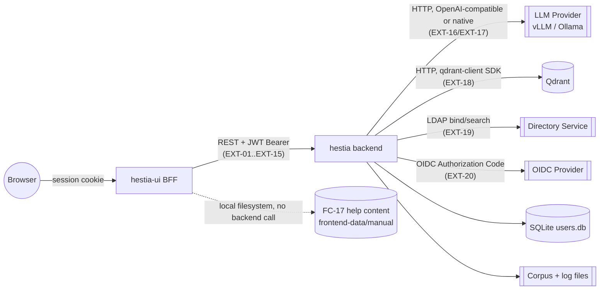
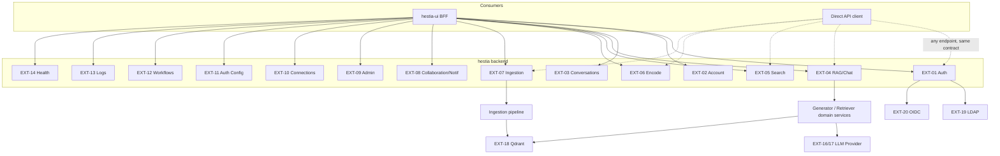
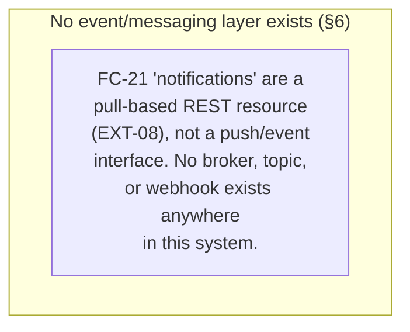
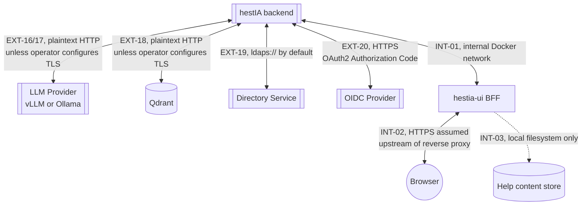
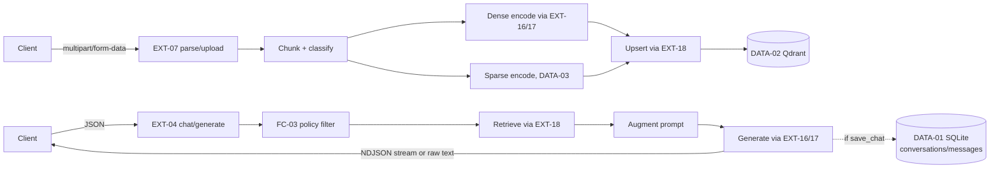

# Interface Control Document (ICD)

**Service:** hestIA API
**Version:** alpha_v0.4
**Classification:** INTERNAL
**Date:** 2026-09-09
**Issuer:** iTrust Luxembourg

Revision note: This revision brings the ICD into alignment with `docs/fad.md` alpha_v0.4 and `docs/sdd.md` alpha_v0.4. The prior version (alpha_v0.3) predated six functional areas — Tenant Collaboration Workflows (FC-20), Notification Management (FC-21), Platform Connection Administration (FC-22), Authentication and Security Configuration Administration (FC-23), Workflow Graph Administration (FC-24), and System Log Administration (FC-25) — none of which appeared in it. This revision adds all six, and additionally corrects three implementation-level claims that direct source verification found to be inaccurate: (1) there is no `{"data", "error", "meta"}` response envelope anywhere in the implementation — responses are ad hoc per endpoint; (2) conversation history is no longer bounded by a fixed `MAX_HISTORY_PAIRS` setting (that setting does not exist in code) but by a token budget derived from the active generation connection, with new streaming status/usage fields; (3) the non-streaming `/api/chat` and `/api/generate` response body is the **raw generated text**, not a JSON object, despite carrying a `Content-Type: application/json` header — confirmed directly against `hestia/handler.py` and the test suite's own assertion (`tests/unit/api/routers/test_generate.py:32`). The prior version's reference to an unauthenticated `GET /collections` health-router endpoint has also been removed: no such route exists in the current codebase.

---

## 1 Introduction

### 1.1 Purpose

This Interface Control Document describes every interface exposed by, or consumed by, hestIA: the REST API surface presented to the SvelteKit frontend and any direct API integrator, the outbound integrations to the LLM provider, vector database, and identity providers, and the data-store interfaces that back them. It is the authoritative integration reference for system integrators, frontend developers, security reviewers, and certification authorities. The implementation is the source of truth; no interface is documented here that does not exist in the current codebase, and no architecturally-intended interface is asserted to exist without a corresponding code reference.

### 1.2 Scope

**Covered:** every HTTP endpoint exposed by the `hestia` backend (FastAPI); the outbound HTTP interfaces to the LLM provider (vLLM/Ollama), Qdrant, LDAP, and an OIDC provider; the `hestia-ui` BFF proxy layer as an internal consumer of the backend API; the data-store interfaces (SQLite, Qdrant, filesystem-based corpus/log/help stores); authentication and error-handling conventions common to all of the above.

**Not covered:** internal module composition and dependency wiring (→ `docs/sdd.md`), functional behaviour and business rules (→ `docs/fad.md`), deployment topology beyond what is needed to describe an interface's reachability (→ `docs/sdd.md` §10).

**Confirmed out of scope because they do not exist:** GraphQL, gRPC, SOAP, WebSocket, any message broker (Kafka, RabbitMQ, Azure Service Bus, SQS) or event/pub-sub interface, and webhooks. A repository-wide search for each found zero matches; §6 records this explicitly rather than leaving the reader to infer it from absence.

### 1.3 References

- `docs/fad.md` — Functional Architecture Document, alpha_v0.4
- `docs/sdd.md` — Software Design Document, alpha_v0.4
- `reviews/sdd-production-readiness-review-2026-09-09.md` — prior review pass; several of its findings (plaintext secrets, transport-security gaps) are load-bearing for §8 of this document
- `GET /openapi.json` — the FastAPI-generated OpenAPI 3.x schema, the field-level authoritative source for request/response JSON Schemas; this ICD documents structure, conventions, and behaviour that the OpenAPI schema alone does not capture (streaming wire format, error taxonomy, cross-cutting authorization rules, external integrations), and defers to the OpenAPI schema for exact per-field types where the two might otherwise drift
- `hestia/api/schemas/{base,requests}.py` — Pydantic request models referenced throughout §4
- `hestia/domain/exceptions.py` — the `HestiaError` hierarchy referenced in §9
- `docs/rtm.csv` — Requirements Traceability Matrix; maps every interface in this document back to its originating MRS/SRS entry where one exists (several EXT-08/EXT-13-family interfaces do not — see `reviews/baseline-integrity-review-2026-09-09.md`)

---

## 2 System Interface Overview

hestIA is a two-tier system: a FastAPI backend (`hestia/`, port 5555) and a SvelteKit frontend (`hestia-ui/`, port 7860) that acts as a Backend-for-Frontend (BFF). The browser never calls the backend directly — every call is proxied server-side by `hestia-ui`, which attaches the session JWT from an HTTP-only cookie. Accordingly, no CORS configuration exists on the backend (§8.4 of `docs/sdd.md` explains why this is correct-by-design, not an omission).

The backend is, in turn, a client of up to four external systems, each behind a protocol adapter: an LLM provider (vLLM or Ollama, selected per connection — FC-22), a vector database (Qdrant), and one identity backend at a time (local credential store, LDAP/Active Directory, or an OIDC provider — FC-23). All four integrations are administrator-configurable at runtime (§4.4–§4.5) rather than fixed at deployment.

One functional area, Help Content Management (FC-17), is implemented entirely by `hestia-ui` against its own local filesystem store and never calls the backend at all — it is documented here as an interface specifically to record that it is *not* one that reaches the backend, since a reader auditing "every interface" should not have to independently rediscover that exclusion.



---

## 3 Interface Inventory

| ID | Interface | Provider | Consumer(s) | Protocol | Status |
|---|---|---|---|---|---|
| EXT-01 | Authentication & Session API | hestia backend | hestia-ui, direct API clients | HTTP/REST, JSON + form-urlencoded | Active |
| EXT-02 | Account Self-Service API | hestia backend | hestia-ui, direct API clients | HTTP/REST, JSON | Active |
| EXT-03 | Conversation Management API | hestia backend | hestia-ui, direct API clients | HTTP/REST, JSON | Active |
| EXT-04 | RAG Generation & Chat API | hestia backend | hestia-ui, direct API clients | HTTP/REST, JSON + streamed JSON lines | Active |
| EXT-05 | Direct Vector Search API | hestia backend | direct API clients (integrators managing their own retrieval) | HTTP/REST, JSON | Active |
| EXT-06 | Vector Encoding API | hestia backend | direct API clients | HTTP/REST, JSON | Active |
| EXT-07 | Document Ingestion & Preview API | hestia backend | hestia-ui, direct API clients | HTTP/REST, multipart/form-data | Active |
| EXT-08 | Tenant Collaboration & Notifications API | hestia backend | hestia-ui | HTTP/REST, JSON | Active |
| EXT-09 | User / Organization / Collection Administration API | hestia backend | hestia-ui | HTTP/REST, JSON | Active |
| EXT-10 | Platform Connection Administration API | hestia backend | hestia-ui | HTTP/REST, JSON | Active |
| EXT-11 | Auth & Security Configuration Administration API | hestia backend | hestia-ui | HTTP/REST, JSON | Active |
| EXT-12 | Workflow Graph Administration API | hestia backend | hestia-ui | HTTP/REST, JSON | Active |
| EXT-13 | System Log Administration API | hestia backend | hestia-ui | HTTP/REST, JSON + streamed NDJSON/CSV | Active |
| EXT-14 | Health & Readiness API | hestia backend | orchestrator/load balancer, hestia-ui, direct clients | HTTP/REST, JSON | Active |
| EXT-15 | OpenAPI Self-Description Interface | hestia backend (FastAPI) | any client, tooling | HTTP, JSON/HTML | Active |
| EXT-16 | LLM Provider Interface — vLLM | vLLM (external) | hestia backend | HTTP, OpenAI-compatible REST | Active |
| EXT-17 | LLM Provider Interface — Ollama | Ollama (external) | hestia backend | HTTP, Ollama native REST | Active |
| EXT-18 | Vector Database Interface — Qdrant | Qdrant (external) | hestia backend | HTTP, qdrant-client SDK | Active |
| EXT-19 | Directory Service Interface — LDAP | LDAP/AD (external) | hestia backend | LDAP (`ldap3`) | Active (conditional on `auth_mode=ldap`) |
| EXT-20 | Federated Identity Interface — OIDC | OIDC Provider (external) | hestia backend | HTTPS, OAuth2 Authorization Code + OIDC | Active (conditional on `auth_mode=oidc`) |
| INT-01 | hestia-ui BFF Proxy Layer | hestia backend | hestia-ui server routes | HTTP/REST, JSON (internal Docker network) | Active |
| INT-02 | Browser ↔ hestia-ui Session Interface | hestia-ui | Browser | HTTP, HTML/JSON + HTTP-only cookie | Active |
| INT-03 | FC-17 Help Content Filesystem Interface | hestia-ui | hestia-ui itself (no backend) | Local filesystem (Markdown + images) | Active — deliberately does not reach the backend |
| EVT-* | Event/messaging interfaces (Kafka, RabbitMQ, SQS, webhooks, WebSocket) | — | — | — | **Unsupported — none exist** (§6) |
| DATA-01 | Relational Data Store — SQLite `users.db` | SQLite (embedded) | hestia backend (all services) | Embedded DB file | Active |
| DATA-02 | Vector Data Store — Qdrant collections | Qdrant (external) | hestia backend (ingestion/retrieval) | Qdrant HTTP API | Active |
| DATA-03 | Sparse Corpus File Store | Local filesystem (`app_data/corpus_stats/`) | hestia backend | JSON files | Active |
| DATA-04 | Log File Store | Local filesystem (`app_data/logs/` — system.log, audit.log) | hestia backend; queried via EXT-13 | Rotated JSON-line files | Active |
| DATA-05 | Help Content File Store | Local filesystem (`frontend-data/manual/`) | hestia-ui only | Markdown + image files | Active |

No interface in this inventory is Deprecated or Planned; every row is either Active or, for the event/messaging category, explicitly Unsupported because no such interface has ever been implemented (there is nothing to deprecate).

---

## 4 External Interface Specifications

All EXT-01 through EXT-15 interfaces share the following transport-level and convention-level baseline, documented once here rather than repeated in every interface section:

**Transport:** HTTP/1.1 over TCP; the backend listens on plain HTTP (default port 5555) — TLS termination is expected at an upstream reverse proxy, which is not bundled (`docs/sdd.md` §10.2). All bodies are `application/json` unless noted (file upload endpoints use `multipart/form-data`; `POST /login` uses `application/x-www-form-urlencoded`).

**Request conventions:** an optional `X-Request-ID` header is echoed back and used for log correlation; if omitted, the server generates a UUID v4 (`hestia/infrastructure/logging/middleware.py`). UUID path parameters use standard hyphenated format.

**Response conventions — corrected from the prior ICD revision:** there is **no** unified response envelope. Each endpoint returns whatever shape its handler constructs — a bare object (`GET /account` returns the profile dict directly), a small ad hoc status object (`{"ok": true, ...}`), a list, or in the specific case of non-streaming `/api/chat`/`/api/generate`, **raw text** with a `Content-Type: application/json` header that does not reflect the actual body encoding (§4.4). Integrators must consult each endpoint's documented shape below (or the OpenAPI schema) rather than assume a common envelope.

**Conditional endpoint availability:** `/api/encode`, `/api/generate`, `/api/chat`, `/api/search`, `/api/parse`, `/api/upload`, and `/api/collections/**` are registered only when a connection exists for their backing purpose (FC-22); an inactive service's routes are simply not mounted, so requests to them return HTTP 404, not 403. Check `GET /ready` (EXT-14) to determine which are available before treating a 404 as a routing error. All other endpoint groups documented in this ICD are always mounted (`hestia/api/routers/registry.py`).

**Pagination:** most list endpoints (users, organizations, roles) return complete, unpaginated result sets. `GET /conversations` and the FC-21 notification/broadcast-history endpoints are the exceptions, using cursor-style pagination (`before_created_at`/`before_rowid`, or `limit`/`offset`) — noted per-interface below.

### 4.1 Interface: Authentication & Session API (EXT-01)

**Overview:** issues, validates, and revokes session JWTs across three mutually exclusive credential modes.

**Provider:** hestia backend (`hestia/api/routers/auth.py`).
**Consumers:** hestia-ui (`hestia-ui/src/routes/api/login*`, `api/logout`, `api/auth/callback`), any direct API client.

**Contract Definition:**

| Method & Path | Request | Response | Auth |
|---|---|---|---|
| `POST /login` | form-urlencoded `username`, `password` (OAuth2 Password flow) | `{"access_token": str, "token_type": "bearer", "must_change_pw": bool}` | None |
| `POST /logout` | none | revokes the current token's `jti`; `{"ok": true}` (verify exact shape against OpenAPI) | Bearer JWT |
| `GET /auth/oidc/authorize?redirect_uri=<uri>` | query param `redirect_uri` (validated against an optional allowlist, `OIDC_REDIRECT_ALLOWLIST`) | `{"url": str, "state": str}` (plus a PKCE verifier held server-side) | None |
| `GET /auth/oidc/logout?redirect_uri=<uri>` | query param | HTTP 302 to the provider's end-session endpoint | None |
| `POST /auth/oidc/callback` | `{"code": str, "redirect_uri": str, "state": str \| null}` | same token envelope as `/login` | None |

**Security Requirements:** `POST /login` is rate-limited by attempted **username** (not IP), configured from FC-23 settings at process start only (`docs/sdd.md` §8.5 — a saved threshold change does not reach the live limiter until restart). All three OIDC endpoints share a flat, non-configurable `10/minute` per-IP limit. JWTs are HMAC-signed (`HS256` default, restricted to an `HS256`/`HS384`/`HS512` allowlist), carry `{sub, exp, jti}`, and are validated fresh (no caching) on every subsequent protected request.

**Data Models:** token payload — `sub` (user UUID, hex), `exp` (UTC epoch), `jti` (revocation identifier).

**Error Handling:** `401` on invalid credentials or invalid/expired token; `429` on rate-limit breach; `400` if OIDC endpoints are called while `auth_mode != "oidc"`. See §9 for the full taxonomy.

**Dependencies:** `hestia/domain/auth/service.py`, `hestia/infrastructure/db/user_repository.py` (`revoked_tokens` table).

**Operational Considerations:** the `must_change_pw` flag in every login response must gate further client navigation until `PATCH /account/password` clears it (EXT-02).

**Source Evidence:** `hestia/api/routers/auth.py:21,36,84,101,122`; `hestia/api/security.py:70-133`; `hestia/api/limiter.py`.

### 4.2 Interface: Account Self-Service API (EXT-02)

**Overview:** the caller's own profile, password change, and a heartbeat used for presence and unread-notification signalling.

**Contract Definition:**

| Method & Path | Request | Response |
|---|---|---|
| `GET /account` | — | the caller's full profile object as returned by `UserService.load_user_profile` (identity, roles, org memberships, computed permissions) — **not** enveloped |
| `PATCH /account/password` | untyped dict `{"current_pw": str, "new_pw": str}` | `{"status": "ok"}` |
| `POST /account/heartbeat` | — | `{"ok": true, "unread_notifications": int}` |

**Security Requirements:** all three require a valid Bearer JWT; no additional role check. `PATCH /account/password` is audited as `admin_action` (`action="password_change"`), despite acting on the caller's own account, not another user's — noted here because it is a slightly unusual audit categorisation an integrator's log-correlation tooling should be aware of.

**Source Evidence:** `hestia/api/routers/account.py:1-40`.

### 4.3 Interface: Conversation Management API (EXT-03)

| Method & Path | Purpose | Notes |
|---|---|---|
| `GET /conversations` | list caller's conversations, paginated | cursor-style, `before_created_at`/`before_rowid` |
| `GET /conversations/{id}` | full message history for one conversation | first page response additionally carries context-budget fields (`used_tokens`, `max_tokens`, `needs_compaction`) — see EXT-04 |
| `PATCH /conversations/{id}` | rename | body carries the new title |
| `POST /conversations/{id}/compact` | explicit on-demand compaction, not subject to the automatic-compaction retained-message floor | response model `CompactOut` |
| `DELETE /conversations/{id}` | delete conversation | |
| `DELETE /conversations/{id}/messages/{message_id}` | delete one message | |

All require a Bearer JWT; ownership is enforced inside the `users` service (a request for another user's conversation is rejected, not silently scoped).

**Source Evidence:** `hestia/api/routers/conversations.py:45-139`.

### 4.4 Interface: RAG Generation & Chat API (EXT-04)

**Overview:** the core AI-assistance interface — single-turn (`generate`) and multi-turn (`chat`) completion, each optionally retrieval-augmented when a `collection` is supplied.

**Contract Definition:**

| Method & Path | Request model | Streaming? |
|---|---|---|
| `POST /api/generate` | `GenerateRequest{prompt: str, model?: str, model_kwargs?: dict, collection?: str, query_kwargs?: dict, stream: bool=false}` | per `stream` flag |
| `POST /api/chat` | `ChatRequest{conversation_id?: str, conversation_title?: str, messages: list[dict], model?: str, model_kwargs?: dict, collection?: str, query_kwargs?: dict, save_chat: bool=false, stream: bool=false, last_user_display_content?: str, last_user_attachments?: list[dict]}` | per `stream` flag |

**Non-streaming response — corrected from the prior ICD revision:** the response body is the **raw generated text as a plain string**, returned via a bare FastAPI `Response(text, media_type="application/json")` (`hestia/api/routers/{chat,generate}.py`). The `Content-Type: application/json` header does **not** mean the body is JSON-encoded — it is plain text that happens to be labelled otherwise. Confirmed directly in `hestia/handler.py`'s `resolve()` (returns `response`, a bare string, when `stream=False`) and in the test suite itself: `tests/unit/api/routers/test_generate.py:32` asserts `resp.text == "generated text"`. **Citations, conversation/message identifiers, and context-usage fields are only available via the streaming path** — a non-streaming caller that needs them must call `stream: true` and parse the final metadata line, or fetch them afterward via `GET /conversations/{id}`.

**Streaming response (`stream: true`):** a sequence of newline-delimited JSON objects (NDJSON), each terminated by `\n`:

1. Zero or one `{"status": "compacting"}` line, emitted only if automatic context-window compaction runs at the start of this turn (new since the prior ICD revision — see FAD A-07 / `docs/sdd.md` §4.3).
2. Zero or more content/reasoning fragments: `{"content": "<text>"}` or `{"thinking": "<reasoning text>"}` (the latter for models that expose a reasoning/thinking channel).
3. Exactly one final metadata line:
   ```json
   {
     "conversation_id": "<uuid>",
     "user_message_id": "<uuid>|null",
     "assistant_message_id": "<uuid>",
     "citations": [{"key": "...", "source": "...", "subject": "...", "excerpt": "..."}],
     "thinking": "<full reasoning text>|null",
     "used_tokens": <int>,
     "max_tokens": <int>,
     "needs_compaction": <bool>,
     "freed_tokens": <int, present only if a fold ran at the start of this turn>
   }
   ```
   `used_tokens`/`max_tokens`/`needs_compaction`/`freed_tokens` are new since the prior ICD revision (`hestia/handler.py:_usage_fields`) and did not exist when `MAX_HISTORY_PAIRS` was the documented (and, per this revision's verification, non-existent) history-bounding mechanism.

**Security Requirements:** Bearer JWT required; if `collection` is supplied, the FC-03 policy gate runs before any retrieval — a `DENY` decision raises `403` before the graph executes, a `FILTER` decision transparently caps retrieved classification.

**Error Handling:** `403` on policy DENY; `502` on upstream LLM failure (`ProviderError`); mid-stream provider failures are converted to a final `{"content": "\n\n⚠️ ..."}` line rather than an HTTP error, since the response has already started (`hestia/handler.py:602,610`) — a client must treat this pattern as a soft failure signal, not rely solely on HTTP status.

**Source Evidence:** `hestia/api/routers/{generate,chat}.py`; `hestia/api/schemas/requests.py:13-36`; `hestia/handler.py:266-413,505-610`.

### 4.5 Interface: Direct Vector Search API (EXT-05)

`POST /api/search` — `SearchRequest{mode: "semantic"|"keyword"|"hybrid" (aliased "dense" internally), query: list[float] | dict, collection: str, options?: dict}`. Applies the identical FC-03 access-policy filter as the RAG path but returns raw ranked chunk payloads with no prompt augmentation or generation. Requires Bearer JWT; performs an inline `can_read_collection` check (the one place this check is inline rather than via a shared `assert_*` guard — a documented inconsistency, see `docs/sdd.md` §4.7).

**Source Evidence:** `hestia/api/routers/search.py:14-20`.

### 4.6 Interface: Vector Encoding API (EXT-06)

`POST /api/encode` — `EncodeRequest{type: "dense"|"sparse", input: str, model?: str, options?: dict, collection?: str}` → `EncodeResponse{type, vector, model?, meta?}`. Dense mode returns a semantic embedding; sparse mode returns a BM25-weighted vector scored against the named collection's corpus statistics (`collection` required for sparse mode). Requires Bearer JWT.

**Source Evidence:** `hestia/api/routers/encode.py:12`; `hestia/api/schemas/requests.py:41-53`.

### 4.7 Interface: Document Ingestion & Preview API (EXT-07)

| Method & Path | Purpose | Auth |
|---|---|---|
| `POST /api/parse` | parse-only preview, no persistence; `multipart/form-data` (`file`) → `{"metadata": {...}, "markdown": str, "filename": str}` | Bearer JWT (no collection-level check — nothing is targeted yet) |
| `POST /api/upload` | ingest; `multipart/form-data` (`file`, `collection`, `tenants` (JSON-encoded list), `original_filename`, `metadata_overrides` (JSON), `language`, `selected_sheets` (JSON), `chunking_strategy`, `max_chars`, `max_depth`) → `{"ok": true, "collection": str, "source": str, "n_chunks": int, "n_upserted": int, "elapsed_ms": float}` | `assert_collection_moderator` |
| `GET /api/collections` | list collections visible to the caller | Bearer JWT, filtered by `can_read_collection` — **this is the only collections-listing endpoint; the prior ICD's reference to a separate unauthenticated `GET /collections` on the health router does not correspond to any route in the current codebase** |
| `GET /api/collections/document-counts` | per-collection counts | filtered as above |
| `GET /api/collections/{name}` | collection detail; moderators/owners see extra `tenants`/`owner_tenant` fields | filtered as above |
| `GET /api/collections/{name}/documents` | list documents in a collection | `assert_collection_moderator` |
| `DELETE /api/collections/{name}/documents` | delete document(s) | `assert_collection_moderator` |
| `PATCH /api/collections/{name}/documents` | edit document metadata — **see `KNOWN_ISSUES.md`: can null out a document's classification field, making it silently invisible to classification-filtered search** | `assert_collection_moderator` |
| `POST /api/collections/{name}/sync/diff`, `.../sync/complete` | bulk re-sync workflow | `assert_collection_moderator` |
| `DELETE /api/collections/{name}` | delete a collection | `assert_collection_moderator` |

**Source Evidence:** `hestia/api/routers/ingestion.py:83-412`; `hestia/application/ingestion.py`.

### 4.8 Interface: Tenant Collaboration & Notifications API (EXT-08) — FC-20 / FC-21

**Overview:** previously undocumented in any ICD revision. Implements the join/invite/share request lifecycle and in-app notifications. All request bodies in this interface are **untyped `dict`s** (no Pydantic schema) — the exact keys below were confirmed directly against each handler's `.get(...)` calls, not inferred from naming convention.

**Self-service (`hestia/api/routers/notifications.py`, no `/admin` prefix):**

| Method & Path | Request body | Auth |
|---|---|---|
| `GET /notifications` | — (query: `limit`, `before_created_at`, `before_rowid`) | any authenticated user |
| `POST /notifications/{id}/read` | — | any authenticated user |
| `POST /notifications/read-all` | — | any authenticated user |
| `GET /organizations/browse` | — | any authenticated user |
| `GET /organizations/{org_id}/summary` | — | `assert_org_member` |
| `POST /organizations/{org_id}/join-requests` | `{"message": str \| null}` | any authenticated user |
| `GET /account/join-requests` | — | any authenticated user |
| `GET /account/invitations` | — | any authenticated user |
| `POST /account/invitations/{id}/accept` \| `.../decline` | — | any authenticated user (invitee only, enforced in the service) |

**Moderator/admin side (`hestia/api/routers/admin.py`, `/admin` prefix):**

| Method & Path | Request body | Auth |
|---|---|---|
| `GET /admin/organizations/{org_id}/join-requests` | query `status?` | `assert_tenant_moderator` |
| `POST /admin/organizations/{org_id}/join-requests/{id}/approve` | `{"tenant_role": "moderator"\|"co-moderator"\|null, "classification_level": int}` | `assert_tenant_moderator`; role-granting approvals additionally require `assert_tenant_role_assigner` |
| `POST /admin/organizations/{org_id}/join-requests/{id}/reject` | `{"reason": str \| null}` | `assert_tenant_moderator` |
| `POST /admin/organizations/{org_id}/invitations` | `{"identifier": str, "message": str \| null}` | `assert_tenant_moderator` |
| `GET /admin/organizations/{org_id}/invitations` | — | `assert_tenant_moderator` |
| `POST /admin/organizations/{org_id}/invitations/{id}/cancel` | — | `assert_tenant_moderator` |
| `POST /admin/organizations/{org_id}/share-requests` | `{"target_org_id": int, "message": str \| null}` | `assert_tenant_moderator` |
| `GET /admin/organizations/{org_id}/share-requests` | query `direction: "incoming"\|"outgoing"` | `assert_tenant_moderator` |
| `POST /admin/organizations/{org_id}/share-requests/{id}/approve` | `{"collections": [{"collection_id": str, "max_classification": int \| null}, ...]}` | `assert_tenant_moderator`; also revalidates the request's `target_org_id == org_id` server-side |
| `POST /admin/organizations/{org_id}/share-requests/{id}/reject` | `{"reason": str \| null}` | `assert_tenant_moderator` |
| `POST /admin/notifications/broadcast` | `{"title": str, "body": str \| null, "link": str \| null}` → `{"ok": true, "notification_id": str}` | `assert_admin` |
| `GET /admin/notifications/history` | query `limit`, `before_created_at`, `before_rowid` | `assert_admin` |
| `GET /admin/notification-settings` \| `PUT` | `{"welcome_title": str, "welcome_body": str}` | `assert_admin` |

**Concurrency semantics:** each organisation permits at most one active `moderator` tenant role holder at a time, enforced both by a service-level pre-check and an in-transaction re-check (`ModeratorConflictError` → `409`-equivalent `ValidationError`) across join-request approval, share-request approval, and invitation acceptance.

**Error Handling:** `503` if the `notifications` service is not wired (its router is always mounted regardless of service gating, but is functionally inert without it); `409`-equivalent on moderator-uniqueness conflicts; `403` from the various `assert_*` guards.

**Source Evidence:** `hestia/api/routers/notifications.py`; `hestia/api/routers/admin.py:415-648`; `hestia/domain/notifications/service.py`; `hestia/infrastructure/db/user_repository.py` (collaboration tables, §7.1).

### 4.9 Interface: User / Organization / Collection Administration API (EXT-09)

Legacy admin surface, largely unchanged since the prior ICD revision. Typed request models exist for user/org creation (`CreateUserRequest`, `CreateOrgRequest`, `UpdateOrgRequest` — `hestia/api/schemas/requests.py:70-89`); membership, classification, role, and collection-grant mutations remain untyped `dict` bodies (`{"level": int}` for classification, `{"role": "moderator"|"co-moderator"|null}` for tenant role, `{"role": "owner"|"access", "max_classification": int|null}` for collection grants, `{"name": str, "owner_org_id": int|null}` for collection creation). Authorization is the `assert_admin` / `assert_admin_or_moderator` / `assert_tenant_moderator` / `assert_tenant_role_assigner` / `assert_collection_moderator` family (`docs/sdd.md` §4.7).

**Source Evidence:** `hestia/api/routers/admin.py:49-411,646`.

### 4.10 Interface: Platform Connection Administration API (EXT-10) — FC-22

**Overview:** previously undocumented. Manages backend connections for generation/embedding/reranking/vector-database purposes, with live activation.

| Method & Path | Request model | Notes |
|---|---|---|
| `GET /admin/llm/connections` | — | list all |
| `POST /admin/llm/connections` | `LLMConnectionCreateRequest{purpose, backend_type, base_url, api_key?}` | `purpose`/`backend_type` fixed at creation, immutable thereafter (delete+recreate to change) |
| `POST /admin/llm/connections/test` | `LLMConnectionTestRequest{backend_type, base_url, api_key?, connection_id?}` | builds a throwaway provider, probes `.models`/`.collections`; nothing persisted |
| `PUT /admin/llm/connections/{id}` | `LLMConnectionUpdateRequest{base_url, api_key?, model, params, compaction_enabled, compaction_model?, compaction_context_window?, compaction_summary_length?}` | live-rewires the running provider in place (`container.apply_connection_update`) — no restart |
| `DELETE /admin/llm/connections/{id}` | — | `container.apply_connection_delete` |
| `POST /admin/llm/connections/{id}/activate` | — | deactivates sibling connections for the same purpose first |
| `GET /admin/llm/connections/{id}/models` | — | live model list; doubles as a post-save connectivity check |

**Security Requirements:** `assert_admin` on every endpoint, no exceptions. `api_key` is never returned by `GET`/list responses (only a derived `has_api_key: bool`); stored in plaintext in `llm_connections.api_key` (see §8.5).

**Source Evidence:** `hestia/api/routers/llm_settings.py`; `hestia/api/schemas/requests.py:97-128`; `hestia/container.py:171-207,237-250`; `hestia/infrastructure/db/llm_settings_repository.py`.

### 4.11 Interface: Auth & Security Configuration Administration API (EXT-11) — FC-23

| Method & Path | Request model | Notes |
|---|---|---|
| `GET /admin/auth/settings` | — | secrets masked (`has_token_secret_key`/`has_oidc_client_secret`/`has_ldap_bind_password` booleans replace the values) |
| `PUT /admin/auth/settings` | `AuthSettingsUpdateRequest` (auth mode, password policy, token signing, LDAP config, OIDC config — full field list in `hestia/api/schemas/requests.py:156-185`) | live-rebuilds and atomically swaps the auth/user/notification service stack (`container.apply_auth_update`); a blank/omitted secret field means "keep existing"; changing `auth_mode` or `token_secret_key` invalidates every previously issued token on its next use (no bulk-revoke pass — relies on signature verification naturally failing) |
| `POST /admin/auth/settings/test` | `AuthSettingsTestRequest` | `local` → always `{"ok": true}`; `ldap` → real service-account bind against the supplied (not-yet-saved) values; `oidc` → plain unauthenticated `GET` on the provider URL (connectivity only, no code exchange — cannot validate client credentials or redirect URI) |

**Security Requirements:** `assert_admin` on every endpoint. See §8.5 for the plaintext-secret-storage caveat and §8.6 for the rate-limiter-drift caveat (a saved `max_failed_attempts`/`lockout_duration_minutes` change does not reach the live login rate limiter until process restart).

**Source Evidence:** `hestia/api/routers/auth_settings.py`; `hestia/api/schemas/requests.py:156-204`; `hestia/container.py:209-235`; `hestia/infrastructure/db/auth_settings_repository.py`.

### 4.12 Interface: Workflow Graph Administration API (EXT-12) — FC-24

| Method & Path | Request model | Notes |
|---|---|---|
| `GET /admin/workflows` | — | lists every live workflow YAML under `app_data/templates/workflows/`, flagging `is_builtin` and `is_custom` (live text differs from the shipped default, or no shipped default exists) |
| `POST /admin/workflows` | `WorkflowCreateRequest{name, yaml_text?}` | `name` validated against `^[A-Za-z0-9_-]{1,64}$` before being used as a filename; omitted `yaml_text` seeds a minimal starter graph |
| `PUT /admin/workflows/{exec_type}` | `WorkflowUpdateRequest{yaml_text}` | validated via `validate_workflow_graph` (fixed 6-node vocabulary, single linear chain) before being written; invalidates the template cache so the change is live on the next request |
| `DELETE /admin/workflows/{exec_type}` | — | resets to the shipped default if one exists (built-in graph), otherwise hard-deletes a custom graph |

**Security Requirements:** `assert_admin`, plus the independent YAML-graph validation above (a rejected graph is never persisted regardless of role).

**Source Evidence:** `hestia/api/routers/workflow_settings.py`; `hestia/api/schemas/requests.py:139-147`; `hestia/domain/rag/graph.py:137-238`; `hestia/domain/rag/template_sync.py`.

### 4.13 Interface: System Log Administration API (EXT-13) — FC-25

| Method & Path | Request | Response |
|---|---|---|
| `GET /admin/logs` | query `log_type: "system"\|"audit"`, `level?`, `search?`, `since?`, `until?`, `limit≤500`, `offset?` | paginated JSON log entries |
| `GET /admin/logs/export` | same filters + `format: "ndjson"\|"csv"` | `StreamingResponse`, `media_type` = `application/x-ndjson` or `text/csv` |
| `GET /admin/logs/settings` | — | `{"log_level": str, "log_dir": str, "log_to_console": bool}` |
| `PUT /admin/logs/settings` | `LogSettingsUpdateRequest{log_level: str}` | mutates the live handler level only — **not persisted**, reverts to the `LOG_LEVEL` env var on next restart |

**Security Requirements:** `assert_admin` on every endpoint. `GET /admin/logs` (plain query) is **not** audited; `GET /admin/logs/export` and `PUT /admin/logs/settings` **are** audited as `admin_action` (`logs_export`, `log_level_change`). Audit-log verbosity is fixed at INFO regardless of any change made here.

**Source Evidence:** `hestia/api/routers/logs.py`; `hestia/api/schemas/requests.py:133-134`; `hestia/infrastructure/logging/query.py`; `hestia/infrastructure/logging/config.py:161-176`.

### 4.14 Interface: Health & Readiness API (EXT-14)

| Method & Path | Auth | Response |
|---|---|---|
| `GET /health` | None | `{"ok": true, "status": "up"}` — pure liveness, no container access |
| `GET /ready` | None | `{"ok": true, "status": "ready", "services": [...], "providers": [...]}` — reveals which optional services/providers are wired; treat presence/absence of a service name as the conditional-availability signal referenced throughout §4 |
| `GET /models` | None | the active LLM provider's model list; **throws an uncaught `KeyError` → generic HTTP 500** if no generation/embedding connection is configured, rather than a clean 503 — integrators should not assume a clean error shape here |

**Security Requirements:** none — all three are unauthenticated by design, for orchestrator/load-balancer use. `/ready`'s service/provider listing is a minor, accepted information-disclosure surface (`docs/sdd.md` §5.4/§12.2).

**Source Evidence:** `hestia/api/routers/health.py:14-34`.

### 4.15 Interface: OpenAPI Self-Description Interface (EXT-15)

`GET /openapi.json` (full schema), `GET /docs` (Swagger UI), `GET /redoc` (ReDoc). No custom OpenAPI document is committed to the repository — this is FastAPI's default auto-generated schema, unauthenticated. Integrators should treat it as authoritative for exact per-field JSON Schema types, and `info.version` as the sole machine-readable version signal (§10).

### 4.16 Interface: LLM Provider Interface — vLLM (EXT-16)

**Overview:** an OpenAI-compatible HTTP client used for generation, chat, and embedding when a connection's `backend_type = "openai"` (the vLLM-facing adapter targets an OpenAI-compatible surface, hence the `backend_type` naming).

**Contract Definition:** `POST /v1/completions`, `POST /v1/chat/completions`, `POST /v1/embeddings`, `GET /v1/models` against the connection's `base_url`. Streaming uses server-sent chunked responses parsed incrementally.

**Authentication:** `Authorization: Bearer <api_key>` when the connection defines one; otherwise unauthenticated.

**Retry/Timeout Behaviour:** `hestia/infrastructure/http/client.py` — a blocking (ingestion) path retries up to 3 times with exponential backoff plus jitter on HTTP `429`/`503` (honouring a `Retry-After` header when present); the interactive (chat/generate/embed) path retries **once**, only on a dropped/reset connection (`ConnectError`/`ReadError`), not on timeouts or HTTP error statuses — a deliberate choice documented in code as covering a known failure mode where a pooled keep-alive connection is silently killed by an intermediate proxy. Default timeout: `(10.0, 800.0)` seconds (connect, read).

**Failure Handling:** surfaced to the caller as `ProviderError` (`HTTP 502`).

**Security Requirements:** transport encryption is not enforced — whatever scheme the connection's `base_url` specifies is used as-is (`docs/sdd.md` §8.7). The API key is stored in plaintext in `llm_connections.api_key` (§8.5).

**Source Evidence:** `hestia/infrastructure/llm/vllm.py`; `hestia/infrastructure/http/client.py`.

### 4.17 Interface: LLM Provider Interface — Ollama (EXT-17)

Native Ollama HTTP API (`backend_type = "ollama"`); chunked-transfer streaming. Same `HttpClient` retry/timeout/security posture as EXT-16.

**Source Evidence:** `hestia/infrastructure/llm/ollama.py`.

### 4.18 Interface: Vector Database Interface — Qdrant (EXT-18)

**Overview:** the sole vector-database backend supported (`backend_type = "qdrant"`, `Settings.db_backend` accepts no other value). Collections are created lazily on first ingest with named dense + sparse vector configurations; upserts are batched (64 points/request); retrieval supports dense-only, sparse-only, or hybrid (reciprocal-rank-fusion by default, distribution-based fusion as a configurable alternative) with classification-level payload filters applied as hard constraints.

**Authentication:** optional bearer API key (`DB_API_KEY` bootstrap / connection `api_key`), stored in plaintext.

**Failure Handling:** `ProviderError` → `502`.

**Source Evidence:** `hestia/infrastructure/db/qdrant.py`; `hestia/container.py:193-207`.

### 4.19 Interface: Directory Service Interface — LDAP (EXT-19)

`ldap3`-based service-account bind, user search, and credential verification. Group membership is fetched at each login (not cached — a directory-side group change only takes effect on the user's next login) and mapped to internal roles via `ldap_group_mapping`. First-time login auto-provisions a local shadow account.

**Security Requirements:** TLS (`ldaps://`) is configurable (`ldap_use_ssl`, default `true`) with optional certificate validation (`ldap_validate_cert`, default `true`) — this is the one external integration where encrypted transport is the documented default, unlike EXT-16/17/18 (§8.6). Bind password stored in plaintext in `auth_settings.ldap_bind_password`.

**Source Evidence:** `hestia/domain/auth/users.py`; `hestia/api/schemas/requests.py:175-185`.

### 4.20 Interface: Federated Identity Interface — OIDC (EXT-20)

OAuth2 Authorization Code flow with PKCE (`hestia/domain/auth/oidc.py`). Claim-to-role/org mapping is configurable (`oidc_role_claim`/`oidc_role_mapping`, `oidc_org_claim`/`oidc_org_mapping`). First-time login auto-provisions a local account. The platform does not perform autonomous IdP discovery — provider configuration must be supplied by an administrator (FAD A-15). **State-parameter validation is the integrating client's responsibility**, not the backend's, per FAD A-11 — confirmed unchanged from the prior ICD revision.

**Source Evidence:** `hestia/domain/auth/oidc.py`; `hestia/api/routers/auth.py:84-141`; `hestia/api/schemas/requests.py:166-173,188-204`.

---

## 5 Internal Interface Specifications

### 5.1 Interface: hestia-ui BFF Proxy Layer (INT-01)

**Overview:** every `hestia-ui` server route under `src/routes/api/**` is a thin, mostly 1:1 passthrough to a corresponding EXT-xx backend endpoint, implemented via two shared helpers.

**Contract Definition:** `backendFetch(path, token, init)` (`hestia-ui/src/lib/server/backend.ts`) attaches `Authorization: Bearer <token>` when a session token is present and calls `PRIVATE_MICROSERVICE_URL` (the sole consumer of that env var). `proxyResponse(upstream)` passes 2xx/4xx bodies through largely as-is, **except**: it flattens FastAPI's structured 422 `detail: [{loc, msg, type}, ...]` array into a single display string (since the frontend's toast UI assumes `detail` is plain text), and it masks any `>=500` upstream body behind a generic `{"detail": "An internal error occurred."}` while logging the real error server-side only. `proxyBinaryResponse(upstream)` forwards `content-type`/`content-disposition` for file/binary downloads (used by EXT-13's log export).

**Security Requirements:** `src/hooks.server.ts` applies a defense-in-depth guard on `/api/admin/*` (requires `is_admin` or a non-empty `moderated_tenants`) — explicitly documented in its own code comment as a secondary check, not the real enforcement boundary, which is the backend's `assert_*` guard family (§4, `docs/sdd.md` §4.7).

**Source Evidence:** `hestia-ui/src/lib/server/backend.ts`; `hestia-ui/src/hooks.server.ts:23-41`; `hestia-ui/src/routes/api/**`.

### 5.2 Interface: Browser ↔ hestia-ui Session Interface (INT-02)

**Overview:** the browser never holds the JWT directly. `hestia-ui` issues an HTTP-only `token` cookie on successful login (`SameSite=Lax`, the only CSRF mitigation in the system besides the OIDC-specific `state`/PKCE cookie check on the callback route). `src/hooks.server.ts` hydrates `locals.user` on every request by calling `GET /account` (EXT-02) server-side. Client-side, `src/lib/auth/session.ts` independently schedules a logout at token expiry and after half the token lifetime of inactivity — a UX layer, not a security boundary, since the backend enforces JWT expiry regardless.

**Security Requirements:** `X-Content-Type-Options: nosniff` and `X-Frame-Options: DENY` are set on every response; no CSP, HSTS, Referrer-Policy, or Permissions-Policy header is present.

**Source Evidence:** `hestia-ui/src/hooks.server.ts:1-49`; `hestia-ui/src/lib/auth/session.ts`; `hestia-ui/src/routes/api/login/+server.ts`.

### 5.3 Interface: FC-17 Help Content Filesystem Interface (INT-03)

**Overview:** documented here specifically to record that it is **not** a backend interface. Help content (Markdown sections + images) lives entirely on `hestia-ui`'s own filesystem at `PRIVATE_HELP_DATA_DIR` (deployed as `./frontend-data/manual`, its own Docker volume, wholly separate from the backend's `app/data`). The sole write-authorization check, `requireAdmin` (`hestia-ui/src/lib/server/help/auth.ts`), inspects only the already-hydrated `locals.user.permissions.is_admin` boolean from session hydration (INT-02) — **no backend call is made**, so no backend policy re-check and no backend audit entry (EXT-13/`hestia.audit`) are ever produced for a help-content write.

**Contract Definition:** `GET/PUT/DELETE /api/help/{section}`, `GET/POST /api/help/images`, `GET/PATCH/DELETE /api/help/images/{filename}` — all served entirely within `hestia-ui`, never proxied to the backend.

**Security Requirements:** filename/path-traversal guard, file-extension allowlist (png/jpg/jpeg/gif/webp), 10 MB upload cap, client-side DOMPurify sanitisation of rendered Markdown — present despite this interface's bypass of every backend control.

**Source Evidence:** `hestia-ui/src/lib/server/help/{sections,images,auth,paths}.ts`; `hestia-ui/src/routes/api/help/**`; `frontend-data/manual/`.

---

## 6 Event and Messaging Interfaces

**None exist.** A repository-wide, case-insensitive search for WebSocket, GraphQL, gRPC, Kafka, RabbitMQ/AMQP, SQS, Azure Service Bus, Celery, and Redis across `hestia/`, `hestia-ui/src`, both requirements files, `hestia-ui/package.json`, and `docker-compose.yml` returned zero matches. There is no publish/subscribe mechanism, no message queue, no event stream, and no webhook — inbound or outbound — anywhere in the system. FC-21's "notifications" are an in-app, pull-based REST resource (EXT-08: `GET /notifications`, polled by the frontend's heartbeat/inbox stores), not a push/event interface, and should not be confused with one. This section exists to state that absence explicitly, per the ICD template's requirement to document (or rule out) event interfaces, rather than leave it to be inferred from the lack of a §6 entry.

---

## 7 Data Interfaces

### 7.1 Interface: Relational Data Store — SQLite `users.db` (DATA-01)

**Overview:** the single authoritative store for accounts, roles, organisations, memberships, collection grants, conversations/messages, collaboration requests (FC-20), notifications (FC-21), and — since FC-22/23 — backend connection and auth/security configuration. No ORM; raw SQL with positional parameters; WAL journal mode; an in-process write-serialising lock plus a bounded-retry `with_txn` wrapper.

**Provider:** embedded SQLite file at `app_data/users.db` (mounted volume, per `docs/sdd.md` §10). **Consumer:** every backend domain service, via `hestia/infrastructure/db/user_repository.py` and the three FC-22/23/21 sibling repositories.

**Schema summary:** see `docs/sdd.md` §6.1 for the full table list; this ICD does not duplicate it, consistent with the ICD's stated non-goal of documenting internal schemas beyond what integration requires. The interface-relevant fact is that `llm_connections.api_key`, `auth_settings.token_secret_key`/`.oidc_client_secret`/`.ldap_bind_password` are stored in **plaintext** (§8.5) — any integrator or auditor granted filesystem access to this store gains those credentials.

**Concurrency guarantees enforced at the SQL level:** partial unique indexes for "at most one active connection per purpose" (`llm_connections`) and "at most one pending request per pair" (join/share/invitation tables); every approve/reject repository method conditions its update on `WHERE status='pending'`, returning a no-op rather than raising on a concurrent double-resolution.

**Source Evidence:** `hestia/infrastructure/db/{user_repository,llm_settings_repository,auth_settings_repository,notification_settings_repository}.py`.

### 7.2 Interface: Vector Data Store — Qdrant Collections (DATA-02)

One Qdrant collection per document collection; one point per chunk, carrying a named dense vector, a named sparse vector, and a payload (content, source/document identifiers, section/position metadata, classification level, prev/next adjacency links). Payload indexes exist on document identifier and classification level. Consumed exclusively through EXT-18's adapter — no direct Qdrant access is exposed to any client of hestIA; EXT-05/EXT-06 are the closest external surfaces, and both still pass through the backend's policy and encoding layers.

**Source Evidence:** `hestia/infrastructure/db/qdrant.py`; `docs/sdd.md` §6.2.

### 7.3 Interface: Sparse Corpus File Store (DATA-03)

Per-collection JSON files under `app_data/corpus_stats/{name}.json`, holding BM25 vocabulary/document-frequency statistics, loaded into an in-process cache at startup. Writes are plain `open(...,"w")` + `json.dump`, guarded by an in-process lock only — **no atomic write** (tempfile+rename or fsync), an unchanged limitation from the prior ICD/SDD revisions. Consumed only by EXT-06/EXT-07's sparse-encoding path; never exposed directly to any external client.

**Source Evidence:** `hestia/domain/rag/services.py:135-277,380+`.

### 7.4 Interface: Log File Store (DATA-04)

`app_data/logs/system.log` (size-rotated, 10 MB × 5 backups) and `app_data/logs/audit.log` (daily-rotated, 90-day retention), both structured JSON lines, correlation-ID-stamped. Read (not written) externally via EXT-13's query/export endpoints, which load the matching file set into memory, filter, and paginate/stream — explicitly not built to scale past a modest log volume per its own code comments.

**Source Evidence:** `hestia/infrastructure/logging/{config,query}.py`.

### 7.5 Interface: Help Content File Store (DATA-05)

Markdown files (one per help section) plus an `images/` subdirectory, at `hestia-ui`'s `PRIVATE_HELP_DATA_DIR`. See INT-03 (§5.3) — this store is never reached by the backend and has no interface to it.

**Source Evidence:** `hestia-ui/src/lib/server/help/paths.ts`; `frontend-data/manual/`.

---

## 8 Authentication and Security

### 8.1 Token Properties

| Property | Value |
|---|---|
| Token type | JWT, signed only (not encrypted) |
| Default signing algorithm | HS256 (FC-23-configurable; restricted at verification time to an `HS256`/`HS384`/`HS512` allowlist regardless of configuration, defending against `alg`-confusion attacks) |
| Default lifetime | 360 minutes (FC-23-configurable) |
| Payload claims | `sub` (user UUID, hex), `exp` (UTC epoch), `jti` (revocation identifier — **new since the prior ICD revision**) |
| Refresh token | Not issued |
| Revocation | `POST /logout` revokes the presenting token's `jti` only (server-side check against `revoked_tokens` on every subsequent request) — **corrects the prior ICD revision's implicit assumption that no revocation exists; other sessions for the same user remain valid until their own expiry, which is by design, not an oversight** |

### 8.2 System Roles and Tenant Roles

Unchanged from the prior ICD revision: system roles `admin`/`user` (exactly two, no custom roles); tenant roles `moderator`/`co-moderator`/null-member; at most one `moderator` per organisation, enforced at the SQL level (partial unique index) and in application code (§4.8).

### 8.3 Collection Access Control

Unchanged: two-layer model (tenant grant with optional `max_classification` cap; per-membership `classification_level` 0–4), effective ceiling = `min(user_level, grant_cap)` when a cap exists, highest-wins across multiple memberships granting the same collection. Classification labels: 0 PUBLIC, 1 INTERNAL, 2 RESTRICTED, 3 CONFIDENTIAL, 4 SECRET — confirmed against the authoritative `Classification` enum (`hestia/domain/rag/classification.py`), which is what actually performs label→level resolution (a separate, unused `Settings.classification_labels` list exists with an inconsistent ordering and no live consumer — a latent maintainability risk, not a behavioural discrepancy; see `docs/sdd.md` §12.2).

### 8.4 Endpoint Authorization Summary

| Endpoint Group | Minimum Requirement |
|---|---|
| `/health`, `/ready`, `/models`, `GET /openapi.json`, `/docs`, `/redoc` | None (unauthenticated) |
| `/login`, `/auth/oidc/**` | None (authentication endpoints) |
| `/account/**`, `/conversations/**`, `/notifications/**` (self-service), `/organizations/browse`, `/api/**` | Any authenticated user |
| `/admin/users/**`, `/admin/roles`, `/admin/llm/**`, `/admin/auth/**`, `/admin/workflows/**`, `/admin/logs/**` | `admin` system role |
| `/admin/organizations` (list), `/admin/collections/create` | `admin` or any tenant moderator |
| `/admin/organizations/{id}/**` (management, collaboration workflows) | `admin` or moderator of the specified org |
| `/api/upload`, collection deletion/document management | `admin` or moderator of the collection's owner org |

### 8.5 Secrets Management

Values that must be supplied via environment variables (bootstrap) and never committed: `AUTH_SECRET_KEY`, `LLM_API_KEY`, `DB_API_KEY`, `OIDC_CLIENT_SECRET`, `LDAP_APP_DN`/`LDAP_APP_PASSWORD` (unchanged from the prior ICD revision). **New finding this revision:** after first boot, the operative values for auth signing key, OIDC client secret, LDAP bind password, and every connection's API key are read from SQLite (FC-22/23), not the environment, and are stored there in **plaintext** with no field-level encryption or external secrets-manager integration. Masking is applied only at the API response boundary (`has_*` boolean flags replace secret values on `GET`), never at rest. See `docs/sdd.md` §8.4 for full detail; this ICD flags it because it is directly relevant to any integrator or operator who will hold filesystem or backup access to `users.db`.

### 8.6 Known Security-Relevant Gaps Affecting Integrators

- **Rate-limiter/config drift (FC-23):** a saved change to `max_failed_attempts`/`lockout_duration_minutes` takes effect in the account-lockout logic immediately but not in the HTTP-level login rate limiter until process restart. An integrator load-testing or tuning around login throttling should be aware the two can disagree for the life of a process.
- **Transport encryption is not enforced** for backend→LLM/Qdrant links (EXT-16/17/18); it **is** configurable and defaults on for LDAP (EXT-19, `ldap_use_ssl=true`). OIDC (EXT-20) inherently requires the provider's own HTTPS endpoint per the OAuth2/OIDC specification, so it is not a comparable gap.
- **No CORS is configured**, and this is correct given the BFF topology (§2) — not something an integrator building a browser-based client against the backend directly should expect to be added; direct browser access to the backend origin is not a supported integration pattern.

---

## 9 Error Handling Standards

### 9.1 Standard Error Format

No unified custom error envelope exists; the shape depends on the error's source, unchanged from the prior ICD revision:

**Domain errors (`HestiaError` subclasses, `hestia/domain/exceptions.py`):** `{"detail": "<message>"}`, status code fixed per subclass:

| Exception | Status |
|---|---|
| `AuthError` | 401 |
| `ForbiddenError` | 403 |
| `NotFoundError` | 404 |
| `ValidationError` | 400 |
| `ProviderError` (upstream LLM/vector-DB failure) | 502 |
| `ConfigurationError` (missing/invalid server config) | 500 |
| plain `HestiaError` (base) | 500 |

**FastAPI validation errors (422):** `{"detail": [{"loc": [...], "msg": "...", "type": "..."}]}`.

**Uncaught `KeyError`:** mapped to a generic 500 (`_key_error_handler`) — treated as a programmer error rather than a 404, even where the missing key logically corresponds to "not found" (e.g. `GET /models` with no configured provider, §4.14). Integrators should not infer resource-existence from a 500 in this system.

**Uncaught `PermissionError`/`ValueError`/any other `Exception`:** 403 / 400 / 500 respectively, as safety-net handlers for anything escaping the expected `HestiaError` taxonomy.

The `X-Request-ID` header is always present and should be logged by integrators for server-side correlation.

### 9.2 Common Errors Table

| HTTP Code | Meaning | When It Occurs |
|---|---|---|
| 400 | Invalid input | Malformed body, invalid field values, OIDC endpoints called while `auth_mode != oidc` |
| 401 | Authentication failure | Missing/expired JWT, invalid signature, revoked `jti`, unknown user |
| 403 | Authorization failure | Insufficient system/tenant role, FC-03 policy DENY, no collection access |
| 404 | Not found | Endpoint not registered (service inactive, §4 baseline), unknown resource ID |
| 409-equivalent | State conflict | `ModeratorConflictError` — a second moderator assignment attempted for an organisation that already has one |
| 413 | Upload too large | Enforced at the SvelteKit/reverse-proxy layer (`BODY_SIZE_LIMIT`), not in the Python API |
| 422 | Schema validation failure | Missing/invalid fields against a typed Pydantic request model |
| 429 | Rate limit exceeded | Login (by username) or OIDC endpoints (by IP) |
| 500 | Unexpected server error | Unhandled exception, `KeyError`, missing configuration |
| 502 | Upstream provider error | LLM provider or Qdrant unreachable/erroring |
| 503 | Dependent service unavailable | FC-20/21 endpoints when the `notifications` service isn't wired |

---

## 10 Interface Versioning Strategy

No formal API versioning scheme exists: no URI path version (`/v1/...` — note this pattern *does* appear, but only in the outbound vLLM adapter's OpenAI-compatible paths, EXT-16, which is unrelated to hestIA's own API versioning), no media-type versioning, no deprecation policy. The deployed version is declared in FastAPI application metadata (`GET /openapi.json` → `info.version`); integrators should monitor this field as the sole change-detection mechanism. The system is at an alpha development stage; breaking changes may occur between releases without prior notice (FAD A-10). This is a corrected continuation of the prior ICD revision's own statement, still accurate — no versioning capability has been added since.

---

## 11 Operational Requirements

### 11.1 Monitoring

`GET /health` (liveness) and `GET /ready` (readiness, service/provider availability) are the operator-facing monitoring surface; both are unauthenticated and intended for orchestrator/load-balancer probes.

### 11.2 Logging

Every request is stamped with a correlation ID (`X-Request-ID`, client-supplied or server-generated) that appears in every log record emitted during that request's lifecycle, across every backend module. Structured JSON logging is queued and written by a background listener thread so logging I/O never blocks request handling.

### 11.3 Observability

No distributed tracing or metrics-export endpoint exists. `/ready`'s service/provider listing is the closest thing to a dependency-health signal, and is coarse (registered-at-some-point, not verified-reachable-now). EXT-13 (System Log Administration) is the only queryable observability surface beyond raw log files, and its own code documents that it is not built to scale past a modest log volume.

---

## 12 Traceability Matrix

| Interface | FAD Component | SDD Component | Implementation Location |
|---|---|---|---|
| EXT-01 Authentication & Session | FC-02 | §4.4 Authentication Service | `hestia/api/routers/auth.py`, `hestia/domain/auth/` |
| EXT-02 Account Self-Service | FC-02, FC-21 | §4.4, §4.8 | `hestia/api/routers/account.py` |
| EXT-03 Conversation Management | FC-10 | §3.1 Knowledge Management | `hestia/api/routers/conversations.py` |
| EXT-04 RAG Generation & Chat | FC-04, FC-05, FC-07, FC-08, FC-09, FC-10 | §4.3 Request Handler, §4.6 Workflow Engine | `hestia/api/routers/{generate,chat}.py`, `hestia/handler.py` |
| EXT-05 Direct Vector Search | FC-12 | §3.1 Knowledge Management | `hestia/api/routers/search.py` |
| EXT-06 Vector Encoding | FC-13 | §3.1 | `hestia/api/routers/encode.py` |
| EXT-07 Document Ingestion & Preview | FC-06, FC-11 | §4.9 Ingestion Pipeline | `hestia/api/routers/ingestion.py`, `hestia/application/ingestion.py` |
| EXT-08 Tenant Collaboration & Notifications | FC-20, FC-21 | §4.8 Notification Service | `hestia/domain/notifications/service.py`, `hestia/api/routers/{notifications,admin}.py` |
| EXT-09 User/Org/Collection Admin | FC-14, FC-15, FC-16 | §4.7 Authorization Guards | `hestia/api/routers/admin.py` |
| EXT-10 Platform Connection Admin | FC-22 | §4.2 Container (live rewiring) | `hestia/api/routers/llm_settings.py`, `hestia/container.py` |
| EXT-11 Auth/Security Config Admin | FC-23 | §4.2 Container (live rewiring) | `hestia/api/routers/auth_settings.py`, `hestia/container.py` |
| EXT-12 Workflow Graph Admin | FC-24 | §4.6 Workflow Engine | `hestia/api/routers/workflow_settings.py`, `hestia/domain/rag/{graph,template_sync}.py` |
| EXT-13 System Log Admin | FC-25 | §11.2 Logging | `hestia/api/routers/logs.py`, `hestia/infrastructure/logging/query.py` |
| EXT-14 Health & Readiness | FC-19 | §5.4 | `hestia/api/routers/health.py` |
| EXT-15 OpenAPI Self-Description | — (FastAPI framework capability, not an FC) | — | FastAPI auto-generated |
| EXT-16/17 LLM Provider | FC-09 (also FC-06/13 via encoding) | §7.1 LLM Provider | `hestia/infrastructure/llm/{vllm,ollama}.py` |
| EXT-18 Vector Database | FC-07 (also FC-06) | §7.2 Vector Database | `hestia/infrastructure/db/qdrant.py` |
| EXT-19 Directory Service | FC-02 | §7.3 Identity Provider | `hestia/domain/auth/users.py` |
| EXT-20 Federated Identity | FC-02 | §7.3 Identity Provider | `hestia/domain/auth/oidc.py` |
| INT-01 hestia-ui BFF Proxy | — (SDD §4.10) | §4.10 SvelteKit Frontend | `hestia-ui/src/lib/server/backend.ts` |
| INT-02 Browser↔hestia-ui Session | — (SDD §4.10) | §4.10 | `hestia-ui/src/hooks.server.ts` |
| INT-03 FC-17 Help Content | FC-17 | §4.10 (FC-17 subsection) | `hestia-ui/src/lib/server/help/` |
| DATA-01 SQLite | FC-02, FC-10, FC-14–FC-25 (User Store) | §6.1 Data Model | `hestia/infrastructure/db/*_repository.py` |
| DATA-02 Qdrant | FC-06, FC-07 | §6.2 Vector Store | `hestia/infrastructure/db/qdrant.py` |
| DATA-03 Sparse Corpus | FC-06, FC-13 | §6.3 | `hestia/domain/rag/services.py` |
| DATA-04 Log Files | FC-18, FC-25 | §6, §11.2 | `hestia/infrastructure/logging/` |
| DATA-05 Help Content Files | FC-17 | §4.10 | `frontend-data/manual/` |

**Missing implementations:** none found — every FAD functional component that implies an interface (FC-02 through FC-25, excluding purely internal ones like FC-03/FC-05 which are enforcement/orchestration logic rather than interfaces in their own right) has a corresponding row above.

**Undocumented interfaces found during this revision that the prior ICD omitted:** EXT-08 through EXT-13 (all six FC-20–25 areas) in their entirety; the `jti`-based logout revocation mechanism within EXT-01; the `status: "compacting"` and usage-metadata fields within EXT-04's streaming contract; INT-03 as an explicit non-backend interface.

**Deprecated interfaces:** none. No interface found in the codebase carries a deprecation marker, a version-sunset header, or documentation describing it as superseded.

---

## 13 Appendices

### 13.1 Acronyms

| Acronym | Expansion |
|---|---|
| API | Application Programming Interface |
| BFF | Backend for Frontend |
| BM25 | Best Match 25 (probabilistic relevance ranking function) |
| CSP | Content Security Policy |
| DAG | Directed Acyclic Graph |
| DN | Distinguished Name (LDAP) |
| HNSW | Hierarchical Navigable Small World (vector index algorithm) |
| ICD | Interface Control Document |
| IdP | Identity Provider |
| ISMS | Information Security Management System |
| JWT | JSON Web Token |
| LDAP | Lightweight Directory Access Protocol |
| LDAPS | LDAP over SSL/TLS |
| LLM | Large Language Model |
| NDJSON | Newline-Delimited JSON |
| OIDC | OpenID Connect |
| PKCE | Proof Key for Code Exchange |
| RAG | Retrieval-Augmented Generation |
| RRF | Reciprocal Rank Fusion |
| SSE | Server-Sent Events (referenced for contrast — hestIA's streaming is chunked NDJSON over a plain HTTP response, not true SSE; see §4.4) |
| TLS | Transport Layer Security |
| WAL | Write-Ahead Logging (SQLite journal mode) |

### 13.2 API Interaction Diagram



### 13.3 Event Flow Diagram



### 13.4 Integration Landscape Diagram



### 13.5 Data Exchange Diagram


