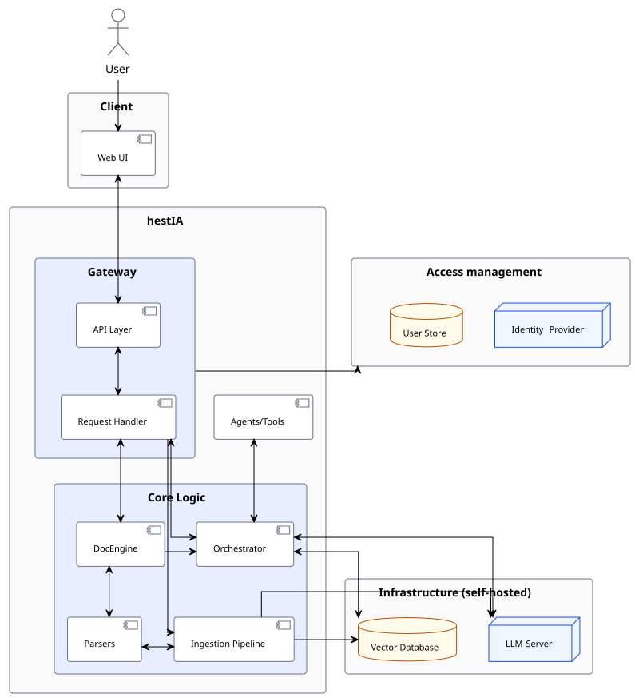

# hestIA — System Concept

| Field | Value |
|---|---|
| Project | hestIA |
| Date | 2026-06-05 |
| Status | Draft |

---

## 1. Introduction

### 1.1 Context

This system concept is developed in the context of work package (WP) 6 of the CyFORT project, under the codename hestIA, which is an on-premises AI assistant system for ISMS. 

---

### 1.2 Objectives

The main goal of this subproject is the development of one or multiple AI systems optimized to run on local hardware to achieve the following objectives:
- AI-Assisted ISMS 
Develop a locally deployed AI system that enhances efficiency and reduces workload in the ISMS context by assisting with documentation querying, policy creation, review, and audit support, while maintaining data privacy and governance compliance.
- AI-Assisted Asset Management
Support organizations, particularly municipalities, in establishing and maintaining a standardized IT asset inventory, leveraging a derived ontology and terminology to harmonize asset classifications, dependencies, and characteristics relevant for regulatory compliance with a focus on NIS2. Integration with threat and vulnerability databases mapped to assets or asset types will enable more comprehensive risk assessments.
- AI-Assisted Document Management
Facilitate an organization-wide, AI-supported document management procedure that (semi-) automates the sorting, archiving, and metadata assignment of documents based on predefined rules and terminology, incorporating human-in-the-loop validation to ensure accuracy and compliance.

Collectively, the subproject aims to increase interoperability and information sharing within these individual domains and potential interdomain spillovers, creating an integrated ecosystem built on practices and knowledge contributed by multiple entities, primarily municipalities. Data, workflows, and documentation from these contributors are aggregated, analysed, and evaluated to generate a consolidated set of best practices, guidelines, and actionable know-how. This ecosystem enables individual municipalities to benefit from collective experience, further enhanced by AI-driven insights and recommendations.
Local deployment ensures full control over sensitive data, while open-source development fosters transparency, trust, and accountability, key qualities for public-sector organizations.

**The current system concept reflects an early-stage implementation (alpha maturity level). While the core architecture and design principles are considered stable, certain functional and non-functional aspects may evolve in subsequent iterations as requirements are refined and validated through prototyping and operational feedback.**

---

## 2. Background 

Background information on hestIA has been elaborated upon in other project artifacts, particularly the Study [1].

## 3. Requirements

The requirements of hestIA have been produced in compliance with [2]. Along with the unique ID , each requirement has the default mandatory attributes:
- **Requirement**: a description of the requirement itself. 
- **Importance**: Identifies the priority level of the requirement, with 1 being the lowest and 5 the highest priority.
- **Type**: Requirements vary in intent and in the kinds of properties they represent.  Use of a type of attribute aids in identifying relevant requirements and categorizing requirements into groups for analysis and allocation. 
- **Urgency**: an indication of how quickly the requirement must be met.

While acceptance criteria will be provided in future iterations in an incremental manner, for each requirement we specify the verification method.  Among the optional C5-DEC attributes we have specified:
- **Rationale**: the main justification for the requirement’s existence. 

In a later stage of the requirements specification process, dealing with subsystem, modules and components, the grouping may disappear. 
For further details and the full list of requirements we refer to [3].


## 4. Solution concept

hestIA is an **on-premises AI assistant for IT governance and compliance**. It combines retrieval-augmented generation (RAG) over managed document corpora with AI-powered asset and document management capabilities, all running on private infrastructure under role-based access control.

At its core, hestIA acts as an **orchestration and logic layer**. It is not an LLM, a vector database, or a document store — it coordinates all of these, but it also carries domain-specific logic of its own: the RAG pipeline that grounds every response in source material, the access policy engine that enforces classification levels and tenant boundaries, and agentic workflows for asset management and document operations in the context of an ISMS.

The system sits between a web UI and three categories of infrastructure service:

- **LLM Server** — generates text and produces embeddings
- **Vector Database** — stores and retrieves document chunks by semantic similarity and/or keyword search
- **User Store** — manages identity, authorisation, and conversation history

Everything that passes between these components flows through hestIA, which means access control, audit logging, and retrieval grounding are enforced unconditionally.

---

### 4.1 System boundary

hestIA acts as an orchestration and control layer within a broader system landscape. It does not implement core infrastructure services such as large language model inference, vector storage, or identity management. Instead, it relies on external components (e.g., LLM servers, vector databases, identity providers) to provide these capabilities, while enforcing access control, workflow orchestration, and audit logging centrally.
All interactions between the Web UI and external infrastructure components are mediated through hestIA, ensuring that policy enforcement and logging are consistently applied.


---

### 4.2 Architecture overview



All user interaction enters through the **Web UI**, which communicates exclusively with the **API Layer** — the single entry point to the platform. No frontend component ever calls the LLM, vector database, or user store directly.

Every request passing through the API Layer is first authenticated and then handed to the **Request Handler**, which applies the **Access Policy** before any work begins. The policy evaluates the user's roles, tenant membership, and classification level and either allows, filters, or denies the request. Filtering injects access constraints directly into downstream retrieval queries, ensuring users can only see data they are authorised to access.

For chat and generation requests, the Request Handler delegates to the Orchestrator, which executes the appropriate workflow. A standard RAG workflow encodes the user query into dense and sparse vectors, retrieves ranked document chunks from the Vector Database, augments the prompt with those chunks, and sends the grounded prompt to the LLM Server for generation. The response streams back through the API Layer to the UI.

For document ingestion, the Request Handler invokes the Ingestion Pipeline, which parses the source file into structured elements, chunks the content, encodes each chunk using both dense (LLM-backed) and sparse (BM25) encoders, and upserts the resulting vectors and metadata into the Vector Database.

The DocEngine draws on the shared Parsers layer to read and locate content within existing documents, then calls the Orchestrator or the LLM Server directly to apply rewrites, completions, or template population, and writes the result back as a modified document file.

Agents and Tools sit at the platform boundary as a user-extensible layer. Custom tools — structured-data parsers, analysis functions, external adapters — are registered and invoked by the Orchestrator as `ToolCall` nodes within a workflow graph, enabling domain-specific capabilities such as asset management or compliance analysis without modifying the core platform.

The Access Management boundary — the User Store and optional Identity Provider — is consulted by the API Layer on every request for user lookup, session validation, and credential delegation. It is the authoritative source for all role and permission data that the Access Policy evaluates. The User Store also persists each user's conversation history, allowing prior exchanges to be loaded as context for multi-turn chat requests.

---

### 4.3 Component responsibilities

#### 4.3.1 Web UI

The SvelteKit frontend is the only client surface. It:
- streams LLM responses in real time via Server-Sent Events
- renders inline citations and lets users inspect source passages
- provides admin panels for users, organisations, collections, and documents
- hosts the CMDB view (asset tables, dependency graph, analysis reports)

The UI has no direct connection to the LLM, vector DB, or user store. All operations are brokered by the API.

#### 4.3.2 API Layer

The FastAPI backend is the single entry point for all platform operations. Every request is authenticated with a JWT before it reaches any business logic. Routers are mounted selectively at startup, so lightweight deployments can omit unused features.

The system can also be booted without requiring authentication for local setups.

#### 4.3.3 Access management

Access control in hestIA operates at two levels: a **platform-level RBAC** that governs what a user can do, and a **runtime execution policy** that governs what data they can see.

**Platform roles** are assigned globally and control which API endpoints and admin functions a user can access:

| Role | Scope |
|---|---|
| Admin | Full platform access: user management, org management, system configuration |
| Moderator | Tenant-scoped administration: manage users and collections within their organisation |
| User | Query and chat within collections they have access to |

**Tenant membership** adds a second axis. A user can belong to multiple organisations, each with its own tenant role and a **classification level** that caps which documents they may retrieve. This means the same user may have different effective permissions depending on which tenant context a request is made in.

**Collection permissions** are set at the organisation level. An organisation is granted access to a foreign collection at a maximum classification level, and that ceiling is inherited by all members of that organisation.

**Execution Policy** is the runtime enforcement step that applies these rules to every incoming request before any workflow executes. It evaluates the requesting user's tenant membership, tenant role, and classification level against the target collection and issues one of three decisions:

| Decision | Effect |
|---|---|
| ALLOW | Request proceeds unchanged |
| FILTER | Execution proceeds but retrieval is restricted to the user's maximum classification level |
| DENY | Request rejected — HTTP 403 |

This is the choke point that enforces multi-tenant data isolation and document classification across all operations.

#### 4.3.4 Orchestrator

Workflows are YAML-defined directed graphs of typed nodes. A minimal node set to support the RAG pipeline is:

| Node | Role |
|---|---|
| EncodeDense | Produce a semantic embedding vector |
| EncodeSparse | Produce a BM25 sparse vector |
| Retrieve | Hybrid search in Qdrant (dense + sparse → RRF fusion) |
| Augment | Format retrieved chunks into a grounded prompt |
| Generate | Single-turn LLM call |
| Chat | Multi-turn LLM call with conversation history |

To accommodate agentic workflows, additional node types such as `ToolCall` (LLM tool use with structured output), `Branch` (conditional routing based on intermediate results), and `QueryStructured` (relational queries against the CMDB store) can be integrated into the engine alongside the existing nodes.

The key benefit of this design is that any workflow is freely modifiable — including at runtime — without touching application code. As long as the required atomic node types are implemented, the orchestration logic lives entirely in YAML. For example, improving the RAG pipeline to retry with an LLM-reformulated query when initial retrieval is poor requires only a new workflow file that adds a `Generate` node (to reformulate the query) and a `Branch` node (to decide whether to retry), with no changes to the underlying node implementations.


#### 4.3.5 Ingestion pipeline

Converts source documents into indexed, retrievable units:

```
file → Parser     → structured elements (paragraphs, tables, images) + metadata
     → Chunker    → chunk list (strategy-dependent)
     → DenseEncoder + SparseEncoder → dense vector + sparse vector per chunk
     → Qdrant upsert (vectors + payload)
```

**Parsing** is multi-modal. Rather than treating a document as a flat stream of text, the parser identifies and handles each structural element type differently:

| Element | Handling |
|---|---|
| Paragraph / heading | Extracted as text, hierarchy preserved |
| Table | Extracted as structured data (rows/columns) for precise querying |
| Image | Passed to OCR or a captioning model to produce indexable text |
| Metadata | Author, date, standard references extracted into the payload |

Supported input formats are minimum PDF, DOCX, and XLSX, with OCR for scanned pages.

**Chunking** is configurable per collection. Supported strategies include:

| Strategy | Description |
|---|---|
| Fixed-size | Split every N tokens; simple but may cut across sentences |
| Sliding window | Overlapping chunks to preserve cross-boundary context |
| Semantic boundary | Split at natural boundaries — paragraph, section, sentence |
| Structural | Respect the document hierarchy; chunk at section or subsection level |

**DenseEncoder** calls the LLM server's embedding endpoint to produce a high-dimensional vector that captures semantic meaning. Two chunks with similar meaning will have similar dense vectors regardless of the words used, enabling semantic similarity search.

**SparseEncoder** builds a BM25 TF-IDF representation. It maintains per-collection term frequency statistics on disk and produces a sparse vector of weighted term scores. This captures keyword relevance that dense embeddings sometimes miss. At retrieval time, dense and sparse scores are fused via Reciprocal Rank Fusion (RRF).

#### 4.3.6 DocEngine

A module for **programmatic document editing and generation**. Its primary operations are:
- reading an existing DOCX or template, locating content by structure (section heading, bookmark, table column)
- applying LLM-assisted rewrites, completions, or insertions at a specific location
- producing a modified document with tracked changes or a clean output file

The DocEngine is a **sibling** to the ingestion pipeline, not a dependent. Both use the same underlying parsers to read DOCX/PDF content, but where ingestion outputs indexed chunks, the DocEngine outputs a modified document file. It also calls the vector database for semantic search within a document — a narrower, document-scoped query rather than a corpus-wide retrieval.


#### 4.3.7 Agents and tools

Agents and Tools is the user-extensible layer of the hestIA platform. Rather than hard-coding domain-specific logic into the core, hestIA allows users to register custom tools — scripts, functions, or adapters — that the Orchestrator can invoke as `ToolCall` nodes within a workflow graph. This keeps the core lean while enabling specialised capabilities to be added, updated, or replaced without touching the platform itself.

Tools are composed into workflows via the `ToolCall` node type. The Orchestrator passes context (retrieved data, user query, prior node outputs) to the tool and receives structured output back, which downstream nodes can use.

**Example — IT asset management (CMDB):** Asset inventory data (JSON, XLSX, CSV) is ingested via a structured-data parser tool that normalises it to a common asset schema. Analysis tools implement operations such as inconsistency detection, dependency graph traversal, missing-asset suggestion, and compliance requirement mapping against the ingested policy corpus. A user composes these into a workflow graph to produce a report without any core platform changes.

#### 4.3.8 Logging

hestIA produces two distinct categories of log output, each written to dedicated log files:

**System logs** capture the operational behaviour of the platform. Every request is assigned a unique correlation ID by the API Layer at the point of entry; this ID is propagated through all subsequent log entries for that request, allowing the full execution trace — authentication, policy evaluation, workflow steps, infrastructure calls — to be reconstructed from the log files. Entries are structured as JSON and include component name, log level, timestamp, correlation ID, and a message payload.

**Audit logs** capture security-relevant events for compliance and accountability purposes. Each audit entry records who performed an action, what the action was, when it occurred, and on which resource. Events covered include:

| Event category | Examples |
|---|---|
| Authentication | Login, logout, failed login attempts, token issuance |
| Document access | Collection queries, chunk retrievals, citation reads |
| AI interactions | User query, retrieved sources, generated response |
| Data modifications | Document upload, collection changes, metadata edits |
| Administrative actions | User creation, role assignment, permission changes |

Audit logs are written separately from system logs to ensure they remain intact and unmodified even if the system log rotation or purge policies are applied. Both log types are written to files on the host filesystem, keeping the logging subsystem independent of the database layer.

#### 4.3.9 LLM Server (external)

A self-hosted inference server that the orchestrator calls for text embedding, single-turn generation, and mutli-turn chat. hestIA supports any backend that exposes either an OpenAI or Ollama API.

#### 4.3.10 Vector Database (external)

A Qdrant instance that stores document chunks as points with dense and sparse vectors plus metadata payload (classification level, source URI, tenant access list). The orchestrator queries it with hybrid search filtered by the user's access policy.


#### 4.3.11 User Store (external)

A relational database (SQLite for single-node deployments, PostgreSQL for horizontally scaled ones) that holds users, roles, organisations, collection permissions, conversation history, and audit records. It is the authoritative source for all access-control decisions.

#### 4.3.12 Identity Provider (external, optional)

LDAP/Active Directory or an OIDC provider for organisations that want to delegate credential validation. When configured, the API uses it during login and falls back to local credentials otherwise.

---

### 4.4 Key Flows

#### 4.4.1 RAG Chat


#### 4.4.2 Document Ingestion


---

## 5. Design Principles

**On-premises by default** — The complete stack, including LLM inference and vector storage, runs on private infrastructure. No telemetry, no external API calls, no cloud dependency at runtime.

**Policy-enforced access** — Access control is not an afterthought applied at the API boundary. It runs as a discrete step in the request path before any data is touched, and its classification filter is injected into every vector search query.

**Pluggable backends** — LLM providers and database backends implement narrow protocols (`LLMProvider`, `DBProvider`). Swapping vLLM for Ollama, or SQLite for PostgreSQL, requires a config change, not a code change.

**Grounded generation** — The system never calls the LLM without first retrieving relevant source passages. Every response is traceable to specific document chunks, and those citations are persisted alongside the conversation.

**Composable workflows** — RAG pipelines are data, not code. YAML workflow files compose typed nodes into execution graphs, decoupling retrieval strategy from application logic.

**Audit logging** — Every request is assigned a correlation ID at the API boundary, which is propagated through all log entries for that request. Document accesses, AI interactions, and administrative actions are recorded as structured log entries and persisted in the User Store, providing a queryable audit trail for compliance and incident investigation.


# Annex A - Data protection study

The purpose of this assessment is to identify the General Data Protection Regulation (GDPR) articles that are relevant to the project and its data processing activities. This enables the derivation of system requirements that ensure the design and operation of the system are compliant with GDPR.

Specifically, the assessment:

- Classifies the types of data handled by the system and maps them to an inventory of processed data elements.
- Determines whether a Data Protection Impact Assessment (DPIA) is required.
- Determines whether cross-border data transfers are in scope.
- Highlights applicable GDPR obligations.
- Provides the rationale for deriving functional and non-functional requirements.

## Data classification

### Direct identifiers

This class comprises all data elements that directly identify an individual without the need for additional information.

### Indirect identifiers

This class includes data elements that, while not directly identifying on their own, can be combined with other available information to identify an individual. This includes pseudonymised data, where the pseudonym–identity mapping exists elsewhere, as well as internal identifiers such as user IDs that are linked to a natural person within the system.

### Aggregated data

Aggregated data refers to collections of data elements contributed by multiple entities. Such collections may include both direct and indirect identifiers across contributing organisations.

### High-risk data

High-risk data are data elements whose compromise, unauthorised access, or misuse could severely impact the privacy, security, or rights of data subjects.

### Data inventory

The following table maps the data elements processed by hestIA to the classifications above and identifies their GDPR relevance.

| Data element | Classification | Personal data | Notes |
| --- | --- | --- | --- |
| User account (username, e-mail, password hash) | Direct identifiers | Yes | Core identity data; Art. 6 lawful basis required by controller |
| User roles and tenant memberships | Indirect identifiers | Yes | Linked to identified accounts; constitutes access-control data |
| Conversation history (queries and responses) | Indirect identifiers / may contain direct | Yes | User-generated content may include personal references or data about third parties |
| Audit log entries (user ID, action, timestamp, resource) | Indirect identifiers | Yes | Linked to identified users via user ID |
| Ingested document content | Variable — may contain all classes | Conditional | Depends on document content; ISMS documents may reference named individuals |
| Asset records — owner and contact fields | Indirect identifiers | Conditional | Asset contact fields may identify natural persons |
| LLM inference inputs/outputs (transient, in-memory) | Indirect identifiers | Yes | Derived from conversation queries; not persisted separately from conversation history |

Special-category data (Art. 9) is not processed by design. If ingested documents are found to contain special-category data, additional safeguards apply and shall be addressed in the controller’s DPIA.

## DPIA trigger assessment

Article 35(1) GDPR requires a Data Protection Impact Assessment prior to processing "likely to result in a high risk to the rights and freedoms of natural persons." The EDPB Guidelines on DPIA (WP248 rev.01) identify nine criteria; processing meeting two or more is recommended to trigger a DPIA.

| # | Criterion | Applies | Rationale |
| --- | --- | --- | --- |
| 1 | Evaluation or scoring, including profiling | Partially | The compliance gap assessment feature (MRS-082, MRS-083) applies AI-based analysis to organisational documentation; it does not profile natural persons but uses automated processing to evaluate compliance posture. |
| 2 | Automated decision-making with legal or similarly significant effect | No | All consequential actions require explicit human approval (MRS-056); no fully automated decisions affecting individuals. |
| 3 | Systematic monitoring of individuals | No | The system does not monitor the behaviour of natural persons. |
| 4 | Sensitive or special-category data (Art. 9) | Conditional | Not processed by design; criterion is triggered if ingested documents contain Art. 9 data. |
| 5 | Large-scale processing | Conditional | Depends on the number of contributing municipalities and the volume of data subjects involved; to be confirmed per deployment. |
| 6 | Matching or combining datasets from multiple sources | No | Datasets are logically separated by source (tenant). |
| 7 | Data concerning vulnerable subjects | No | The system serves organisational users in a professional capacity. |
| 8 | Innovative use or application of new technology | Yes | LLM-based processing of ISMS and compliance documentation constitutes a novel technology application. |
| 9 | Processing that prevents data subjects from exercising rights or using a service | No | No such processing by design. |

**Determination:** Criteria 8 applies unconditionally; criterion 1 applies partially; criterion 5 is deployment-dependent. With at minimum two criteria met, a DPIA is required under EDPB guidance before go-live in any multi-entity deployment. The DPIA shall be conducted by the controller; itrust’s obligations are captured in MRS-GDPR-011.

## Cross-border data transfers

hestIA operates fully on-premises with no external API calls at runtime (MRS-001, MRS-022). Personal data processed by the system does not leave the deployment environment during normal operation, and no third-country transfers within the meaning of GDPR Chapter V occur.

Model weights and software components may be sourced from external repositories during initial setup, but this does not constitute a transfer of personal data. **GDPR Art. 44–49 is considered out of scope for this assessment.**

## GDPR Requirements

For the purposes of GDPR compliance, in the context of this project, itrust is classified as a data processor. itrust processes personal data on behalf of system users (the controllers) and does not determine the purposes or means of processing. Consequently, as a data processor itrust is primarily obligated to comply with GDPR Article 28.

By virtue of Articles 28(3)(c), 28(3)(e), 28(3)(f), and 28(3)(g), and in fulfilling the processor’s obligation to assist the controller in ensuring compliance with GDPR, itrust is indirectly required to implement measures necessary to support the controller’s adherence to other relevant provisions of the Regulation.

The controller retains responsibility for establishing the lawful basis under Art. 6 for each processing activity and for conducting the DPIA identified in the trigger assessment above. As processor, itrust shall maintain a record of processing activities carried out on behalf of each controller as required by Art. 30(2).

In line with these obligations, the following GDPR articles are considered immediately relevant for the system.

| ID | Name | Requirement | Justification |
| --- | --- | --- | --- |
| MRS-GDPR-001 | Lawful processing | The system shall support lawful processing of personal data in compliance with applicable GDPR obligations. This requirement is fulfilled through the combination of a Data Processing Agreement and the technical capabilities defined in MRS-GDPR-002 through MRS-GDPR-012. | GDPR Art. 5 <br> GDPR Art. 28 |
| MRS-GDPR-002 | Data minimisation | The system shall ensure that only the data necessary for the defined processing purpose are collected, stored, and transmitted. | GDPR Art. 5.1b <br> GDPR Art. 5.1c <br> GDPR Art. 25 |
| MRS-GDPR-003 | Data accuracy | The system shall maintain personal data in an accurate and up-to-date state in cooperation with the controller. | GDPR Art. 5.1d |
| MRS-GDPR-004 | Data retention and deletion | The system shall support the controller in enforcing retention limits and secure deletion of personal data when no longer required. | GDPR Art. 5.1e <br> GDPR Art. 17 <br> GDPR Art. 25 |
| MRS-GDPR-005 | Data security | The system shall preserve the confidentiality, integrity, and availability of personal data through appropriate technical and organisational measures, including the ability to detect security events affecting personal data. | GDPR Art. 5.1f <br> GDPR Art. 25 <br> GDPR Art. 32 |
| MRS-GDPR-006 | Access control | The system shall ensure that access to personal data is restricted to authorised users and processes acting under the controller’s authority, and shall ensure that such access is logged and auditable. | GDPR Art. 5.1f <br> GDPR Art. 25 <br> GDPR Art. 32 |
| MRS-GDPR-007 | Accountability and documentation | The system shall enable the controller to demonstrate compliance with applicable data-protection obligations through documentation and auditable records. | GDPR Art. 5.2 <br> GDPR Art. 25 <br> GDPR Art. 28.3e <br> GDPR Art. 30 |
| MRS-GDPR-008 | Data-subject rights | The system shall support the controller in fulfilling data-subject rights, including rectification, erasure, and portability, within the processor’s scope. | GDPR Art. 16–20 <br> GDPR Art. 28.3e |
| MRS-GDPR-009 | Availability, resilience, and restoration | The system shall maintain resilience and the capability to restore personal data and processing functions within agreed recovery objectives. | GDPR Art. 5.1f <br> GDPR Art. 32.1 |
| MRS-GDPR-010 | Breach notification | The system shall record any personal-data breach and notify the controller without undue delay, providing sufficient information for the controller to meet its notification obligations under Art. 33.1 and Art. 34. | GDPR Art. 33.2 |
| MRS-GDPR-011 | Data protection impact assessment | The system shall provide the controller with the technical and organisational information required to conduct the DPIA determined as necessary by this assessment, covering processing activities, data flows, security measures, and residual risks. | GDPR Art. 35 |
| MRS-GDPR-012 | Continuous improvement | The system shall undergo periodic review, testing, and assessment of its data-protection measures to ensure ongoing effectiveness. | GDPR Art. 32.1d <br> GDPR Art. 28.3f |