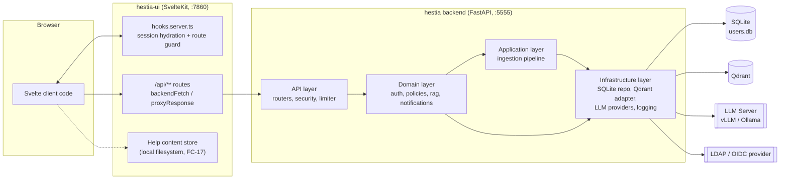
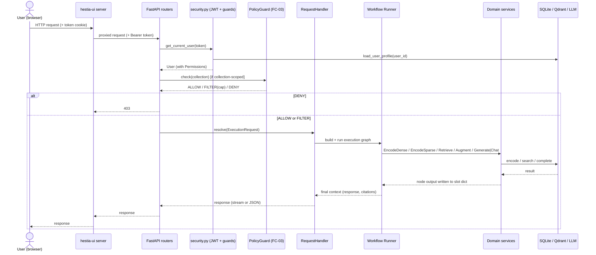
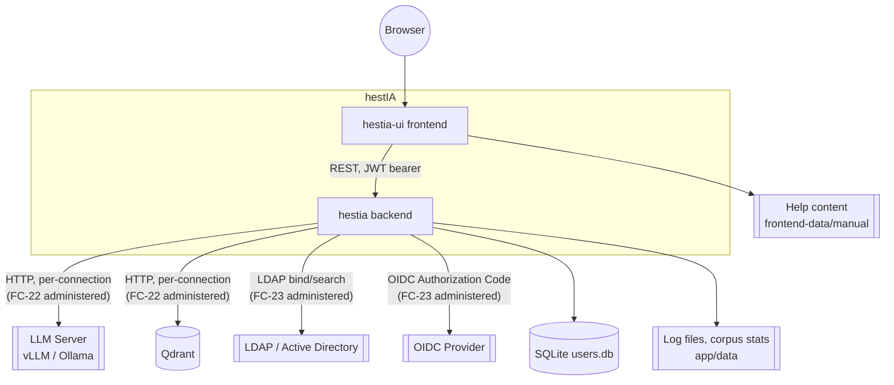
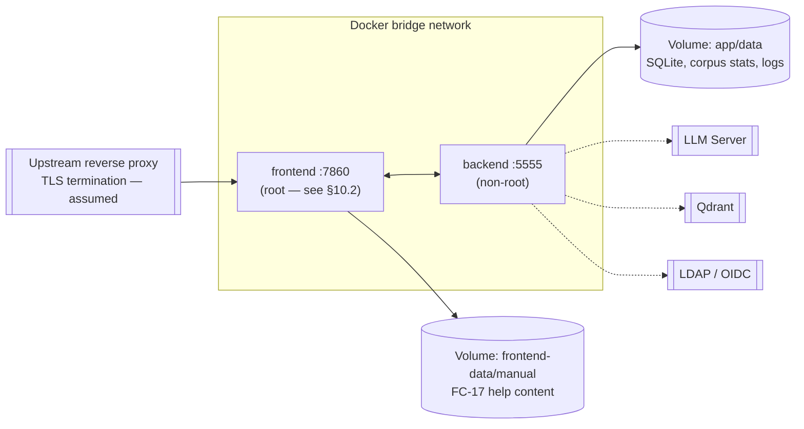

# Software Design Document (SDD)

Service: hestIA
Version: alpha_v0.4
Classification: INTERNAL
Date: 2026-09-09

Revision note: This revision brings the SDD into conformance with `fad.md` alpha_v0.4 and with the as-built codebase as of 2026-09-09. It documents six previously unrecorded functional areas — Tenant Collaboration Workflows (FC-20), Notification Management (FC-21), Platform Connection Administration (FC-22), Authentication and Security Configuration Administration (FC-23), Workflow Graph Administration (FC-24), and System Log Administration (FC-25) — and corrects several statements in alpha_v0.3 that implementation has since superseded (most significantly: configuration is no longer purely environment-variable-driven; JWT logout revocation now exists; help content management is confirmed to live entirely in the presentation tier). It additionally incorporates a production-readiness design review conducted the same day (`reviews/sdd-production-readiness-review-2026-09-09.md`), which added §5.3 (API Versioning), §8.7 (Transport Security and CORS), and §11.4 (Backup and Disaster Recovery), and surfaced a documented architecture-vs-implementation contradiction in `docs/scd.md` regarding PostgreSQL/horizontal scaling (§12.2). See §13 for the full architecture traceability table and §12 for known gaps.

---

## 1 Introduction

### 1.1 Purpose

This System Design Document specifies how hestIA is actually built: its module and service structure, data models and persistence strategy, workflow execution engine, external integrations, security controls, logging infrastructure, and deployment configuration. It bridges the functional description in the FAD and the running code, and is the primary reference for engineering onboarding, architecture review, and audit of the as-built system. The implementation is the source of truth; this document does not speculate about designs that are not implemented.

### 1.2 Scope

**Covered:** internal module/layered architecture of the backend (`hestia/`) and frontend (`hestia-ui/`); service instantiation and dependency wiring, including runtime "live-rewiring" of backend connections, auth configuration, and workflow graphs (FC-22/23/24); data models and SQLite schema, including the collaboration/notification/connection/security-configuration tables added since alpha_v0.3; the workflow execution graph and runner; integration design for the LLM provider, vector database, and identity providers; JWT authentication, authorization guards, and policy enforcement; logging, audit, and the new log-administration surface (FC-25); containerisation and deployment configuration.

**Not covered:** functional requirements (→ FAD), external API contract detail beyond what is needed to explain design (→ ICD), system rationale and operational context (→ SCD).

### 1.3 Definitions and Terminology

Terminology in this document matches `docs/fad.md`. FC-xx numbers refer to the Functional Components enumerated there. Additional implementation-level terms:

| Term | Meaning |
|---|---|
| Container | The backend's manual dependency-injection registry (`hestia/container.py`), holding `providers` (infrastructure clients) and `services` (domain services) |
| Connection | A persisted, admin-managed record (FC-22) describing one backend endpoint for a purpose (generation, embedding, reranking, vector_db) |
| Live rewire | Mutating an already-referenced, already-constructed service/client object in place so that in-flight and subsequent requests observe the new configuration without a process restart |
| Seed-once | A persistence pattern where a table/file is populated from environment-derived defaults only if empty, and never overwritten again once any row/content exists |
| Execution graph | A runtime instantiation of a YAML workflow template: an ordered list of typed nodes connected by a single linear chain of edges |
| BFF | Backend-for-frontend; the SvelteKit server-side layer in `hestia-ui/` that proxies all backend calls |

### 1.4 References

- `docs/fad.md` — Functional Architecture Document, alpha_v0.4, 2026-09-09
- `docs/scd.md` — System Concept Document
- `docs/icd.md` — Interface Control Document
- `docs/rtm.csv`, `docs/reqs/` — Requirements Traceability Matrix and MRS/TST definitions
- `KNOWN_ISSUES.md` — open defects at the time of writing
- `reviews/hestia_v2-backend-review-2026-05-21.md`, `reviews/hestia_v2-backend-concept-2026-05-21.md`, `reviews/svelte-gui-*-2026-05-21.md`, `reviews/Fix.md` — prior code reviews; several of their findings are cross-referenced in §12
- `docs/rtm.csv` — Requirements Traceability Matrix (MRS/GDPR → SRS → FAD → SDD → ICD → TST, with a per-requirement Status); `reviews/baseline-integrity-review-2026-09-09.md` — the full baseline integrity assessment across MRS/SRS/FAD/SDD/ICD, including the requirements-layer gaps noted in §12.2
- Note: `docs/fad.md`'s revision note refers to an "accompanying Architecture Conformance Review." No such artifact exists anywhere in this repository (working tree or git history) as of this writing — it could not be located or cited. This SDD's findings were instead derived directly from the current source tree, the fad.md alpha_v0.3→alpha_v0.4 diff, and the review documents listed above. This gap is also recorded in §12.
- **Document alignment note:** the four governing documents are not currently at the same revision. `docs/fad.md` and this SDD are alpha_v0.4 (2026-09-09); `docs/icd.md` remains at alpha_v0.3 and does not describe FC-20 through FC-25 (§5.3); `docs/scd.md` was last substantively revised 2026-06-18 and contains at least one claim (a PostgreSQL horizontal-scaling path) that contradicts the current implementation (§12.2). A reader should treat this SDD and the FAD as authoritative for anything they cover, and treat `icd.md`/`scd.md` as requiring re-validation before being relied upon for integration or capacity-planning decisions respectively.

---

## 2 System Overview

### 2.1 Business Context

hestIA is an on-premises AI assistance platform for IT governance and compliance (ISMS) use cases, positioned as an orchestration/logic layer between end-user interfaces and managed infrastructure (LLM inference, vector search, identity). See `docs/fad.md` §1–2 and `docs/scd.md` for full business rationale; this document assumes that context and focuses on realisation.

### 2.2 Architecture Summary

hestIA is a two-tier, two-container system: a Python/FastAPI backend (`hestia/`) that owns all business logic, persistence, and external integrations, and a TypeScript/SvelteKit frontend (`hestia-ui/`) that renders the UI and proxies every backend call server-side, attaching a session JWT held in an HTTP-only cookie. The two containers communicate over an internal Docker bridge network; the backend listens on port 5555, the frontend on port 7860.

The single largest architectural change since alpha_v0.3 is that **configuration is no longer purely environment-variable/deploy-time**. Three functional areas — backend connections (FC-22), authentication/security configuration (FC-23), and workflow graph definitions (FC-24) — are now administered at runtime through dedicated admin API surfaces and persisted to SQLite (FC-22/23) or to a writable data-directory copy of the YAML templates (FC-24). Environment variables now serve only as **bootstrap defaults**, consumed once to seed these tables/files on first start; from the second start onward, the persisted values take precedence, and admin changes take effect on the next request by mutating already-referenced service objects in place — no restart occurs. This "live-rewiring" pattern, plus two new functional domains built on the same persistence and notification substrate — Tenant Collaboration Workflows (FC-20) and Notification Management (FC-21) — plus a query/export/verbosity surface over the existing log store (FC-25), account for all six FC-20…FC-25 additions in the FAD.



### 2.3 Design Principles

- **Layered dependency direction, top-down only.** API → Domain → Application → Infrastructure; infrastructure and domain modules never import from the API layer. Cross-layer access is mediated by protocol interfaces (`LLMProvider`, `DBProvider`, `BaseParser`).
- **Composition over restart.** Anything an administrator can change (connections, auth config, workflow graphs, log verbosity) is designed to take effect on the next request by mutating live objects, not by requiring a redeploy.
- **Fixed vocabulary, declarative composition.** The workflow engine supports exactly six node types and four workflow kinds; within that boundary, sequencing and prompt content are YAML-declarative and administrator-editable; outside it, a code change is required.
- **No permission caching.** Every request recomputes the caller's permissions from stored roles/memberships/grants; this trades some CPU for the security property that a revoked grant is honoured on the very next request (FAD A-02).
- **Fail closed on ambiguity.** Guards raise 403 by default; DENY policy decisions terminate before any knowledge-base or AI interaction; unauthenticated routes are an explicit allowlist (health, login/OIDC endpoints), not a default.
- **Audit is unconditional and separate from system logging.** The audit stream cannot be silenced by lowering system-log verbosity (FC-25), and Help Content Management (FC-17) is the sole documented function outside this guarantee, by virtue of not passing through the backend at all.

---

## 3 Logical Design

### 3.1 Domains

The FAD's eight functional domains map onto backend packages as follows:

| FAD Domain | Backend home |
|---|---|
| Identity and Access | `hestia/domain/auth/`, `hestia/api/security.py` |
| Document Intelligence | `hestia/application/ingestion.py`, `hestia/infrastructure/parsers/` |
| AI Interaction | `hestia/handler.py`, `hestia/domain/rag/`, `hestia/domain/chat/` |
| Knowledge Management | `hestia/infrastructure/db/qdrant.py`, `hestia/infrastructure/db/user_repository.py` (conversations) |
| Collaboration and Notifications | `hestia/domain/notifications/service.py`, `hestia/api/routers/notifications.py`, `admin.py` (moderator side) |
| Administration | `hestia/api/routers/{admin,llm_settings,auth_settings,workflow_settings,logs,notification_settings}.py`, corresponding `hestia/infrastructure/db/*_repository.py` |
| Observability | `hestia/infrastructure/logging/` |
| Extensibility | `hestia/domain/rag/graph.py`, `templater.py`, `template_sync.py`, `hestia/templates/` |

### 3.2 Modules

```
hestia/
├── api/            # FastAPI routers, Pydantic schemas, security guards, rate limiting, error handlers
├── domain/         # auth, policies, rag (graph/templater/services), chat (context budget), notifications
├── application/     # ingestion pipeline coordination
├── infrastructure/ # db (SQLite repos + Qdrant adapter), llm (vLLM/Ollama adapters), http, logging, parsers
├── templates/       # shipped YAML: base/ (fragments) + workflows/ (4 built-ins) — read-only source of truth
├── container.py     # composition root / DI registry / live-rewire operations
├── handler.py       # RequestHandler + Runner: execution-type→template mapping, policy gate, graph execution
└── main.py          # FastAPI app construction, lifespan (settings→container→template sync→routers)

hestia-ui/
├── src/hooks.server.ts        # session hydration, admin-API guard (defense-in-depth), security headers
├── src/lib/server/backend.ts  # sole consumer of PRIVATE_MICROSERVICE_URL; JWT attachment; error passthrough
├── src/lib/server/help/       # FC-17: local filesystem-backed help content store, independent of backend
├── src/lib/api/client.ts      # browser-side fetch wrapper; 401→/login redirect
├── src/lib/stores/            # chat, conversations, notifications, uploads, corpora/ISMS selection, toast
└── src/routes/
    ├── login/, (protected)/    # pages: chat, help, account, admin/*
    └── api/**                  # SvelteKit server routes proxying to the backend (one tree per FC area)
```

### 3.3 Component Model

| Component | Description |
|---|---|
| FastAPI application (`hestia/main.py`) | Entry point; lifespan builds settings → container → template sync → mounts routers |
| Router registry (`hestia/api/routers/registry.py`) | Declares each router's prefix, tags, and service gate; mounts always-on admin/core routers unconditionally, gates `encode`/`generate`/`chat`/`search`/`ingestion` on service presence; raises on route-shadowing collisions |
| Dependency injection container (`hestia/container.py`) | Wires providers/services at startup from bootstrap settings overlaid with DB-persisted connection/auth/notification config; exposes `apply_connection_update/_delete`, `apply_auth_update` for live rewiring |
| Request handler (`hestia/handler.py`) | Execution façade: policy check → template selection → graph build → run → optional persistence → audit |
| Authentication service (`hestia/domain/auth/`) | Local/LDAP/OIDC credential verification, JWT issuance/decoding support, auto-provisioning |
| Policy guard (`hestia/domain/policies/guard.py`) | `ExecutionPolicy`/`CollectionAccessPolicy`: ALLOW/FILTER/DENY on collection-scoped requests |
| Workflow engine (`hestia/domain/rag/graph.py`, `templater.py`) | Graph validation, template loading/caching, node execution in linear order |
| Ingestion pipeline (`hestia/application/ingestion.py`) | Parse → chunk → dense/sparse encode → upsert |
| Notification service (`hestia/domain/notifications/service.py`) | FC-20 collaboration workflows and FC-21 notifications, in one class, backed by `UserRepository` |
| Repositories (`hestia/infrastructure/db/*_repository.py`) | `user_repository` (core + collaboration tables), `llm_settings_repository` (FC-22), `auth_settings_repository` (FC-23), `notification_settings_repository` (FC-21 welcome message) |
| Qdrant adapter (`hestia/infrastructure/db/qdrant.py`) | Vector collection management, upsert, hybrid search |
| LLM provider adapters (`hestia/infrastructure/llm/`) | vLLM (OpenAI-compatible HTTP) and Ollama adapters behind `LLMProvider` protocol |
| Logging infrastructure (`hestia/infrastructure/logging/`) | Queue+listener JSON logging, audit stream, `query.py` (FC-25 query/export), runtime verbosity control |
| SvelteKit frontend (`hestia-ui/`) | BFF proxy, UI rendering, route guards, FC-17 help content store |

### 3.4 Interactions



---

## 4 Detailed Component Design

### 4.1 FastAPI Application & Router Registry

**Responsibilities:** construct the FastAPI instance; register middleware (rate-limit exception handler, `SlowAPIMiddleware`, `CorrelationMiddleware`, in that order — `hestia/main.py:56-58`); register typed exception handlers; drive the startup lifespan: `Settings.load()` → `build_container(settings)` → `sync_templates(...)` (FC-24 fragment refresh / one-time workflow seed, `main.py:41`) → `include_routers(app, enabled_services)`.

**Internal structure:** `hestia/api/routers/registry.py` defines a `RouterSpec{router, prefix, tags, service, always_on}` per module and a static `ROUTER_REGISTRY` dict (15 entries). `include_routers` mounts every `always_on` router unconditionally — this now includes **all five FC-2x admin routers** (`notifications`, `notification_settings`, `llm_settings`, `auth_settings`, `workflow_settings`, `logs`) plus the pre-existing core routers (`health`, `auth`, `account`, `conversations`, `admin`) — and mounts `encode`/`generate`/`chat`/`search`/`ingestion` only if the corresponding service key is present in `container.services` (FAD A-18). Before mounting, it walks every route to detect duplicate `(method, path)` pairs across routers and raises, explicitly to prevent a stricter router's auth dependency from being silently shadowed by a looser one mounted later.

**Public interfaces:** the 15 router modules; see §5 for the full endpoint inventory.

**Dependencies:** `Settings`, `Container`, `RequestHandler`.

**Error handling:** `hestia/api/error_handlers.py` — `HestiaError` subclasses map to their carried status code (this is the expected path for all domain/application errors); `PermissionError`→403, `ValueError`→400, `KeyError`→500 (treated as a programmer error, not 404), `RequestValidationError`→422, and a catch-all `Exception`→500 with full traceback logged server-side only.

**Extension points:** a new router is added by writing the module and one `RouterSpec` entry; a new service gate is added by naming it consistently between `container.services` and the `RouterSpec.service` field.

### 4.2 Dependency Injection Container (`hestia/container.py`)

**Responsibilities:** at startup, seed/read the FC-22/23/21 SQLite-backed configuration tables, overlay their values onto the bootstrap `Settings` object, then instantiate providers and services in dependency order, gated by `services_to_start`. At runtime, expose the three live-rewire entry points that make FC-22/FC-23 changes effective without a restart.

**Internal structure:**
- `providers: Dict[str, Any]` — currently one entry, `"db"` (the shared `QdrantDB`/`DBProvider` instance).
- `providers_by_connection: Dict[int, LLMProvider]` — one cached `LLMProvider` instance per **connection row id** (not per purpose), built lazily by `get_or_build_provider`.
- `services: Dict[str, Any]` — domain services keyed by RAG-facing name (`generate`, `chat`, `encDense`, `search`, `ingestion`, `auth`, `users`, `notifications`, …), populated only for names present in `services_to_start`.
- `_PURPOSE_SERVICES` — maps an LLM connection `purpose` (generation/embedding/reranking) to the live service attribute(s) that must be re-pointed when that purpose's active connection changes.

**Live rewiring — FC-22 (connections):**
- `apply_connection_update(connection_id)` (`container.py:171-191`): for generation/embedding/reranking, mutates the already-open `HttpClient`'s `base_url`/`api_key` **in place** (`HttpClient` reads these fields fresh per call, so no rebuild is needed) and pushes new `model`/`params`/compaction fields onto the live `Generator`/`DenseEncoder` service object (`_rewire_purpose`).
- `_apply_vector_db_update(row)` (`:193-207`): `QdrantDB` bakes its `QdrantClient` at construction, so this rebuilds the client and reassigns it to `db.client` **on the same `QdrantDB` instance** already referenced by `Retriever` and `IngestionPipeline` — a dict-entry swap alone would not reach those holders.
- `apply_connection_delete(connection_id, purpose=None)` (`:237-250`): drops the cached provider and pops the purpose's service(s) out of `services` entirely, so a deleted connection cannot keep serving stale requests.
- No pub/sub or event bus is used; this is direct, synchronous, in-process mutation of shared objects, made safe only because the mutated fields (`HttpClient.base_url/api_key`, `QdrantDB.client`) are read per-call rather than cached by their callers.

**Live rewiring — FC-23 (auth/security config):**
- `apply_auth_update()` (`:209-235`): reloads the single-row `auth_settings` table, reconstructs `AuthSettings`/`OIDCSettings`/`LDAPSettings`, then calls the same `_build_auth_stack()` helper used at boot to build fresh `UserService`, `LDAPService`/`OIDCService`, and `AuthenticationService` instances, plus a fresh `NotificationService` (re-wiring its `on_user_created` hook). All three replacement services (`auth`, `users`, `notifications`) are swapped into `self.services` with **one atomic `dict.update()` call**, specifically so a concurrent request can never observe a new `auth` service paired with a stale `users`/`notifications` service.
- Token invalidation on mode/signing-key change is **not** implemented via a version/epoch counter. `get_current_user` (`hestia/api/security.py`) rereads `auth_svc.config.token_secret_key`/`token_encoding_alg` fresh on every call and decodes with that key; once it changes, every token signed under the old key fails verification on its next use. This is documented in code (`container.py:216-218`) as "by design."

**Dependencies:** all domain and infrastructure modules; `LLMSettingsRepository`, `AuthSettingsRepository`, `NotificationSettingsRepository`.

### 4.3 Request Handler (`hestia/handler.py`)

**Responsibilities:** serve as the single execution façade for all four AI workflow kinds; apply the policy gate; build and run an execution graph; manage conversation-context budgeting/compaction; persist conversation turns; emit audit entries.

**Internal structure:** `TEMPLATE_MAP` (`handler.py:418-423`) maps `generate|rag_generate|chat|rag_chat` 1:1 onto YAML template names. `resolve()` (`:505-556`) runs the policy check first (DENY raises before any graph is built; FILTER injects a `filters` kwarg carrying the classification ceiling into the eventual `Retrieve` node's query options), then builds the graph via `TemplateRepository` and executes it through `Runner`. `Runner.node_handlers` (`:138-145`) is the authoritative list of the six supported node types, and is what `validate_workflow_graph` (FC-24) checks a submitted YAML graph against. `PersistChat` (`:266-413`) wraps `Runner` to write conversation turns to SQLite after generation completes, buffering the full streamed response in memory before persisting. Context-budget logic (`_check_and_compact_budget`, `_compact`, `_stream_with_budget_notice`) sources the token budget and compaction thresholds from the *active generation connection's* configuration (FC-22), not a fixed constant — this is new since alpha_v0.3 and implements FAD A-07.

**Public interfaces:** `RequestHandler.resolve(ExecutionRequest) -> ExecutionResult` (or an async generator for streaming).

**Dependencies:** `Container`, `PolicyGuard`, `TemplateRepository`, `Runner`.

**Error handling:** raises typed `HestiaError` subclasses on policy DENY, unknown execution type, or graph-build failure; these are caught by the API layer's generic `HestiaError` handler.

### 4.4 Authentication Service (`hestia/domain/auth/`)

**Responsibilities:** verify credentials across local/LDAP/OIDC modes (mutually exclusive at any instant, per FAD A-04); auto-provision directory/federated users on first login; compute the derived `Permissions` object; support server-side logout revocation.

**Internal structure:** `service.py` — `AuthenticationService.authenticate`/`authenticate_oidc`; local mode tries the local credential store first, falling back to the directory service for directory-sourced users. `users.py` — `UserService.compute_user_permissions` (`:95-127`) computes, per collection, `min(user's classification_level, grant's max_classification)` when a cap exists, taking the maximum across multiple memberships that grant the same collection; also computes `moderated_tenants` and the stricter `role_assignable_tenants` (true `moderator` role only, not `co-moderator`) consumed by the FC-20 guards (§4.7). `oidc.py` — Authorization Code flow, claim-to-role/org mapping. Revocation: a `revoked_tokens` table keyed by JWT `jti`, checked in `get_current_user`; `/logout` inserts a row for the current token's `jti` only (not a bulk revoke).

**Public interfaces:** `authenticate`, `authenticate_oidc`, `load_user_profile`, `compute_user_permissions`, `record_login`, `is_token_revoked`.

**Dependencies:** `UserRepository`, `LDAPService`, `OIDCService`, audit logger.

**Error handling:** failed/expired/rate-limited attempts raise typed errors mapped to 401/429; account-expiry and must-change-password conditions are checked explicitly before token issuance.

### 4.5 Policy Guard (`hestia/domain/policies/guard.py`)

Unchanged in design from alpha_v0.3: `PolicyDecision{ALLOW, DENY, FILTER}`; `CollectionAccessPolicy.check` looks up the caller's already-computed `Permissions.allowed_collections`, denies on no grant, otherwise returns `FILTER` carrying `max_classification`. `ExecutionPolicy.check` audits every non-ALLOW decision. Confirmed: this guard performs **no administrator bypass** of its own — an admin's unconditional access to collections is instead a property of how `compute_user_permissions` populates `allowed_collections` for an admin caller, not a branch inside the guard. Administrator/moderator bypass **is** explicit in the separate route-level guards described in §4.7.

### 4.6 Workflow Engine (`hestia/domain/rag/graph.py`, `templater.py`, `template_sync.py`)

**Responsibilities:** validate and load YAML workflow graphs; execute them node-by-node; provide the FC-24 administration substrate (validation, seed-once persistence, fragment refresh).

**Internal structure:**
- `NODE_TYPE_SPECS` (`graph.py:64-71`) — the fixed six-node vocabulary (`EncodeDense`, `EncodeSparse`, `Retrieve`, `Augment`, `Generate`, `Chat`) with declared inputs/outputs per type.
- `validate_workflow_graph(root)` (`graph.py:137-238`) — validates node ids/types, context-field references, slot-producer ordering, the `Augment` node's required `{user_prompt}` placeholder, and that `edges` (with `entrypoint` as the first node) form a **single linear chain covering every declared node** — the same check the FAD's A-14 describes as bounding what an administrator-edited graph may express.
- `TemplateRepository` (`templater.py:53-78`) — loads/caches parsed YAML keyed by path, from `app_data/templates` (the live copy), not `hestia/templates` (the shipped source); `invalidate()` clears the whole cache, called by the admin write path so a change is visible on the very next request with no restart.
- `template_sync.sync_templates(source_dir, dest_dir)` — called once at startup (`main.py:41`): mirrors `base/` (shared node fragments) with `overwrite=True` every start, because fragments are coupled to `Runner` code and are never admin-editable; mirrors `workflows/` (the four built-in graphs) with `overwrite=False` — only copies a file if the destination doesn't already exist — so administrator edits, made through the FC-24 admin UI and living only in `app_data/templates/workflows/`, survive both restarts and platform upgrades, since only `app/data` is a mounted volume.

**Public interfaces:** `validate_workflow_graph`, `TemplateRepository.load/invalidate`, `sync_templates`, `Runner.node_handlers`.

**Dependencies:** `hestia/templates/` (source), `app_data/templates/` (live copy, on the mounted data volume).

**Extension points:** within the fixed vocabulary, new workflow compositions are pure YAML and take effect immediately via the admin API; a new node type or a fifth workflow kind requires a code change to `Runner.node_handlers`/`TEMPLATE_MAP` and is explicitly out of scope for administrator editing (FAD A-14).

### 4.7 Authorization Guards (`hestia/api/security.py`)

Distinct from the FC-03 policy guard, these are plain functions called as the first statement of each protected endpoint (no shared decorator or FastAPI dependency wrapper):

| Guard | Rule | Used by |
|---|---|---|
| `assert_admin` | `user.permissions.is_admin` | All FC-22/23/24/25 endpoints; user/org/role admin CRUD |
| `assert_admin_or_moderator` | admin OR any `moderated_tenants` entry | Admin user/org listing (moderator-scoped view) |
| `assert_org_member` | admin OR org present in `user.orgs` | Organisation summary (FC-20 discovery) |
| `assert_tenant_moderator` | admin OR `org_id in moderated_tenants` | FC-20 moderator endpoints: join/share/invitation review, member/collection management (15+ call sites in `admin.py`) |
| `assert_tenant_role_assigner` | admin OR `org_id in role_assignable_tenants` (true `moderator` only, not `co-moderator`) | Endpoints that grant the moderator/co-moderator role itself, including role-granting join-request approvals |
| `assert_collection_moderator` | admin OR the collection's owning org is in `moderated_tenants` (resolved via a live grant lookup, so this guard alone takes the request handler as a parameter) | Collection grant edit/delete, document upload/delete/metadata-edit |

All six guards short-circuit `is_admin` first, so a platform administrator bypasses every tenant-scoped guard. This family is **consistently applied** across the newer FC-22–25 routers (`assert_admin` as the first line of every endpoint, paired with typed Pydantic request schemas) but is **less uniform** in the older `admin.py`/`notifications.py` routers implementing FC-20/21, where guard choice varies per endpoint semantics and request bodies remain untyped `dict`s rather than Pydantic models — see §12 for this as a flagged inconsistency. `search.py` performs its own inline `can_read_collection` check rather than calling one of these helpers, a further inconsistency point.

### 4.8 Notification Service (`hestia/domain/notifications/service.py`) — FC-20 & FC-21

**Responsibilities:** implements both Tenant Collaboration Workflows (FC-20) and Notification Management (FC-21) in a single 497-line class; there is no separate FC-20 module — the FAD's component boundary is a documentation grouping, not a code module boundary.

**Internal structure:** `NotificationService(repo: UserRepository, settings_repo: NotificationSettingsRepository)`.
- **FC-21 methods:** `list_notifications`, `unread_count`, `mark_read`, `mark_all_read`, `broadcast` (targets `user_id=None`), `send_welcome_notification`/`get_welcome_settings`/`update_welcome_settings`.
- **FC-20 join requests:** `file_join_request` (pre-check plus `sqlite3.IntegrityError` fallback for the race window), `list_org_join_requests`/`list_user_join_requests`, `approve_join_request`, `reject_join_request`.
- **FC-20 share requests:** `file_share_request`, `approve_share_request` (validates each named collection is actually owned by the target org before granting), `reject_share_request`.
- **FC-20 invitations:** `invite_user`, `cancel_invitation`, `accept_invitation`, `decline_invitation`.
- Notification emission is inline in every workflow method via private `_notify`/`_notify_org_moderators` helpers — filing a request notifies the target org's moderators; approval notifies the original requester.

**Moderator-uniqueness enforcement (each org has at most one active `moderator` at a time, across all three FC-20 workflows):** enforced twice for defense in depth — a pre-flight check in the service (`get_org_tenant_moderator`) and an authoritative in-transaction re-check inside the repository's combined resolve+grant methods (raising `ModeratorConflictError` on a concurrent conflict, translated to a `ValidationError` at the service boundary). The uniqueness rule applies only to the literal `moderator` tenant role, not `co-moderator`. A second, independent enforcement point exists in `UserService.set_member_tenant_role` for direct admin role edits made outside the request/invite flow.

**Approval → FC-15/FC-16 wiring:** the repository's `approve_join_request_and_grant` (and its share-request/invitation analogues) perform resolve-request + membership/grant creation in one transaction, guarded by `WHERE status='pending'` so a concurrent double-approval is a no-op (returns `False`) rather than a race.

**Public interfaces:** the methods above, called directly from `hestia/api/routers/admin.py` (moderator side) and `hestia/api/routers/notifications.py` (self-service side).

**Dependencies:** `UserRepository` (all collaboration/notification tables), `NotificationSettingsRepository`.

**Error handling:** domain-level `ValidationError`/`ModeratorConflictError`, mapped to 4xx by the standard error handlers.

### 4.9 Ingestion Pipeline (`hestia/application/ingestion.py`)

Unchanged in design from alpha_v0.3: format-specific parser (PDF, DOCX, XLSX/XLSM, PPTX, JSON, CSV, TXT, Markdown) → Markdown extraction → section chunking with adjacency links → dense batch embedding → sparse BM25 encoding with per-collection corpus update → collection initialisation if needed → batched Qdrant upsert. Runs synchronously within the request thread; no background job queue.

### 4.10 SvelteKit Frontend (`hestia-ui/`)

**Responsibilities:** render the UI; hydrate session state; proxy every backend call server-side with JWT attachment; provide a defense-in-depth guard on `/api/admin/*`; independently implement Help Content Management (FC-17) against its own local store.

**Internal structure:** `hooks.server.ts` reads the `token` cookie, calls `GET /account` to hydrate `event.locals.user`, redirects legacy `/mod/*` paths to `/admin/*`, blanket-guards `/api/admin/*` on `is_admin || moderated_tenants.length > 0` (explicitly documented in-code as defense-in-depth, not the real enforcement point), and sets `X-Content-Type-Options: nosniff` / `X-Frame-Options: DENY` on every response — no other security headers (no CSP, HSTS, Referrer-Policy) are set anywhere in the frontend. `src/lib/server/backend.ts` (`backendFetch`/`proxyResponse`/`proxyBinaryResponse`) is the sole consumer of `PRIVATE_MICROSERVICE_URL`; it flattens FastAPI's structured 422 validation-error arrays into a display string and masks 5xx bodies with a generic message while logging the real error server-side. `src/lib/api/client.ts` auto-redirects to `/login` on any `401`. Stores under `src/lib/stores/` hold chat/conversation/notification/upload/corpus-selection state; `src/lib/auth/session.ts` independently schedules a client-side logout at token expiry and after half the token lifetime of inactivity, as a UX layer on top of (not a substitute for) backend JWT expiry enforcement.

**FC-17 Help Content Management — confirmed presentation-tier-only:** content is Markdown files on the SvelteKit server's own filesystem, at a path controlled by `PRIVATE_HELP_DATA_DIR` (deployed as `./frontend-data/manual` — a sibling directory of `hestia-ui/`, mounted as its own Docker volume, entirely separate from the backend's `app/data`). Read/write logic lives in `src/lib/server/help/{sections,images,frontmatter}.ts`; the sole authorization check, `requireAdmin` (`src/lib/server/help/auth.ts`), inspects only the already-hydrated `locals.user.permissions.is_admin` boolean — **no additional backend call is made**, so no backend policy re-check and no backend audit entry are produced for a help-content write, exactly as FAD A-16 states. Filesystem-level safety measures (path-traversal guard, file-extension allowlist, 10 MB upload cap, client-side DOMPurify sanitisation of rendered Markdown) are present despite this bypass of backend controls.

**Admin page inventory:** `admin/users`, `admin/roles`, `admin/tenants` (+ FC-20 collaboration inbox), `admin/collections`, `admin/settings/connections` (FC-22), `admin/settings/authentication` (FC-23), `admin/settings/workflows` (FC-24, visual node-graph editor plus a YAML dual view), `admin/settings/logging` (FC-25), `admin/settings/notifications` (FC-21 welcome message + broadcast composer/history).

**Dependencies:** SvelteKit, backend API, a local filesystem volume for FC-17.

---

## 5 API Design

### 5.1 Router Inventory

| Router | File | Prefix | Mounting | FC area |
|---|---|---|---|---|
| health | `routers/health.py` | — | always-on | FC-19 |
| auth | `routers/auth.py` | — | always-on | FC-02 |
| account | `routers/account.py` | — | always-on | FC-02, FC-21 (heartbeat) |
| conversations | `routers/conversations.py` | — | always-on | FC-10 |
| admin | `routers/admin.py` | `/admin` | always-on | FC-14, FC-15, FC-16, FC-20, FC-21 (broadcast) |
| notifications | `routers/notifications.py` | — | always-on | FC-20 (self-service), FC-21 (inbox) |
| notification_settings | `routers/notification_settings.py` | `/admin` | always-on | FC-21 (welcome-message admin) |
| llm_settings | `routers/llm_settings.py` | `/admin` | always-on | FC-22 |
| auth_settings | `routers/auth_settings.py` | `/admin` | always-on | FC-23 |
| workflow_settings | `routers/workflow_settings.py` | `/admin` | always-on | FC-24 |
| logs | `routers/logs.py` | `/admin` | always-on | FC-25 |
| encode | `routers/encode.py` | `/api` | service=`encDense` | FC-13 |
| generate | `routers/generate.py` | `/api` | service=`generate` | FC-09 |
| chat | `routers/chat.py` | `/api` | service=`generate` | FC-09, FC-10 |
| search | `routers/search.py` | `/api` | service=`search` | FC-12 |
| ingestion | `routers/ingestion.py` | `/api` | service=`ingestion` | FC-06, FC-11, FC-16 (grant view) |

Note the mounting asymmetry documented in §4.1: every admin/FC-2x router is always mounted; only the five RAG-facing routers are conditionally mounted on `services_to_start`, per FAD A-18.

### 5.2 FC-20 through FC-25 — Endpoints, Schemas, and Authorization

| FC | Representative endpoints | Request schema | AuthZ |
|---|---|---|---|
| FC-20 Tenant Collaboration | `POST /organizations/{id}/join-requests`, `POST /account/invitations/{id}/accept`, `POST /admin/organizations/{id}/join-requests/{id}/approve`, `POST /admin/organizations/{id}/share-requests`, `.../approve`, `.../reject`, `POST /admin/organizations/{id}/invitations` | none — untyped `dict` bodies | Self-service: `get_current_user` (+ `assert_org_member` for summaries). Moderator side: `assert_tenant_moderator`; role-granting approvals additionally require `assert_tenant_role_assigner`; share-request approve/reject additionally revalidate `target_org_id` server-side against the fetched row |
| FC-21 Notifications | `GET /notifications`, `POST /notifications/{id}/read`, `GET/PUT /admin/notification-settings`, `POST /admin/notifications/broadcast`, `GET /admin/notifications/history` | none — untyped `dict` bodies | Inbox/self-service: `get_current_user`. Broadcast, history, welcome-message config: `assert_admin` |
| FC-22 Platform Connections | `GET/POST /admin/llm/connections`, `POST /admin/llm/connections/test`, `PUT/DELETE /admin/llm/connections/{id}`, `POST /admin/llm/connections/{id}/activate`, `GET /admin/llm/connections/{id}/models` | `LLMConnectionCreateRequest`, `LLMConnectionUpdateRequest`, `LLMConnectionTestRequest` | `assert_admin`, no exceptions |
| FC-23 Auth/Security Config | `GET/PUT /admin/auth/settings`, `POST /admin/auth/settings/test` | `AuthSettingsUpdateRequest`, `AuthSettingsTestRequest` | `assert_admin`, no exceptions |
| FC-24 Workflow Graph Admin | `GET /admin/workflows`, `POST /admin/workflows`, `PUT /admin/workflows/{exec_type}`, `DELETE /admin/workflows/{exec_type}` | `WorkflowCreateRequest`, `WorkflowUpdateRequest` | `assert_admin`, plus independent server-side name-pattern (`^[A-Za-z0-9_-]{1,64}$`) and YAML-graph validation |
| FC-25 System Log Admin | `GET /admin/logs`, `GET /admin/logs/export`, `GET/PUT /admin/logs/settings` | `LogSettingsUpdateRequest` | `assert_admin`, no exceptions |

**Validation rules:** all Pydantic schemas under `hestia/api/schemas/requests.py` derive from a base configured with `extra="forbid"` and `str_strip_whitespace=True` (`schemas/base.py`). FC-24's workflow name is additionally checked against a 64-character alphanumeric/`_`/`-` pattern before being interpolated into a filesystem path (duplicated, not shared, on the frontend). FC-22's update endpoint independently re-checks `compaction_summary_length < compaction_context_window` server-side even though the frontend enforces the same rule, precisely because it is a security-relevant invariant, not just a UX nicety.

**Design inconsistency to note (also flagged in §12):** FC-22 through FC-25 (the four newest, purely administrative capabilities) consistently pair `assert_admin` with typed Pydantic schemas. FC-20/FC-21 — built by extending the pre-existing `admin.py`/`notifications.py` routers rather than new modules — still use untyped `dict` request bodies and a wider variety of guards. This is a real, reportable gap in API consistency rather than an artefact of documentation.

### 5.3 API Versioning

No formal versioning scheme exists: there is no URI path version (`/v1/...`), no `Accept`-header/media-type versioning, and no deprecation policy. `docs/icd.md` §5 confirms this is a deliberate alpha-stage constraint (integrators are told to watch `GET /openapi.json` → `info.version` as a change-detection mechanism, not a compatibility guarantee), matching FAD A-10. This SDD records the constraint rather than a design: no code path implements versioning to describe. **Cross-document risk:** `docs/icd.md` itself is pinned at `alpha_v0.3` and does not document any FC-20 through FC-25 endpoint — the six functional areas covering roughly a third of the current admin API surface have no published external contract at all. Until `icd.md` is updated, integrators have no authoritative reference for the notifications, collaboration, connection-, auth-, workflow-, and log-administration endpoints described in §5.1/§5.2 of this document. See §12.2.

### 5.4 Authentication Mechanism

`OAuth2PasswordBearer(tokenUrl="/login")` (`security.py:16`) extracts the bearer token; `get_current_user` (`security.py:100-133`) rereads `auth_config` fresh from the live `auth` service on every call (this is precisely what lets FC-23 changes take effect without a cache-invalidation step), enforces an HMAC-only algorithm allowlist (`HS256`/`HS384`/`HS512`) both before and during `jwt.decode` (defending against an attacker-controlled `alg` header such as `"none"`), checks the token's `jti` against `revoked_tokens`, and loads the full profile via `load_user_profile`. Token issuance (`create_access_token`) signs a `{sub, exp, jti}` payload with `HS256` by default; lifetime is read from `auth.config.token_lifetime_minutes` (FC-23-configurable).

### 5.5 Health and Readiness

`GET /health` — static liveness, no container access, no auth. `GET /ready` — reads `container.services`/`container.providers` keys, no auth; discloses which optional backend services are wired (a minor unauthenticated information-disclosure point noted in §12, not a claimed vulnerability). `GET /models` — returns the active LLM provider's model list; raises an uncaught `KeyError`→generic 500 if no generation/embedding connection is configured, rather than a clean 503.

---

## 6 Data Design

### 6.1 Data Model — SQLite (`app/data/users.db`)

No ORM; raw SQL with positional parameters; WAL journal mode; `foreign_keys=ON`; a `busy_timeout` plus an in-process write-serialising lock and a `with_txn` decorator that retries `OperationalError` a bounded number of times. No formal migration-version table — schema evolution is a fixed, ordered sequence of idempotent, check-then-skip functions run unconditionally on every `initialize()` (column-add via `PRAGMA table_info`, or a rename/rebuild when a `CHECK` constraint itself needs to widen, e.g. adding the `vector_db` purpose to `llm_connections`).

| Table | Purpose | Key columns / constraints |
|---|---|---|
| `users` | accounts | UUID id, unique username/email, password hash+salt, `auth_source`, `expires_at`, `last_login_at`, `last_seen_at` |
| `roles` | platform roles | seeded to exactly `admin`/`user` |
| `user_roles` | role assignment | validity window (start/expiry) |
| `organizations` | tenants | name, abbreviation |
| `user_orgs` | membership | `classification_level` (0–4), `tenant_role` |
| `tenant_collections` | collection grants | `role` (owner/access), `max_classification` |
| `conversations` / `messages` | FC-10 | owner-scoped; message metadata carries citations, thinking text, model options |
| `revoked_tokens` | FC-02 logout | keyed by JWT `jti` |
| `notifications` | FC-21 | nullable `user_id` (NULL = broadcast), `type`, `title`, `body`, `link`, `ref_type`/`ref_id` |
| `notification_reads` | FC-21 | per-`(notification_id, user_id)` read state — read state is per-recipient even for broadcasts |
| `tenant_join_requests` | FC-20 | `status ∈ {pending, approved, rejected}`; captures `granted_tenant_role`/`granted_classification_level` at approval time |
| `tenant_share_requests` + `tenant_share_grants` | FC-20 | request row + child table of `(request_id, collection_id, max_classification)` — one request can span multiple collections |
| `tenant_invitations` | FC-20 | `status ∈ {pending, accepted, declined, cancelled}` |
| `llm_connections` | FC-22 | `purpose ∈ {generation, embedding, reranking, vector_db}`, `backend_type ∈ {ollama, openai, qdrant}`, `api_key` (plaintext), `model`, `params` (JSON text), `is_active`, generation-only compaction fields |
| `auth_settings` | FC-23 | single row (`id=1`), auth mode + password policy + token signing config + inline LDAP/OIDC config, all in one denormalised table |
| `notification_settings` | FC-21 | single row (`id=1`), `welcome_title`/`welcome_body` |

**Uniqueness/concurrency guarantees enforced at the SQL level (not just in application code):**
- `idx_llm_connections_active_purpose ON llm_connections(purpose) WHERE is_active=1` — a partial unique index; this, not application logic, is the actual guarantee that at most one connection per purpose is active.
- `idx_join_requests_one_pending`, `idx_invitations_one_pending`, `idx_share_requests_one_pending` — partial unique indexes closing the check-then-insert race for "one pending request per pair"; callers catch the resulting `sqlite3.IntegrityError`.
- Every `approve_*`/`reject_*` repository method conditions its `UPDATE` on `WHERE status='pending'`; a zero-rowcount result (already resolved by a concurrent request) returns `False` rather than raising, and is treated by the service layer as a no-op rather than an error.

**Seed-once pattern:** `LLMSettingsRepository`, `AuthSettingsRepository`, and `NotificationSettingsRepository` each seed their table from the just-loaded, env-derived `Settings` object only if the table is empty at `initialize()` time; on every subsequent start they detect existing rows and skip seeding entirely, so admin edits and deletions persist across restarts and upgrades. Per §6.4, this is a genuine precedence inversion versus alpha_v0.3: DB values, once seeded, win over environment variables.

### 6.2 Vector Store (Qdrant, per collection)

Unchanged from alpha_v0.3: one point per chunk, a named dense vector (cosine similarity) and a named sparse vector (BM25 indices/values), a payload carrying content, source/document identifiers, section/position metadata, classification level, and prev/next adjacency links. Payload indexes exist on document identifier and classification level to support filtered retrieval. Collections are created lazily on first ingest; upserts are batched (64 points/request).

### 6.3 Sparse Corpus Statistics

Per-collection JSON files under `app_data/corpus_stats/{name}.json`, loaded into an in-process cache at startup (`preload_all`). Writes are a plain `open(...,"w")` + `json.dump` guarded only by an in-process `threading.Lock` — **no tempfile+rename atomicity and no fsync**; this alpha_v0.3 limitation is confirmed unchanged (see §12).

### 6.4 Configuration Precedence (delta vs. alpha_v0.3)

Alpha_v0.3 stated configuration was purely environment-variable-driven with no runtime configuration files. This is now materially wrong and is the single most important correction in this revision: `Settings.load()` still reads every environment variable once at boot (and still validates invariants such as `AUTH_SECRET_KEY` ≥32 chars and `SUMMARY_TARGET_TOKENS < MAX_CONTEXT_TOKENS`), but `build_container()` then reads back the FC-22/23/21 SQLite tables and **overwrites the in-memory `Settings` object's auth/LLM/notification fields with the DB-persisted values whenever a row already exists**. From the second start of a given deployment onward, environment variables for these fields are inert except as the one-time seed; DB values, edited live through the FC-22/23/21 admin APIs, are authoritative. Environment variables remain the sole configuration source for values with no DB-backed equivalent: data/log paths, bootstrap admin credentials, PBKDF2 iteration count, request timeout, `MAX_CONTEXT_TOKENS`, classification labels, and the login-rate-limiter's boot-time values (see §12 for the one documented exception where a DB-persisted change does *not* reach a live in-process object).

### 6.5 Data Lifecycle

Full conversation history is retained indefinitely in SQLite regardless of any context-window compaction applied for a given LLM call (FAD A-07). Notifications/collaboration requests have no automatic expiry or purge. Log files rotate on a fixed policy (§8.4) rather than being deleted on any application-level lifecycle event. No soft-delete pattern is used anywhere in the schema; deletions are hard deletes (e.g., message delete, collection delete, custom workflow delete).

---

## 7 Integration Design

### 7.1 LLM Provider — FC-22-mediated

Behind an `LLMProvider` protocol (generation, chat, embedding) with two adapters: vLLM (OpenAI-compatible HTTP, separate base URLs configurable for generation/chat, embeddings, and reranking; SSE streaming) and Ollama (native HTTP API; chunked-transfer streaming). Unlike alpha_v0.3's description of a single adapter chosen once at startup from `LLM_BACKEND`, the active adapter and its endpoint/model/credentials are now per-**connection** (`llm_connections` rows), administrator-managed through FC-22, and rewired live via `container.apply_connection_update`/`_apply_vector_db_update` (§4.2) rather than fixed for the deployment's lifetime. A connectivity test (`POST /admin/llm/connections/test`) builds a throwaway provider from unsaved values and probes `.models`/`.collections` before any persistence occurs.

### 7.2 Vector Database — FC-22-mediated

`QdrantDB` implements `DBProvider` via the official `qdrant-client` SDK: collection creation on first ingest with named dense/sparse vector configs, batched upsert, and dense-only/sparse-only/hybrid (reciprocal-rank-fusion by default, distribution-based fusion available as a configurable alternative) retrieval with classification filters applied as hard payload constraints. As with the LLM provider, the endpoint/credentials are a `vector_db`-purpose connection administered through FC-22, and its client is rebuilt in place on change.

### 7.3 Identity Providers — FC-23-mediated

**LDAP:** `ldap3`-based bind + search + credential verification; group-to-role mapping via a configurable table; first-time login auto-provisions a local shadow account. **OIDC:** Authorization Code flow; user-info claims mapped to role/org via configurable claim names; first-time login auto-provisions. Both are now configured through the single `auth_settings` row (FC-23) rather than env vars alone, with the same seed-once-then-DB-owns-it precedence as §6.4, and both support a pre-save connectivity test (`POST /admin/auth/settings/test`) — LDAP performs a real service-account bind; OIDC performs a plain unauthenticated `GET` against the provider URL (connectivity only, no code exchange, so this test cannot validate client credentials or redirect-URI configuration).

### 7.4 External Storage

No external object storage. Uploaded documents are written to a temporary path during ingestion and deleted once the pipeline completes. `app/data/` (SQLite, corpus stats, logs) and, on the frontend, `frontend-data/manual/` (FC-17 help content) are the two persistent volumes.

### 7.5 Integration Context



---

## 8 Security Design

### 8.1 Authentication

JWTs carry `{sub, exp, jti}`, signed HMAC (default HS256), with the signing key/algorithm and token lifetime all FC-23-configurable at runtime. The algorithm is restricted to an HMAC allowlist to defend against `alg`-confusion attacks. On every protected request, the token is decoded, revocation-checked by `jti` against `revoked_tokens`, and the caller's full permission set is recomputed from stored data — never cached (FAD A-02). Logout revokes only the presenting token's `jti`; other sessions for the same user remain valid until their own expiry (FAD confirms this is by design, not an oversight, distinct from a mode/key change which invalidates every outstanding token).

### 8.2 Password Storage

PBKDF2-HMAC-SHA256, per-user random salt, 210,000 iterations. Minimum length is FC-23-configurable (`AUTH_PW_LENGTH`, bootstrap default 15).

### 8.3 Authorization

Two independent layers, deliberately not unified: (1) the FC-03 `PolicyGuard`, the single gate for collection-scoped retrieval requests (RAG paths and FC-12 direct search), returning ALLOW/FILTER/DENY; and (2) the `assert_*` route-level guard family (§4.7), used by every administrative endpoint (FC-14 through FC-25) and by collection-mutating ingestion endpoints. The FAD's framing — that FC-03 is narrower than, and independent of, platform/tenant-role authorisation on administrative functions — is confirmed exactly by the code: no administrative router calls `PolicyGuard`, and `PolicyGuard` never checks `is_admin` or `moderated_tenants`.

### 8.4 Secrets Management

**Confirmed gap, not previously documented:** all secrets managed by FC-22/FC-23 — every connection's `api_key`, the JWT `token_secret_key`, the OIDC client secret, the LDAP bind password — are stored as **plaintext columns** in `users.db`, alongside user password hashes, with no envelope encryption, no KMS/secret-manager integration, and no field-level encryption library in use anywhere in the repository. Masking is applied only at the API response boundary (`GET /admin/auth/settings` strips secret values and substitutes `has_*` booleans; `GET /admin/llm/connections` never includes `api_key`, only `has_api_key`), not in the repository or at rest. A blank/omitted secret field on update means "keep existing value" — there is no explicit "clear this secret" affordance and no secret-rotation history. This is carried into §12 as a risk.

### 8.5 Rate Limiting

Login is rate-limited by attempted **username** (not source IP — a deliberate choice, since browser logins are proxied through the frontend server and would otherwise all collapse onto one IP), with thresholds sourced from auth configuration and applied at **process startup only** (`login_rate_limit.configure(...)`, called once in `main.py`'s lifespan). OIDC authorize/callback/logout endpoints carry a flat, non-configurable `10/minute` per-IP limit. **No other endpoint is rate-limited** (confirmed: FAD A-08's scope statement holds exactly). The FAD's A-08 gap is confirmed precisely in code: `PUT /admin/auth/settings` persists new lockout thresholds and triggers `apply_auth_update()`, which rebuilds the auth/user/notification service stack, but never re-invokes `login_rate_limit.configure(...)` — so the HTTP-level limiter continues enforcing whatever window was active at boot until the process restarts, even though the account-lockout logic *inside* the auth service (which reads its config fresh per call) picks up the change immediately. The two subsystems drift apart until restart.

### 8.6 Frontend Security

`hooks.server.ts` sets `X-Content-Type-Options: nosniff` and `X-Frame-Options: DENY` on every response; no other security headers (CSP, HSTS, Referrer-Policy, Permissions-Policy) are present anywhere in `hestia-ui`. There is no CSRF token mechanism; the sole cross-site mitigation is the session cookie's `SameSite=Lax` attribute, plus an explicit OIDC `state`/PKCE cookie check on the callback route (the only deliberate CSRF-style protection in the codebase, scoped to the OIDC login flow). The frontend's `/api/admin/*` guard in `hooks.server.ts` is explicitly documented in its own code comment as defense-in-depth; the backend's `assert_*` guards are the real enforcement boundary.

### 8.7 Transport Security and CORS

**CORS is intentionally absent, not an oversight.** No `CORSMiddleware` or `Access-Control-Allow-*` header is configured anywhere in the backend (confirmed by repository-wide search). This is correct for the current topology: the browser never calls the backend's origin directly — every call is proxied server-side through the SvelteKit BFF (§4.10), which is a same-origin relationship from the browser's perspective. A future reviewer should not "fix" this by adding a permissive CORS policy; doing so would only be necessary if a browser-based client were ever allowed to call the backend's `/api`/`/admin` origin directly, which is not the current design and is not recommended without a corresponding threat-model review.

**Internal transport encryption is not enforced.** `HttpClient` (`hestia/infrastructure/http/client.py`) accepts whatever scheme is present in a connection's configured `base_url`; nothing in the code rejects a plain `http://` endpoint or requires certificate validation beyond what `httpx` does by default. In practice this means backend-to-LLM, backend-to-Qdrant, and backend-to-LDAP/OIDC traffic runs in plaintext unless an operator deliberately configures HTTPS endpoints and the upstream services support it. Combined with the plaintext-secrets finding in §8.4 — every connection's API key, and the LDAP bind password/OIDC client secret, travel over these same links — this means credential material can cross the Docker network unencrypted by default. External (browser-facing) TLS is assumed to be terminated by an unbundled upstream reverse proxy (§10.2); there is no equivalent assumption or enforcement documented for the internal service-to-service links. This is recorded as a risk in §12.2.

### 8.8 Audit Logging

Unconditional for every backend-mediated function (FAD A-13): `auth_attempt`, `logout`, `policy_decision`, `ai_request`, `ai_response`, `admin_action` event categories, none containing raw prompt/response content — only identifiers, lengths, timing, and decisions. FC-25's log **query** endpoint is deliberately not audited; FC-25's log **export** and **verbosity change** actions are audited as `admin_action` entries. Audit verbosity is fixed at INFO regardless of any FC-25 system-log verbosity change, and is never touched by `set_log_level`. FC-17 (help content) remains the sole documented function with zero backend audit coverage, by virtue of never calling the backend at all.

---

## 9 Runtime Design

### 9.1 Request Processing

**Non-streaming AI request:** router resolves `User` from JWT → constructs `ExecutionRequest` → `RequestHandler.resolve()` → policy check (DENY raises / FILTER injects a classification-cap filter) → template selection from `TEMPLATE_MAP` → graph build via `TemplateRepository` → `Runner` executes nodes in linear order, each delegating to the corresponding domain service and writing its output to a shared slot dictionary → JSON response.

**Streaming AI request:** identical through graph-build; the terminal `Generate`/`Chat` node streams; the response wrapper separates reasoning/thinking tokens from content tokens and emits a closing envelope (conversation id, citation list) once the stream ends; for `PersistChat`-wrapped requests, the full response is buffered in memory and persisted to SQLite after the stream closes.

**Ingestion request:** multipart upload → `assert_collection_moderator` → temp file → format-specific parser → chunk → dense+sparse encode → collection init if needed → batched upsert → temp file deleted → result (chunk count, elapsed time) returned as JSON.

**Administrative configuration change (FC-22/23/24):** admin submits change → `assert_admin` → optional connectivity test against unsaved values → persist to SQLite (FC-22/23) or `app_data/templates/workflows/` (FC-24) → in-process live rewire (`apply_connection_update`/`apply_auth_update`/`TemplateRepository.invalidate()`) → next request observes the new behaviour, no restart.

### 9.2 Startup Sequence

`hestia/main.py` lifespan, in order: `Settings.load()` (env-var bootstrap + invariant validation) → `build_container(settings)` (seed-once FC-22/23/21 SQLite tables if empty, overlay DB values onto `Settings`, instantiate providers/services gated by `services_to_start`, bootstrap the default admin user if `users` table is empty) → `sync_templates(...)` (always-refresh `base/`, seed-once `workflows/`) → `include_routers(app, enabled_services)` (mount always-on routers unconditionally, gate the five RAG-facing routers on service presence, detect route-shadowing collisions).

### 9.3 Shutdown Behaviour

No explicit graceful-shutdown drain logic beyond FastAPI/Uvicorn defaults was found; the logging subsystem's background `QueueListener` thread is not observed to be explicitly joined on shutdown in the reviewed code — in-flight log records at process termination may be lost, a minor operational note carried into §12.

### 9.4 Background Processing / Scheduling

None. There is no task queue, cron, or background worker anywhere in the backend: ingestion is synchronous within the request thread, and log rotation is handled entirely by the standard-library `RotatingFileHandler`/`TimedRotatingFileHandler` on the logging thread, not by an application-scheduled job.

---

## 10 Deployment Design

### 10.1 Environments

Single deployment topology is documented (no distinct dev/staging/prod compose overlays were found); the same `docker-compose.yml` is used, parameterised by environment variables (`.env` substitution) and, for FC-22/23/24, by administrator action after first boot.

### 10.2 Infrastructure Components

| Service | Image source | Port | Notes |
|---|---|---|---|
| `backend` | `./Dockerfile` (Python 3.13-slim) | 5555 | Installs `pandoc` (needed for `python-docx`'s OMML conversion path); non-root `user`; `app/data` bind-mounted for persistence |
| `frontend` | `./hestia-ui/Dockerfile` (Node 22-alpine) | 7860 | **Runs as root — no `USER` directive in the Dockerfile**, an asymmetry with the backend worth remediating; `./frontend-data/manual` bind-mounted at `PRIVATE_HELP_DATA_DIR` for FC-17 |

Both containers share a Docker bridge network and address each other by service hostname; no reverse proxy or TLS termination is bundled — an upstream proxy is assumed. External services (LLM inference, Qdrant, LDAP/OIDC) are not managed by Compose and are assumed reachable at their configured URLs.



### 10.3 Configuration Strategy

See §6.4 for the full precedence model. Bootstrap admin credentials (`DEFAULT_ADMIN_USERNAME`/`PASSWORD`/`EMAIL`) create the initial administrator account once, only if `users` is empty, from `container.py`'s startup bootstrap. `LOG_DIR` was relocated to live inside the mounted `app/data` volume (`data/logs`) since alpha_v0.3, fixing a prior persistence bug where logs sat outside any mounted volume. `services_to_start` continues to gate which of the five RAG-facing routers/services are instantiated, enabling deployments configured for only a subset of capabilities (e.g. search+chat without ingestion).

---

## 11 Operational Considerations

### 11.1 Monitoring

`GET /health` (liveness) and `GET /ready` (readiness, reflecting registered-service/provider availability) are unauthenticated and container-orchestration-friendly. No metrics/tracing endpoint (Prometheus, OpenTelemetry) was found in the repository.

### 11.2 Logging

Structured JSON logging via a non-blocking queue+background-listener pattern; two file streams — `system.log` (size-rotated, 10 MB × 5 backups) and `audit.log` (daily-rotated, 90-day retention) — both correlation-ID-stamped by `CorrelationMiddleware` (reads/generates `X-Request-ID`, echoes it back). FC-25 adds administrator query (`GET /admin/logs`, in-memory filter over the rotated file set — explicitly not built to scale past a modest log volume, per its own code comments), filtered export (NDJSON/CSV streaming), and live, non-persisted verbosity control over the system-log handlers only (audit stays fixed at INFO).

### 11.3 Observability Gaps

No distributed tracing; no metrics export; `/ready`'s service/provider key listing is a coarse readiness signal only (it does not verify each external dependency is actually reachable at the moment of the call, only that it was registered at startup or after a live connection change).

### 11.4 Backup and Disaster Recovery

**No backup, snapshot, or restore mechanism exists anywhere in the current implementation.** A repository-wide search (code, Compose file, CI configuration, and all four architecture documents) found no backup tooling, scheduled export, or documented restore procedure for any of hestIA's three persistent stores: the SQLite `users.db` (accounts, roles, memberships, collection grants, conversations, collaboration requests, notifications, and — since this revision — connection and auth configuration), the per-collection sparse-corpus JSON files, or the Qdrant vector store. `docker-compose.yml`'s bind mounts (`app/data`, `frontend-data/manual`) make the data durable across container restarts, but durability of a live volume is not a backup: there is no point-in-time recovery capability, no offsite/replica copy, and no tested restore path. This is a materially higher-priority gap now than it would have been in alpha_v0.3, since `users.db` has grown from holding session/permission data to also being the sole store of record for FC-22/23 runtime configuration (LLM connections, auth mode, secrets) — its loss now also means losing the platform's operating configuration, not just user accounts.

`docs/scd.md` (MRS-GDPR-009) states the system "shall maintain resilience and the capability to restore personal data and processing functions within agreed recovery objectives" — this SDD records that no such capability is implemented today, and no RTO/RPO target is defined anywhere in the documentation set for this SDD to design against. Establishing that target with the business owner is a precondition for designing the backup strategy, not something this document can supply unilaterally. See §12.2 for this finding's priority and §12.3 for the corresponding recommendation.

### 11.5 Failure Recovery

DENY policy decisions and guard failures fail closed (403/DENY, not silent allow). Sparse-corpus writes have no atomicity guarantee (§6.3) — a crash mid-write can corrupt a collection's keyword index, degrading (not eliminating, since dense retrieval is unaffected) retrieval quality until re-ingestion. SQLite write-serialisation means a burst of concurrent writers (e.g. simultaneous ingestion jobs) queue rather than fail, at the cost of latency. No dead-letter or retry mechanism exists for LLM/vector-DB call failures; they surface synchronously as errors to the calling request.

---

## 12 Risks and Technical Debt

### 12.1 Known Design Limitations (carried forward from alpha_v0.3, confirmed still true)

- SQLite write-serialisation is a scaling ceiling for concurrent write-heavy workloads (ingestion in particular).
- Ingestion is fully synchronous within the request thread; no background job queue exists.
- Sparse corpus JSON files have no atomic-write guarantee.
- The entire corpus vocabulary/frequency table for every collection is held in process memory.
- List operations return unpaginated result sets in several places (FAD A-09).
- A single Qdrant endpoint is assumed; no replicated/sharded configuration is supported.

### 12.2 New Findings from This Revision

**Priority key used below:** P0 = should block a production go-live decision until addressed or explicitly risk-accepted; P1 = should be scheduled promptly after go-live; P2 = maintainability/hygiene, address opportunistically. Full rationale and remediation for each item is in the accompanying Design Review Report (`reviews/sdd-production-readiness-review-2026-09-09.md`).

- **[P0] `docs/scd.md` documents a horizontal-scaling path that does not exist in the codebase.** `scd.md` (last substantively revised 2026-06-18, the stalest of the four architecture documents) states the relational store is "SQLite for single-node deployments, PostgreSQL for horizontally scaled ones." No PostgreSQL adapter, driver, or configuration path exists anywhere in `hestia/` (confirmed by repository-wide search for `postgres`/`psycopg`/`asyncpg` — zero matches); the only backend-selectable store setting, `db_backend` (default `"qdrant"`), governs the *vector* database, not the relational one, and accepts no other value. FAD A-17 already states, correctly, that horizontal scaling "would require an external, shared persistence layer not present in the current architecture" — but `scd.md` still describes that layer as if it were an available deployment option today. Any capacity-planning or HA decision made by reading `scd.md` in isolation would be based on a capability that does not exist. This is a direct architecture-vs-implementation contradiction between two governing documents, not merely a staleness issue, and should be corrected in `scd.md` before this system is presented as horizontally scalable in any production planning conversation.
- **[P0] No backup or disaster-recovery mechanism exists** for `users.db`, corpus-statistics files, or the Qdrant store, and no RTO/RPO is defined anywhere in the documentation set. See §11.4.
- **[P1] No dependency or security-vulnerability scanning runs anywhere in CI.** `.gitlab-ci.yml` runs only `pytest`; there is no SAST tool (e.g. `bandit`), no Python dependency-audit step (e.g. `pip-audit`/`safety`), no `npm audit`, and no Dependabot/Renovate configuration. Given `requirements.txt` pins exact versions with no automated re-check, a disclosed CVE in any pinned dependency (FastAPI, `qdrant-client`, `ldap3`, `PyJWT`, etc.) would go undetected until someone manually audits the pin list.
- **[P1] `docs/icd.md` is stale relative to the implemented API.** It remains at `alpha_v0.3` and documents none of the FC-20 through FC-25 endpoints (§5.3). Any integrating party relying on the ICD as the external contract has no authoritative reference for roughly a third of the current admin API surface.
- **[P1] No linting or static analysis is configured for either codebase.** No `pyproject.toml`/`ruff`/`flake8`/`mypy` configuration exists for the backend; the frontend has `svelte-check` (type-checking) and `vitest` available as `npm` scripts but neither is invoked anywhere in CI (which has no frontend stage at all — already noted below). Style, type, and a class of correctness defects are caught only by whatever the 90%-branch-coverage test suite happens to exercise, not by static tooling.
- **[P1] Internal service-to-service transport is not required to be encrypted**, and the same plaintext-stored secrets (§8.4) traverse those links. See §8.7.
- **[P2] `Settings.classification_labels` (a flat, order-inconsistent list of label strings in `hestia/config/settings.py`) duplicates, and can drift from, the authoritative classification mapping in `hestia/domain/rag/classification.py`'s `Classification` enum.** The enum correctly orders `RESTRICTED=2` before `CONFIDENTIAL=3`; the settings list places a "confidential" entry before "restricted," an inconsistent ordering. No current code path was found to actually consume `IngestionRequest.classification_labels` for level derivation (the enum's `from_label`/`from_level` classmethods are what perform real label→level resolution), so this does **not** presently cause a misclassification defect — but the duplication is a latent trap: a future change that naively indexes into `settings.classification_labels` instead of using the `Classification` enum would silently swap the RESTRICTED/CONFIDENTIAL levels assigned to documents. Recommend removing the unused field or deriving it from the enum so there is exactly one source of truth for classification labels.

- **Configuration precedence was materially misdocumented.** Alpha_v0.3 stated configuration was purely environment-variable-driven; it is now DB-backed for auth/LLM/notification settings after first boot, with env vars serving only as a one-time seed (§6.4). Any operational runbook that assumes "edit the `.env` file and restart" to change these settings is now wrong for a deployment past its first boot.
- **The referenced "Architecture Conformance Review" does not exist in this repository.** `docs/fad.md`'s revision note and its FC-20 workflow section both reference this artifact; a full repository and git-history search found nothing. This SDD's findings were reconstructed directly from source and from the fad.md diff instead. This should be resolved — either the artifact should be committed, or the references in `fad.md` should be removed/corrected.
- **Secrets are stored in plaintext** across FC-22 (`llm_connections.api_key`) and FC-23 (`token_secret_key`, `oidc_client_secret`, `ldap_bind_password`), in the same SQLite file as user password hashes, with no encryption at rest (§8.4). This is a materially higher-severity finding than anything in the alpha_v0.3 SDD, since it now covers a much larger and more centrally-important set of secrets than before.
- **The login rate-limit / auth-config drift is confirmed exactly as FAD A-08 describes:** a saved change to lockout thresholds via FC-23 takes effect in the auth service's own lockout logic immediately, but not in the HTTP-level `slowapi` limiter until a process restart (§8.5). This is a genuine split-brain between two enforcement points for the same nominal setting.
- **API schema/authorization inconsistency between FC-20/21 and FC-22–25.** The four newest admin capabilities uniformly pair `assert_admin` with typed Pydantic schemas; FC-20/21, built into pre-existing routers, use untyped `dict` bodies and a wider, endpoint-specific mix of guards (§4.7, §5.2). Not a security defect on its own (guards are still present and correct), but a maintainability and audit-consistency risk.
- **`/ready` and `/models` are unauthenticated and disclose backend topology / fail ungracefully.** `/ready` reveals which optional services/providers are wired (minor information disclosure); `/models` throws an uncaught `KeyError`→generic 500 rather than a clean 503 when no generation connection exists (§5.4).
- **Frontend container runs as root.** `hestia-ui/Dockerfile` has no `USER` directive, unlike the backend's explicit non-root user (§10.2) — an avoidable asymmetry.
- **No frontend CI stage exists at all** — `.gitlab-ci.yml` runs only backend unit tests (`pytest --cov-fail-under=90`); there is no `npm test`/build/lint job, despite six new FCs adding substantial frontend admin surface area with zero automated verification.
- **FC-20 through FC-25 have solid unit-test coverage but no end-to-end integration coverage.** All six areas have dedicated, substantial (116–1069 line) unit test files spanning router/service/repository layers; none currently has a corresponding `tests_integration/` TST-numbered test run against a live stack, unlike the older, more mature functional areas.
- **`KNOWN_ISSUES.md` open defect:** the document metadata-edit route (`PATCH /api/collections/{name}/documents`) can null out a document's classification field in Qdrant, silently making it invisible to classification-filtered RAG search (Qdrant range filters exclude `null`). The ingestion-time path already defaults to `Internal`; the edit-time path does not. Unresolved as of this writing.
- **Prior code-review findings not independently re-verified in this pass** (from `reviews/hestia_v2-backend-review-2026-05-21.md`, predating the current package layout): several items — OIDC state/CSRF validation, IDOR checks on conversation/message endpoints, admin-action audit coverage — should be explicitly re-verified against the current `hestia/` tree in a dedicated security review pass, since that document predates the FC-20–25 additions and the `hestia_v2`→`hestia` package consolidation.

### 12.3 Improvement Opportunities

- Correct `docs/scd.md`'s PostgreSQL/horizontal-scaling claim to match the implemented single-node, SQLite-only reality, or treat it as a roadmap item and label it explicitly as not-yet-implemented (P0 — see §12.2).
- Define an RTO/RPO with the business owner and design a backup/restore procedure for `users.db`, corpus-statistics files, and the Qdrant store against it (P0 — see §11.4).
- Add a dependency/security-scanning stage to CI: a Python SAST tool, `pip-audit` or `safety` against `requirements.txt`, and `npm audit` for `hestia-ui`; consider Dependabot/Renovate for pin upkeep (P1).
- Update `docs/icd.md` to cover the FC-20 through FC-25 endpoints, or explicitly mark it superseded by this SDD's §5 until it is (P1).
- Add lint/type-check tooling for the backend (e.g. `ruff`, `mypy`) and wire the frontend's existing `svelte-check`/`vitest` scripts into CI alongside a new frontend build/lint stage (P1).
- Require or default to encrypted transport for backend-to-LLM/Qdrant/LDAP/OIDC connections where the target service supports it, and document the expectation where it does not (P1).
- Remove or consolidate `Settings.classification_labels` so classification-level derivation has exactly one source of truth (`hestia/domain/rag/classification.py`'s `Classification` enum) (P2).
- Introduce field-level encryption (or an external secrets manager) for the plaintext secret columns identified in §8.4/§12.2.
- Re-invoke `login_rate_limit.configure(...)` from `apply_auth_update()` to close the FC-23/rate-limiter drift (§8.5).
- Standardise FC-20/21 request bodies onto typed Pydantic schemas and a single reusable guard-dependency pattern, matching FC-22–25.
- Add a frontend CI stage (type-check, lint, build, and ideally component tests) given the growing admin-UI surface.
- Add `tests_integration/` coverage for FC-20 through FC-25 to validate them against a live stack, not only in-process unit tests.
- Add a `USER` directive to `hestia-ui/Dockerfile`.
- Commit the referenced Architecture Conformance Review, or remove the dangling references in `docs/fad.md`.

---

## 13 Traceability to FAD

| FAD Component | Implementation Location | Status | Notes |
|---|---|---|---|
| FC-01 API Gateway | `hestia/main.py`, `hestia/api/routers/registry.py` | Implemented | Route-shadowing guard is a defensive addition beyond the FAD's description |
| FC-02 Authentication | `hestia/domain/auth/`, `hestia/api/security.py` | Implemented | Logout revocation via `revoked_tokens`/`jti`, corrects alpha_v0.3's "cannot be revoked before expiry" claim |
| FC-03 Access Policy Enforcement | `hestia/domain/policies/guard.py` | Implemented | No admin bypass inside the guard itself; admin's effective unrestricted access is a property of `compute_user_permissions` |
| FC-04 Request Handling | `hestia/handler.py` (`RequestHandler.resolve`) | Implemented | Context-budget/compaction logic (FAD A-07) added since alpha_v0.3 |
| FC-05 Workflow Orchestration | `hestia/domain/rag/graph.py`, `templater.py`, `hestia/handler.py` (`Runner`) | Implemented | Six-node vocabulary and linear-chain constraint enforced by `validate_workflow_graph` |
| FC-06 Document Ingestion | `hestia/application/ingestion.py` | Implemented | Unchanged in design from alpha_v0.3 |
| FC-07 Document Retrieval | `hestia/infrastructure/db/qdrant.py` | Implemented | Hybrid fusion strategies as described |
| FC-08 Prompt Augmentation | `hestia/domain/rag/` (Augment node) | Implemented | |
| FC-09 AI Generation | `hestia/infrastructure/llm/{vllm,ollama}.py` | Implemented | Now per-connection (FC-22), not a single fixed adapter |
| FC-10 Conversation Management | `hestia/infrastructure/db/user_repository.py` (conversations/messages) | Implemented | Token-budgeted, connection-derived context window per FAD A-07 |
| FC-11 Document Preview | `hestia/api/routers/ingestion.py` (`/api/parse`) | Implemented | |
| FC-12 Direct Vector Search | `hestia/api/routers/search.py` | Implemented | Inline `can_read_collection` check rather than a shared guard — noted inconsistency (§4.7) |
| FC-13 Vector Encoding Exposure | `hestia/api/routers/encode.py` | Implemented | |
| FC-14 User Administration | `hestia/api/routers/admin.py` (user endpoints) | Implemented | |
| FC-15 Organisation and Membership Administration | `hestia/api/routers/admin.py` (org/member endpoints), `hestia/domain/auth/users.py` | Implemented | |
| FC-16 Collection Grant Administration | `hestia/api/routers/admin.py` (collection-grant endpoints) | Implemented | |
| FC-17 Help Content Management | `hestia-ui/src/lib/server/help/`, `frontend-data/manual/` | Implemented (presentation tier only) | Confirmed: bypasses backend policy/audit entirely, exactly per FAD A-16 |
| FC-18 Logging and Audit | `hestia/infrastructure/logging/{config,audit,middleware}.py` | Implemented | |
| FC-19 Health and Readiness | `hestia/api/routers/health.py` | Implemented | `/models` fails ungracefully (KeyError→500) if unconfigured — minor gap |
| FC-20 Tenant Collaboration Workflows | `hestia/domain/notifications/service.py`, `hestia/api/routers/admin.py` (moderator side), `hestia/api/routers/notifications.py` (self-service side) | Implemented | No dedicated module — co-located with FC-21 in one service class; untyped request schemas (§5.2) |
| FC-21 Notification Management | `hestia/domain/notifications/service.py`, `hestia/api/routers/{notifications,notification_settings}.py` | Implemented | Per-recipient read state even for broadcasts (`notification_reads`) |
| FC-22 Platform Connection Administration | `hestia/api/routers/llm_settings.py`, `hestia/infrastructure/db/llm_settings_repository.py`, `hestia/container.py` | Implemented | Live rewiring confirmed mechanically (§4.2); secrets stored plaintext (§8.4) |
| FC-23 Authentication and Security Configuration Administration | `hestia/api/routers/auth_settings.py`, `hestia/infrastructure/db/auth_settings_repository.py`, `hestia/container.py` | Implemented | Rate-limit-threshold-take-effect gap confirmed exactly as FAD A-08 describes |
| FC-24 Workflow Graph Administration | `hestia/api/routers/workflow_settings.py`, `hestia/domain/rag/{graph,template_sync}.py` | Implemented | Seed-once/fragment-refresh mechanism confirmed exactly as described |
| FC-25 System Log Administration | `hestia/api/routers/logs.py`, `hestia/infrastructure/logging/query.py` | Implemented | Query/export implemented as in-memory file scan, explicitly not built to scale past modest log volumes |

No FC was found to be Not Implemented or Deprecated. The revision's overall thrust — reconciling the FAD with an already-complete implementation — is confirmed: every FC-20 through FC-25 capability described in the FAD has a concrete, working, unit-tested code path.
