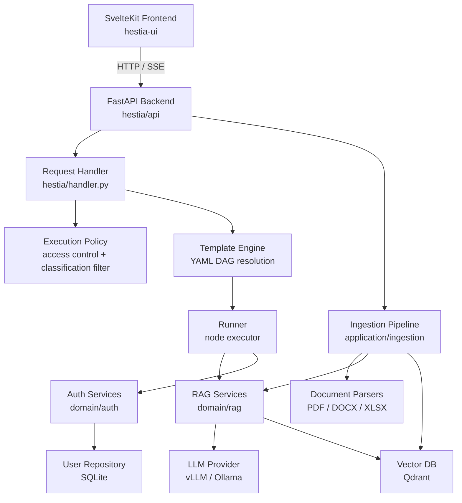
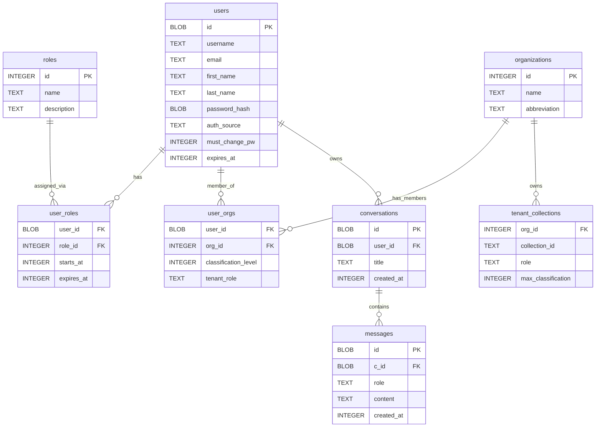
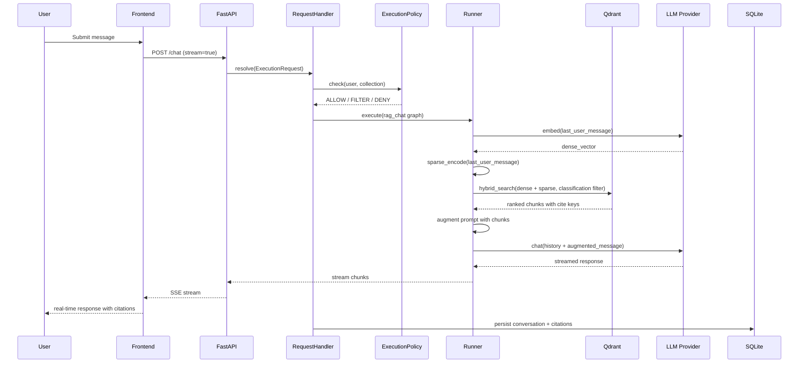
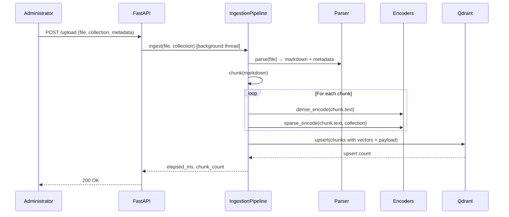
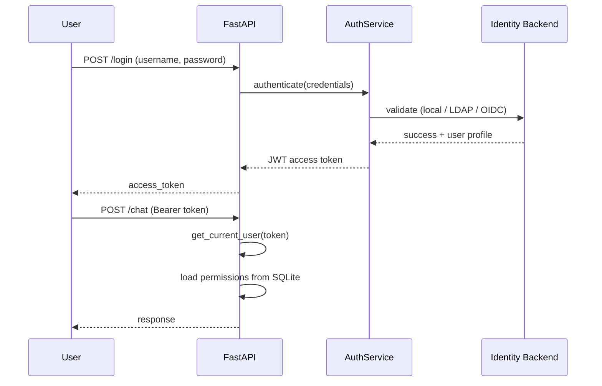
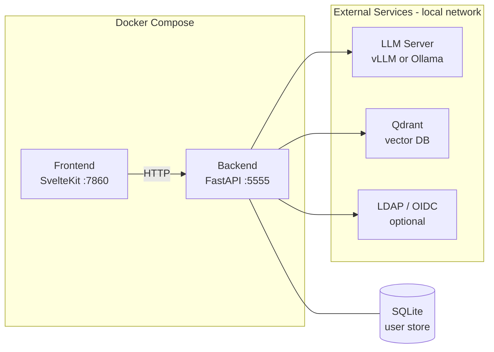

# hestIA — System Concept and Architecture

| Field | Value |
|---|---|
| Project | hestIA |
| Version | alpha_v0.2.2 |
| Date | 2026-05-27 |
| Status | Draft |

---

## 1. System Concept

### 1.1 Purpose

hestIA is a generative AI assistant platform built for enterprise IT governance and compliance. It enables users to query a managed corpus of internal policy, procedure, and standards documents through a conversational interface, with responses grounded in and traceable to source material.

### 1.2 Problem Statement

Enterprise IT governance and compliance teams maintain large, heterogeneous document corpora — security policies, procedures, business continuity plans, audit records — that are difficult to navigate and cross-reference manually. Relevant information is spread across multiple documents and organisations, access to sensitive material must be controlled, and answers must be auditable. Generic LLM tools are unsuitable because they hallucinate, lack access to internal documents, and provide no provenance for their responses.

### 1.3 Key Capabilities

- **Conversational document retrieval**: Users ask natural-language questions; the system retrieves relevant document passages and synthesises a response with explicit citations.
- **Full traceability**: Every LLM response cites the document passages it drew from, which users can inspect directly.
- **On-premises deployment**: The entire stack — LLM inference, vector database, authentication, frontend — can run locally without external cloud services.
- **Multi-tenant access control**: Documents are scoped to organisations (tenants); users inherit permissions and classification levels from their tenant memberships.
- **Document ingestion**: PDF, DOCX, and XLSX files are parsed into clean, LLM-ready markdown, chunked, encoded, and indexed.
- **Extensible infrastructure**: LLM backends and vector databases are abstracted behind provider protocols, enabling component substitution without application code changes.
- **Workflow composability**: RAG pipelines are defined as YAML execution graphs, enabling retrieval strategies and future agentic patterns to be composed without code changes.

### 1.4 Stakeholders and Use Cases

| Stakeholder | Use Case |
|---|---|
| Compliance analyst | Query specific control requirements across multiple policy documents |
| IT security officer | Verify procedure coverage against a regulatory framework |
| New employee | Navigate onboarding and acceptable-use documentation |
| System administrator | Ingest new documents, manage tenant collections, manage user access |
| Platform operator | Monitor system health, configure LLM and DB backends |

### 1.5 Deployment Context

hestIA is designed for deployment within an organisation's private infrastructure. It integrates with existing identity management systems (LDAP directory, OpenID Connect provider) and can be operated entirely air-gapped. The system assumes access to a self-hosted LLM inference server (vLLM or Ollama) and a Qdrant vector database instance.

### 1.6 Constraints and Assumptions

- LLM inference is provided by an external (but locally hosted) inference server; hestIA does not bundle or manage model weights.
- Classification-level enforcement is policy-based at query time; it relies on correct metadata being set at ingestion time.
- The system is at alpha stage (v0.2.2); some features (reranker integration, comprehensive test coverage) are partially implemented.

---

## 2. System Architecture

### 2.1 Architectural Overview

hestIA is structured as a layered, modular system. Each layer has a clearly defined responsibility and communicates with adjacent layers through well-defined interfaces.



### 2.2 Technology Stack

| Layer | Technology |
|---|---|
| Frontend | SvelteKit 5, Svelte 5, Tailwind CSS, TypeScript |
| Backend API | Python 3.13, FastAPI, Uvicorn |
| LLM inference | vLLM (default) or Ollama (self-hosted) |
| Vector database | Qdrant |
| User and conversation store | SQLite |
| Containerisation | Docker, Docker Compose |

### 2.3 Component Descriptions

#### 2.3.1 Frontend (hestia-ui)

A SvelteKit single-page application that consumes the backend API. Key capabilities:

- Real-time streaming of LLM responses via Server-Sent Events
- Inline citation rendering with source passage inspection
- Conversation history with rename and delete
- Document upload and collection browsing
- Account management (profile, password change)
- Admin and moderation panels for users, organisations, and collections

#### 2.3.2 Backend API (hestia/api)

A FastAPI application serving as the single API surface for all platform functionality. Routers are mounted dynamically at startup based on which services are enabled in configuration, allowing lightweight deployments that omit unused components.

| Router | Paths | Responsibility |
|---|---|---|
| auth | /login, /auth/oidc | JWT login, OIDC authorisation flow |
| chat | /chat | Conversational RAG or plain chat |
| generate | /generate | Single-turn RAG or plain generation |
| search | /search | Direct vector search |
| encode | /encode | Dense or sparse text encoding |
| ingestion | /upload, /parse, /collections | Document ingestion and collection management |
| conversations | /conversations | Conversation CRUD |
| account | /account | User profile and password management |
| admin | /users, /organizations, /roles | Admin and moderation operations |
| health | /health, /ready, /models | Liveness, readiness, model listing |

All endpoints require JWT authentication except `/login` and OIDC endpoints. A `CorrelationMiddleware` injects a request correlation ID into every request for structured log tracing.

#### 2.3.3 Request Handler and Template Engine (hestia/handler.py)

The `RequestHandler` is the central orchestrator for all RAG and generation requests. On each request it:

1. Applies the `ExecutionPolicy` (access control and classification filtering)
2. Selects the appropriate YAML workflow template based on request type
3. Resolves the template into a concrete `ExecutionGraph`
4. Executes the graph via the `Runner`
5. Persists the conversation and citations via `PersistChat`

The **Runner** executes nodes sequentially, maintaining a slot dictionary for inter-node data flow. Six node types are supported:

| Node type | Function |
|---|---|
| EncodeDense | Vectorise input with dense semantic embeddings |
| EncodeSparse | Vectorise input with BM25 sparse encoding |
| Retrieve | Hybrid search against Qdrant |
| Augment | Format retrieved passages into a RAG prompt |
| Generate | Single-turn LLM generation |
| Chat | Multi-turn LLM chat with conversation history |

#### 2.3.4 Execution Template System (hestia/templates)

Workflows are defined as YAML DAGs composed from reusable base node templates. Two substitution operators drive data flow:

- `${param}` — substitutes a value from the `ExecutionRequest` context (request-time parameters)
- `?slot` — references an output slot produced by a previously executed node

Four workflows are currently defined:

| Workflow | Node sequence |
|---|---|
| `chat.yaml` | Chat |
| `generate.yaml` | Generate |
| `rag_chat.yaml` | EncodeDense → EncodeSparse → Retrieve → Augment → Chat |
| `rag_generate.yaml` | EncodeDense → EncodeSparse → Retrieve → Augment → Generate |

Example — `rag_chat.yaml` abbreviated:

```yaml
entrypoint: Encode1
exitpoint: [Chat1]
nodes:
  - use: encode_dense.yaml
    with:
      id: Encode1
      inputs: { data: ${last_user_message} }
      outputs: { vector: dense_vector }
  - use: encode_sparse.yaml
    with:
      id: Encode2
      inputs: { data: ${last_user_message}, collection: ${collection} }
      outputs: { vector: sparse_vector }
  - use: retrieve.yaml
    with:
      id: Retrieve1
      inputs: { dense: ?dense_vector, sparse: ?sparse_vector, collection: ${collection} }
      outputs: { hits: points }
  - use: augment.yaml
    with:
      id: Augment1
      inputs: { prompt: ${last_user_message}, hits: ?points }
      outputs: { prompt: aug_message }
  - use: chat.yaml
    with:
      id: Chat1
      inputs: { history: ${history}, last_user_message: ?aug_message }
      outputs: { response: response }
```

New retrieval strategies and future agentic orchestration patterns can be introduced by authoring new YAML workflow files without modifying application code.

#### 2.3.5 Access Control and Policy (hestia/domain/policies)

The `ExecutionPolicy` is applied before any workflow execution. It evaluates the requesting user's permissions against the target collection and returns one of three decisions:

| Decision | Effect |
|---|---|
| ALLOW | Request proceeds unchanged |
| FILTER | Request proceeds but Qdrant query is restricted to the user's maximum classification level |
| DENY | Request is rejected with HTTP 403 |

#### 2.3.6 RAG Services (hestia/domain/rag)

| Service | Responsibility |
|---|---|
| DenseEncoder | Produces semantic embedding vectors via the LLM provider's embedding endpoint |
| SparseEncoder | Produces BM25 TF-IDF sparse vectors; maintains per-collection corpus statistics on disk |
| Retriever | Executes hybrid search in Qdrant, fusing dense and sparse results via Reciprocal Rank Fusion (RRF) |
| Generator | Calls the LLM provider for single-turn generation and multi-turn chat; supports streaming |

#### 2.3.7 Ingestion Pipeline (hestia/application/ingestion)

The ingestion pipeline handles the full lifecycle of bringing a document into the system:

1. **Parse** — extract content using the appropriate parser; output is LLM-ready markdown with frontmatter metadata
2. **Chunk** — split the document into semantically coherent sections
3. **Encode** — produce dense and sparse vectors for each chunk
4. **Upsert** — store chunks with vectors and payload metadata (classification level, source URI, tenant access) in Qdrant

A dry-run `/parse` endpoint allows inspecting parser output before committing to ingestion.

#### 2.3.8 Document Parsers (hestia/infrastructure/parsers)

Parsers implement a common base class with a `to_markdown()` method. Three formats are supported, each with an optional organisation-specific subclass for proprietary document templates:

| Parser | Format | Library |
|---|---|---|
| PDFParser | PDF | pymupdf4llm |
| DOCXParser | Word documents | python-docx |
| XLSXParser | Excel spreadsheets | openpyxl |

#### 2.3.9 Authentication Services (hestia/domain/auth)

Authentication supports three modes, selected by configuration:

| Mode | Description |
|---|---|
| Local | Credentials validated against the SQLite user repository |
| LDAP | Credentials delegated to an LDAP / Active Directory server |
| OIDC | Authorization Code Flow via an OpenID Connect provider |

All modes issue a JWT access token on successful authentication. Token validation runs on every protected endpoint via FastAPI dependency injection.

#### 2.3.10 Infrastructure Providers

**LLM Providers** (`hestia/infrastructure/llm`)

Both providers implement the `LLMProvider` protocol (`embed()`, `generate()`, `chat()`, `models`), making them interchangeable:

| Provider | Typical use case |
|---|---|
| vLLMProvider | High-throughput self-hosted inference (default) |
| OllamaProvider | Lightweight local inference |

**Database Providers** (`hestia/infrastructure/db`)

| Store | Technology | Responsibility |
|---|---|---|
| QdrantDB | Qdrant | Vector storage, hybrid search, collection and document management |
| UserRepository | SQLite | Users, roles, organisations, conversations, messages |

#### 2.3.11 Dependency Injection (hestia/container.py)

The `Container` is built at startup and holds all provider and service instances. Services are activated selectively based on the `services_to_start` configuration list, enabling lightweight deployments that omit unused components (e.g. a search-only node that does not run the ingestion pipeline).

### 2.4 Data Models

#### 2.4.1 User and Conversation Store (SQLite)



#### 2.4.2 Vector Store (Qdrant)

Each Qdrant collection stores document chunks as points with:

- **Dense vector**: high-dimensional semantic embedding
- **Sparse vector**: BM25 TF-IDF term weights
- **Payload fields**: `doc_id`, `source_uri`, `classification_level`, `section`, `text`, `metadata`

Payload indices on `doc_id` and `classification_level` enable efficient filtering during retrieval.

### 2.5 Data Flows

#### 2.5.1 RAG Chat Request



#### 2.5.2 Document Ingestion



#### 2.5.3 Authentication Flow



### 2.6 Deployment Architecture

hestIA is containerised with Docker Compose. The backend and frontend are packaged as separate images and communicate over a private bridge network.



All external services are expected to be reachable on the local network. No public internet access is required at runtime.

### 2.7 Security Architecture

| Concern | Mechanism |
|---|---|
| Authentication | JWT tokens (signed); LDAP and OIDC delegation supported |
| Authorisation | Role-based (admin, moderator, user) enforced per endpoint via FastAPI dependency guards |
| Data access control | ExecutionPolicy applied at query time; enforces collection permissions and classification-level filtering |
| Document classification | Classification level stored as payload metadata in Qdrant and filtered during vector search |
| Audit logging | Structured JSON logs with correlation IDs; AI request/response audit trail |
| Password security | Salted hash stored in SQLite; forced password change on first login |
| Request tracing | CorrelationMiddleware injects a unique request ID into all log entries |
