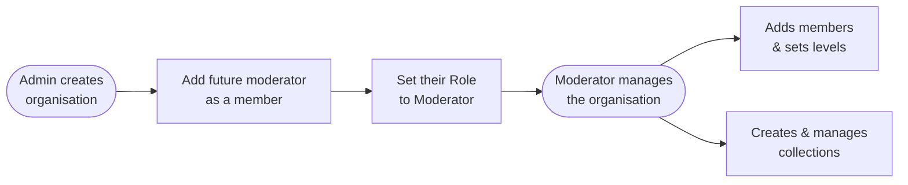
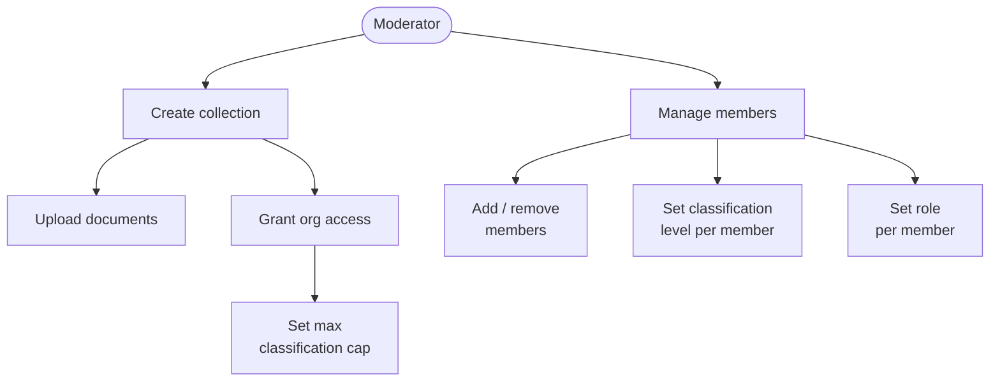

# Administration

> [!NOTE]
> The Admin panel is accessible to users with the **admin**, **moderator**, or **co-moderator** role. Open it via the account menu in the top-right corner and select **Admin Panel**.

---

## Role Overview

| Role | Scope | What they manage |
|------|-------|-----------------|
| **admin** | Platform-wide | Users, organisations, all collections |
| **moderator** | Organisation | Members, classification levels, owned collections |
| **co-moderator** | Organisation | Same as moderator — cannot promote or demote moderators |
| **member** | Organisation | Query access only |

---

## Part 1 — Admin

Admins have platform-wide access. They manage users and organisations, and can perform all moderator actions in any organisation.

---

### User Management

**Admin → Users**

#### Adding a user

1. Click **Add User** (top-right of the Users page).
2. Fill in **First name**, **Last name**, **Email**, **Username**, and a **Default Password** (use **Generate** for a random one), plus optionally an **Expiry date**.
3. Save. The user can log in immediately with the credentials you set.

> [!TIP]
> For LDAP / OIDC deployments, accounts are created automatically on first login. You can still add users manually to pre-assign roles or set expiry dates before their first sign-in.

#### Editing a user

1. Click any row in the Users list to open the user detail page.
2. Update **First name**, **Last name**, **Email**, **Username**, or **Expires**. Click the **Never expires** link to remove an expiry date.
3. Toggle **Role** checkboxes to grant or revoke system roles.
4. Click **Save changes**.

#### Resetting a password

1. On the user detail page, find the **Reset Password** card.
2. Enter and confirm a new password.
3. Click **Reset password**. The user will be forced to change their password on next login.

#### Adding or removing a user from an organisation

On the user detail page, in the **Organisations** card:

- **Add** — select an organisation from the dropdown and click **Add**. The user joins as a member at Public classification.
- **Remove** — click the **×** button on the organisation row.

#### Deleting a user

Click **Delete** on the row in the Users list, or click **Delete User** in the header of the user detail page. Confirm the prompt.

> [!WARNING]
> Deletion is permanent. If you want to preserve conversation history, disable access instead by setting an expiry date in the past.

---

### Organisation Management

**Admin → Organisations**

Organisations (also called *tenants*) are the units of access control. Each organisation has its own members, roles, and collection access.

#### Creating an organisation

1. Click **Add Organisation** (top-right).
2. Enter a **Name** and **Abbreviation**.
3. Save.

> [!NOTE]
> The create form takes Name and Abbreviation only. Assigning a moderator is a **separate step** after creation — see below.

#### Editing an organisation

1. Click the organisation row to open its detail page.
2. Click **Edit** in the Details card, update **Name** or **Abbreviation**, and click **Save**.

#### Deleting an organisation

Click **Delete** on the row in the Organisations list, or click **Delete Organisation** in the detail page header. Confirm the prompt.

> [!WARNING]
> Deleting an organisation removes all member associations and deletes any collections it owns.

#### Assigning a moderator

Because the creation form has no moderator field, this is done in two steps after the organisation is created:

1. Open the organisation detail page → **Members** card → click **Add Member**.
2. Select the user who will be the moderator and confirm.
3. In the member's **Role** column, open the dropdown and select **Moderator**.

The change saves immediately. The user can now manage the organisation independently.

---

### Collection Management

**Admin → Collections**

Admins can create collections from the Collections list or from inside an organisation's detail page.

#### Creating a collection

1. Click **Create collection** on the Collections list page.
2. Enter a **collection name** and select the **owning organisation**.
3. Save. You are taken to the collection detail page.

#### Deleting a collection

Click **Delete** on the row in the Collections list, or **Delete collection** in the detail page header — both ask you to confirm before deleting.

---

### Roles

**Admin → Roles** shows the list of system roles (ID, Name, Description). Roles are **read-only** in the UI and cannot be created or modified.

---

## Part 2 — Moderation

Moderators manage their assigned organisations. The Admin panel shows only the organisations they moderate and the collections those organisations own.

---

### Member Management

**Admin → Organisations → {your organisation}**

The **Members** card is the primary workspace. Each member row shows their username, name, email, an inline classification dropdown, and an inline role dropdown. Both dropdowns **save immediately** on change — there is no separate Save button.

#### Adding a member

1. Click **Add Member** in the Members card.
2. Select a user from the dropdown (all active platform users are listed regardless of their current organisations).
3. Confirm. The user is added as a **Member** at **Public** classification.

#### Setting classification

Click the **Classification** dropdown on the member's row:

| Level | Who receives answers from documents at this level |
|-------|--------------------------------------------------|
| **Public** | Everyone |
| **Internal** | Organisation members |
| **Confidential** | Users cleared to Confidential or above |
| **Restricted** | Users explicitly cleared at Restricted |
| **Secret** | Users explicitly cleared at Secret |

A user's ceiling limits which passages they can receive — documents above their level are never cited to them.

#### Setting role

Click the **Role** dropdown on the member's row:

| Role | What they can do |
|------|-----------------|
| **Member** | Query collections the organisation has access to |
| **Co-moderator** | All moderation actions except promoting/demoting moderators |
| **Moderator** | Full organisation management |

#### Removing a member

Click **Remove** on the member's row and confirm the prompt.

---

### Collection Management

Moderators manage collections **owned** by their organisation. Collections granted by another organisation are visible but read-only.

#### Creating a collection

1. On the organisation detail page, in the **Collections** card, click **Add collection**.
2. Enter a collection name and save. You are taken to the collection detail page.

#### Uploading a document

1. Open the collection detail page.
2. Click **Add document** in the header.
3. Select a supported file (PDF, DOCX, XLSX/XLSM, PPTX, TXT, CSV, JSON, Markdown).
4. Confirm. Indexing runs in the background — the document becomes queryable once complete.

> [!WARNING]
> Indexing happens at upload time. If you update a source file, you must re-upload it. Use **Replace** on the document row to swap the file without losing the document's place in the list.

#### Replacing a document

Click **Replace** on the document row, confirm the prompt — this removes the existing document and its index entries — then the upload dialog opens for you to pick and upload the new version, going through the same steps as a fresh upload.

#### Deleting a document

Click **Delete** on the document row and confirm.

#### Granting another organisation access

1. Click **Manage Access** in the collection detail header.
2. Search for and select the tenant you want to grant — access is created immediately, capped at **Public** by default.
3. Adjust the cap using the classification dropdown on that tenant's row in the same modal.

> [!TIP]
> The maximum classification cap applies on top of each user's individual ceiling — whichever is stricter wins. If an external user is cleared to Confidential but the collection is capped at Internal for their organisation, they only see Internal-level passages.

#### Revoking access

In the **Manage Access** modal, click **Revoke** on the tenant's row — this takes effect immediately.

